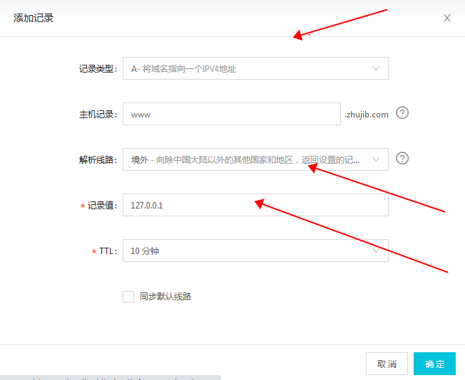
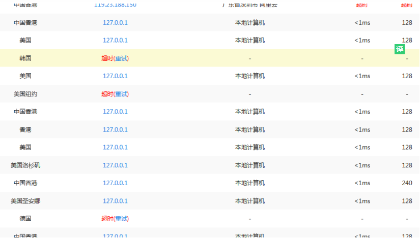
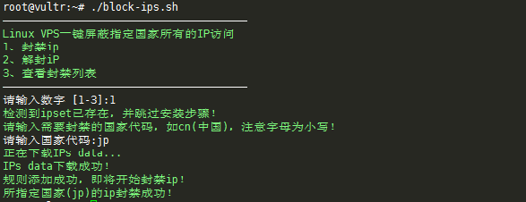

网站的客户和受众人群都是国内的，不想让国外访问；或者站长监测到国外肉鸡一直有扫描或攻击。这时就需要对对境外IP进行进行过滤和屏蔽；对IP进行过滤屏蔽只有两种方法：`加白`和`加黑`; `加白`就是把允许访问的添加入白名单中，没在白名单中的都进行屏蔽过滤，不允许访问；`加黑`就是把不允许访问的加入到黑名单中，没在黑名单中的完全放开，都可以进行访问。那么两种方法怎么选择呢？并且要怎样去屏蔽呢？


<!--more-->

## 黑白名单

作为运维的对黑白名单肯定不会默认，但是他们的使用场景是完全不同的。根据不同场景要求，选择是`加白`还是`加黑`是很重要的。正确选择可以让我们事半功倍，而且便于后期维护，反之亦然。那么他们哪些场景选择黑名单？哪些场景选择白名单呢？黑白名单的选择是根据场景需求中目标数量的比较决定的。


### 黑名单

要屏蔽的目标数量远远小于允许访问的数量时，就选择黑名单。只需要把需要屏蔽的加入黑名单中，其他完全放开就可以了。


### 白名单

允许访问的目标数量远远小于要屏蔽的数量时就选择白名单。


## 工具

`ipset`是`iptables`的扩展，它允许你创建匹配整个`IP`地址集合的规则。可以快速的让我们屏蔽某个`IP`段。


## 屏蔽方法

### DNS屏蔽

原理: 利用域名解析来禁止掉海外IP访问。绝大多数域名解析服务商都是提供电信联通移动海外线路区分解析的，所以我们可以充分利用这个功能，来禁止海外访问。

以阿里云DNS解析为例：

设置A记录类型

解析线路：境外

记录值：127.0.0.1



设置后等30分钟后我们再用ping工具测试下境外解析，就会发现所有的海外线路都会解析至127.0.0.1这个IP上，为什么是127.0.0.1呢？因为这个是本地IP，如果有攻击海外肉鸡攻击这个网站，就会自己攻击自己。




### 黑名单屏蔽

首先需要得到国家`IP`段，下载地址：http://www.ipdeny.com/ipblocks/。这里以我们国家为例。


#### **安装ipset**

```bash
#Debian/Ubuntu系统
apt-get -y install ipset

#CentOS系统
yum -y install ipset
```

#### **创建规则**

```bash
#创建一个名为cnip的规则
ipset -N cnip hash:net
#下载国家IP段
wget -P . http://www.ipdeny.com/ipblocks/data/countries/cn.zone
#将IP段添加到cnip规则中
for i in $(cat /root/cn.zone ); do ipset -A cnip $i; done
```

#### **开始屏蔽**

```bash
iptables -I INPUT -p tcp -m set --match-set cnip src -j DROP
```

#### **解除屏蔽**

```bash
#-D为删除规则
iptables -D INPUT -p tcp -m set --match-set cnip src -j DROP
```


#### 一键执行

为了便于实时，这里我写了个脚本，可以一键执行。适用于`CentOS`、`Debian`、`Ubuntu`等常用系统

```
vim  sunblock.sh

#! /bin/bash
#Block-IPs-from-countries
#Blog:https://wandouduoduo.github.io/

Green="\033[32m"
Font="\033[0m"

#root权限
root_need(){
    if [[ $EUID -ne 0 ]]; then
        echo "Error:This script must be run as root!" 1>&2
        exit 1
    fi
}

#封禁ip
block_ipset(){
check_ipset
#添加ipset规则
echo -e "${Green}请输入需要封禁的国家代码，如cn(中国)，注意字母为小写！${Font}"
read -p "请输入国家代码:" GEOIP
echo -e "${Green}正在下载IPs data...${Font}"
wget -P /tmp http://www.ipdeny.com/ipblocks/data/countries/$GEOIP.zone 2> /dev/null
#检查下载是否成功
    if [ -f "/tmp/"$GEOIP".zone" ]; then
	 echo -e "${Green}IPs data下载成功！${Font}"
    else
	 echo -e "${Green}下载失败，请检查你的输入！${Font}"
	 echo -e "${Green}代码查看地址：http://www.ipdeny.com/ipblocks/data/countries/${Font}"
    exit 1
    fi
#创建规则
ipset -N $GEOIP hash:net
for i in $(cat /tmp/$GEOIP.zone ); do ipset -A $GEOIP $i; done
rm -f /tmp/$GEOIP.zone
echo -e "${Green}规则添加成功，即将开始封禁ip！${Font}"
#开始封禁
iptables -I INPUT -p tcp -m set --match-set "$GEOIP" src -j DROP
iptables -I INPUT -p udp -m set --match-set "$GEOIP" src -j DROP
echo -e "${Green}所指定国家($GEOIP)的ip封禁成功！${Font}"
}

#解封ip
unblock_ipset(){
echo -e "${Green}请输入需要解封的国家代码，如cn(中国)，注意字母为小写！${Font}"
read -p "请输入国家代码:" GEOIP
#判断是否有此国家的规则
lookuplist=`ipset list | grep "Name:" | grep "$GEOIP"`
    if [ -n "$lookuplist" ]; then
        iptables -D INPUT -p tcp -m set --match-set "$GEOIP" src -j DROP
	iptables -D INPUT -p udp -m set --match-set "$GEOIP" src -j DROP
	ipset destroy $GEOIP
	echo -e "${Green}所指定国家($GEOIP)的ip解封成功，并删除其对应的规则！${Font}"
    else
	echo -e "${Green}解封失败，请确认你所输入的国家是否在封禁列表内！${Font}"
	exit 1
    fi
}

#查看封禁列表
block_list(){
	iptables -L | grep match-set
}

#检查系统版本
check_release(){
    if [ -f /etc/redhat-release ]; then
        release="centos"
    elif cat /etc/issue | grep -Eqi "debian"; then
        release="debian"
    elif cat /etc/issue | grep -Eqi "ubuntu"; then
        release="ubuntu"
    elif cat /etc/issue | grep -Eqi "centos|red hat|redhat"; then
        release="centos"
    elif cat /proc/version | grep -Eqi "debian"; then
        release="debian"
    elif cat /proc/version | grep -Eqi "ubuntu"; then
        release="ubuntu"
    elif cat /proc/version | grep -Eqi "centos|red hat|redhat"; then
        release="centos"
    fi
}

#检查ipset是否安装
check_ipset(){
    if [ -f /sbin/ipset ]; then
        echo -e "${Green}检测到ipset已存在，并跳过安装步骤！${Font}"
    elif [ "${release}" == "centos" ]; then
        yum -y install ipset
    else
        apt-get -y install ipset
    fi
}

#开始菜单
main(){
root_need
check_release
clear
echo -e "———————————————————————————————————————"
echo -e "${Green}Linux VPS一键屏蔽指定国家所有的IP访问${Font}"
echo -e "${Green}1、封禁ip${Font}"
echo -e "${Green}2、解封iP${Font}"
echo -e "${Green}3、查看封禁列表${Font}"
echo -e "———————————————————————————————————————"
read -p "请输入数字 [1-3]:" num
case "$num" in
    1)
    block_ipset
    ;;
    2)
    unblock_ipset
    ;;
    3)
    block_list
    ;;
    *)
    clear
    echo -e "${Green}请输入正确数字 [1-3]${Font}"
    sleep 2s
    main
    ;;
    esac
}
main
```

封禁`ip`时会要求你输入国家代码，代码查看：[点击进入](http://www.ipdeny.com/ipblocks)。记住所填参数均为小写字母。比如`JAPAN (JP)`，我们就输入`jp`这个参数。`注意：封禁国内时要特别注意，如封禁国内会造成登录服务器失败`

**演示**

**封禁IP**



**查看封禁列表**


**解封IP**


### 白名单屏蔽

有同学会说国外那么多国家，我不可能一个个国家去进行屏蔽吧。只需要国内访问或个别几个国家访问。那就选择白名单，把允许的几个国家加入白名单中，其他全部屏蔽掉即可。已中国为例：


#### **获取列表**

```bash
#下面语句可以单独执行，不需要每次执行都获取网段表
wget -q --timeout=60 -O- 'http://ftp.apnic.net/apnic/stats/apnic/delegated-apnic-latest' | awk -F\| '/CN\|ipv4/ { printf("%s/%d\n", $4, 32-log($5)/log(2)) }' > /root/china_ssr.txt
或
wget https://github.com/17mon/china_ip_list > /root/china_ssr.txt
```

#### 一键执行

**脚本一**

```bash
mmode=$1

 
CNIP="/root/china_ssr.txt"


gen_iplist() {
        cat <<-EOF
             $(cat ${CNIP:=/dev/null} 2>/dev/null)
		EOF
}

flush_r() {
iptables  -F ALLCNRULE 2>/dev/null
iptables -D INPUT -p tcp -j ALLCNRULE 2>/dev/null
iptables  -X ALLCNRULE 2>/dev/null
ipset -X allcn 2>/dev/null
}

mstart() {
ipset create allcn hash:net 2>/dev/null
ipset -! -R <<-EOF
$(gen_iplist | sed -e "s/^/add allcn /")
EOF

iptables -N ALLCNRULE
iptables -I INPUT -p tcp -j ALLCNRULE
iptables -A ALLCNRULE -s 127.0.0.0/8 -j RETURN
iptables -A ALLCNRULE -s 169.254.0.0/16 -j RETURN
iptables -A ALLCNRULE -s 224.0.0.0/4 -j RETURN
iptables -A ALLCNRULE -s 255.255.255.255 -j RETURN
#可在此增加你的公网网段，避免调试ipset时出现自己无法访问的情况

iptables -A ALLCNRULE -m set --match-set allcn  src -j RETURN
iptables -A ALLCNRULE -p tcp -j DROP


}

if [ "$mmode" == "stop" ] ;then
flush_r
exit 0
fi

flush_r
sleep 1
mstart
```

 将上面内容保存为/root/allcn.sh，并授予可执行权限

**运行**
/root/allcn.sh
运行后国外IP无法访问网站

**停止**
/root/allcn.sh stop
运行后国外IP恢复访问网站  


**脚本二**

```bash
#! /bin/bash
#判断本次运行时间
#判断是否具有root权限
root_need() {
    if [[ $EUID -ne 0 ]]; then
        echo "Error:This script must be run as root!" 1>&2
        exit 1
    fi
}
#检查系统分支及版本(主要是：分支->>版本>>决定命令格式)
check_release() {
    if uname -a | grep el7  ; then
        release="centos7"
    elif uname -a | grep el6 ; then
        release="centos6"
        yum install ipset -y
    elif cat /etc/issue |grep -i ubuntu ; then
        release="ubuntu"
        apt install ipset -y
    fi
}
#安装必要的软件(wget),并下载中国IP网段文件(最后将局域网地址也放进去)
get_china_ip() {
  #安装必要的软件(wget)
  rpm --help >/dev/null 2>&1 && rpm -qa |grep wget >/dev/null 2>&1 ||yum install -y wget ipset >/dev/null 2>&1 
  dpkg --help >/dev/null 2>&1 && dpkg -l |grep wget >/dev/null 2>&1 ||apt-get install wget ipset -y >/dev/null 2>&1
  #该文件由IPIP维护更新，大约一月一次更新(也可以用我放在国内的存储的版本，2019-05-18日版)
  [ -f china_ip_list.txt ] && mv china_ip_list.txt china_ip_list.txt.old
  wget https://github.com/17mon/china_ip_list/blob/master/china_ip_list.txt
  cat china_ip_list.txt |grep 'js-file-line">' |awk -F'js-file-line">' '{print $2}' |awk -F'<' '{print $1}' >> china_ip.txt
  rm -rf china_ip_list.txt
  #wget https://www.321dz.com/shell/china_ip.txt
  #放行局域网地址
  echo "192.168.0.0/18" >> china_ip.txt
  echo "10.0.0.0/8" >> china_ip.txt
  echo "172.16.0.0/12" >> china_ip.txt
}
#只允许国内IP访问
ipset_only_china() {
  echo "ipset create whitelist-china hash:net hashsize 10000 maxelem 1000000" > /etc/ip-black.sh
  for i in $( cat china_ip.txt )
  do
          echo "ipset add whitelist-china $i" >> /etc/ip-black.sh
  done
  echo "iptables -I INPUT -m set --match-set whitelist-china src -j ACCEPT" >> /etc/ip-black.sh
  #拒绝非国内和内网地址发起的tcp连接请求（tcp syn 包）（注意，只是屏蔽了入向的tcp syn包，该主机主动访问国外资源不用影响）
  echo "iptables  -A INPUT -p tcp --syn -m connlimit --connlimit-above 0 -j DROP" >> /etc/ip-black.sh
  #拒绝非国内和内网发起的ping探测（不影响本机ping外部主机）
  echo "iptables  -A INPUT -p icmp -m icmp --icmp-type 8 -j DROP" >> /etc/ip-black.sh
  #echo "iptables -A INPUT -j DROP" >> /etc/ip-black.sh
  rm -rf china_ip.txt
}
run_setup() {
  chmod +x /etc/rc.local
  sh /etc/ip-black.sh
  rm -rf /etc/ip-black.sh
  #下面这句主要是兼容centos6不能使用"-f"参数
  ipset save whitelist-china -f /etc/ipset.conf || ipset save whitelist-china > /etc/ipset.conf
  [ $release = centos7 ] && echo "ipset restore -f /etc/ipset.conf" >> /etc/rc.local
  [ $release = centos6 ] && echo "ipset restore < /etc/ipset.conf" >> /etc/rc.local
  echo "iptables -I INPUT -m set --match-set whitelist-china src -j ACCEPT" >> /etc/rc.local
  echo "iptables  -A INPUT -p tcp --syn -m connlimit --connlimit-above 0 -j DROP" >> /etc/rc.local
  echo "iptables  -A INPUT -p icmp -m icmp --icmp-type 8 -j DROP" >> /etc/rc.local
  #echo "iptables -A INPUT -j DROP" >> /etc/rc.local
}
main() {
  check_release
  get_china_ip
  ipset_only_china
case "$release" in
centos6)
  run_setup
  ;;
centos7)
  chmod +x /etc/rc.d/rc.local
  run_setup
  ;;
ubuntu)
  sed -i '/exit 0/d' /etc/rc.local
  run_setup
  echo "exit 0" >> /etc/rc.local
  ;;
esac
}
main
```

