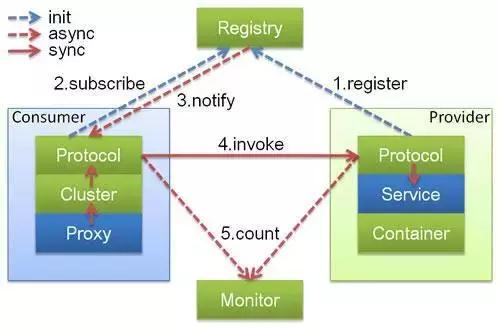
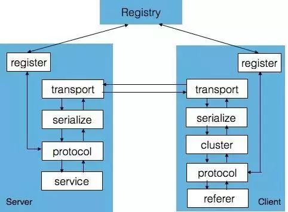
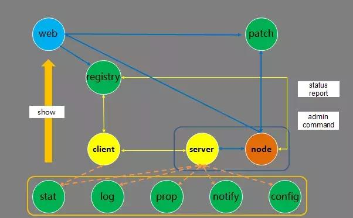
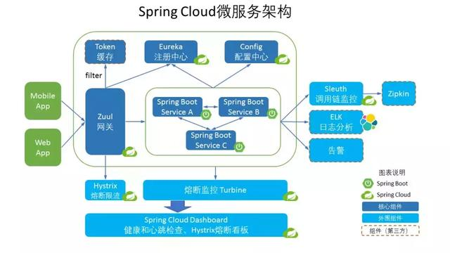
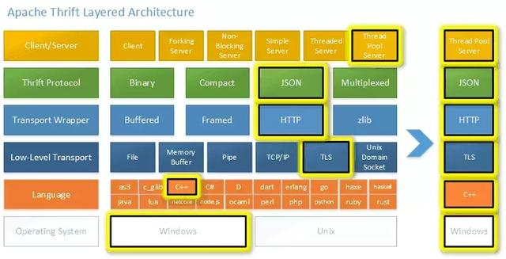

通读了前面两篇内容，我们了解到微服务离不开RPC，知道了RPC架构的原理，那么开源RPC架构有哪些，你知道多少呢？本文就针对`开源RPC框架`的种类进行漫谈。

<!--more-->

## 开源RPC框架种类

大致可分为两类：一类是与特定开发语言绑定的；另一类是与开发语言无关即跨语言平台的。

### **和语言平台绑定开源RPC框架**：

- **Dubbo**：国内最早的开源RPC框架。它是由阿里公司开发并于 2011 年末对外开源，仅支持 Java 语言。

- **Motan**：微博内部使用的RPC框架。于2016年对外开源，仅支持 Java 语言。
- **Tars**：腾讯内部使用的RPC框架。于 2017 年对外开源，仅支持 C++ 语言。
- **Spring Cloud**：国外Pivotal公司2014年对外开源的RPC框架，仅支持 Java 语言。

### 跨语言平台开源RPC框架：

- **gRPC**：Google 于2015年对外开源的跨语言RPC框架，支持多种语言。
- **Thrift**：最初是由Facebook开发的内部系统跨语言的RPC框架，2007年贡献给了Apache基金，成为Apache 开源项目之一，支持多种语言。

## 语言绑定框架

### **Dubbo**

Dubbo可以说是国内开源最早的RPC框架了，目前只支持 Java 语言。架构图如下：

图中可知Dubbo架构主要包含四个角色：其中Consumer为服务消费者，Provider为服务提供者，Registry是注册中心，Monitor是监控系统。

**交互流程**：Consumer通过注册中心获取到Provider节点信息后，通过Dubbo客户端SDK与Provider建立连接，并发起调用。Provider通过Dubbo服务端SDK接收到请求，处理后再把结果返回。

### **Motan**

Motan是国内另外一个比较有名的开源的RPC框架，同样也只支持 Java 语言实现。架构图如下：

Motan与Dubbo架构类似，都需在Client端(服务消费者)和Server端(服务提供者)引入SDK。Motan框架主要包含下面几个功能模块。

register：用来和注册中心交互。包括注册服务、订阅服务、服务变更通知、服务心跳发送等功能。

protocol：用来进行RPC服务的描述和RPC服务的配置管理。还可以添加不同功能的filter来完成统计、并发限制等功能。

serialize：将RPC请求中的参数、结果等对象进行序列化与反序列化

transport：用来进行远程通信，默认使用Netty NIO 的TCP长链接方式。

cluster：请求时会根据不同的高可用与负载均衡策略选择一个可用的 Server 发起远程调用。

### **Tars**

Tars是腾讯根据内部多年使用微服务架构的实践，总结而成的开源项目，仅支持 C++ 语言。架构图如下。

**交互流程**:

服务发布流程：在web系统上传 server的发布包到patch，上传成功后，在 web上提交发布server请求，由 registry服务传达到node，然后node拉取server的发布包到本地，拉起server服务。

管理命令流程：web 系统上的可以提交管理 server 服务命令请求，由 registry 服务传达到 node 服务，然后由 node 向 server 发送管理命令。

心跳上报流程：server 服务运行后，会定期上报心跳到 node，node 然后把服务心跳信息上报到 registry 服务，由 registry 进行统一管理。

信息上报流程：server 服务运行后，会定期上报统计信息到 stat，打印远程日志到 log，定期上报属性信息到 prop、上报异常信息到 notify、从 config 拉取服务配置信息。

client 访问 server 流程：client 可以通过 server 的对象名 Obj 间接访问 server，client 会从 registry 上拉取 server 的路由信息(如 IP、Port 信息)，然后根据具体的业务特性(同步或者异步，TCP 或者 UDP 方式)访问 server(当然 client 也可以通过 IP/Port 直接访问 server)。

### **Spring Cloud**

Spring Cloud 是利用 Spring Boot 特性整合了开源行业中优秀的组件，整体对外提供了一套在微服务架构中服务治理的解决方案。只支持 Java 语言平台，架构图如下：

**交互流程**:

请求统一通过 API 网关 Zuul 来访问内部服务，先经过 Token 进行安全认证。

通过安全认证后，网关 Zuul 从注册中心 Eureka 获取可用服务节点列表。

从可用服务节点中选取一个可用节点，然后把请求分发到这个节点。

整个请求过程中，Hystrix 组件负责处理服务超时熔断，Turbine 组件负责监控服务间的调用和熔断相关指标，Sleuth 组件负责调用链监控，ELK 负责日志分析。

## 跨平台框架

### **gRPC**

gRPC原理是通过 IDL(Interface Definition Language)文件定义服务接口的参数和返回值类型，然后通过代码生成程序生成服务端和客户端的具体实现代码，这样在 gRPC 里，客户端应用可以像调用本地对象一样调用另一台服务器上对应的方法。调用图如下：

主要特性三个方面:

通信协议采用了 HTTP/2。因为 HTTP/2 提供了连接复用、双向流、服务器推送、请求优先级、首部压缩等机制。

IDL使用了ProtoBuf。ProtoBuf 是由 Google 开发的一种数据序列化协议，它的压缩和传输效率极高，语法也简单

多语言支持，能够基于多种语言自动生成对应语言的客户端和服务端的代码。

### **Thrift**

Thrift 是一种轻量级的跨语言 RPC 通信方案，支持多达 25 种编程语言。为了支持多种语言，跟 gRPC 一样，Thrift 也有一套自己的接口定义语言 IDL，可以通过代码生成器，生成各种编程语言的 Client 端和 Server 端的 SDK 代码，这样就保证了不同语言之间可以相互通信。架构图如下：

Thrift RPC框架的特性:

支持多种序列化格式：如 Binary、Compact、JSON、Multiplexed 等。

支持多种通信方式：如 Socket、Framed、File、Memory、zlib 等。

服务端支持多种处理方式：如 Simple 、Thread Pool、Non-Blocking 等。

## 平台选择

选择哪个平台需要根据实际场景出发。如果你的业务场景仅仅局限于一种开发语言，那么选择比较多，可以选择和开发语言的绑定的RPC框架平台，可以选择支持该种开发语言的跨平台框架；但如果开发中涉及多种开发语言之间的相互调用，那就应该选择跨语言平台的RPC框架。当然也要考虑学习和维护成本。