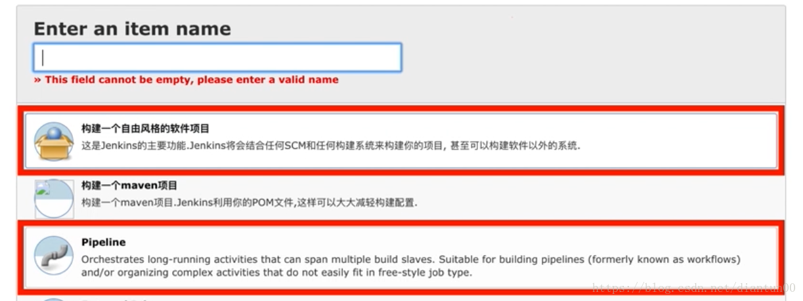
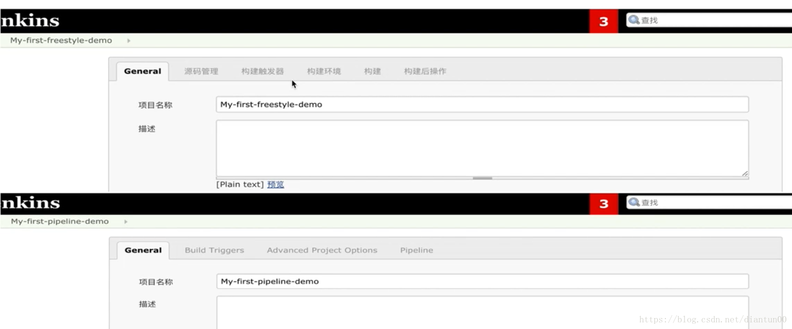

## 介绍

Pipeline，简而言之，就是一套运行于Jenkins上的工作流框架，将原本独立运行于单个或者多个节点的任务连接起来，实现单个任务难以完成的复杂流程编排与可视化。

Pipeline是Jenkins2.X的最核心的特性，帮助Jenkins实现从CI到CD与DevOps的转变。Pipeline是一组插件，让Jenkins可以实现持续交付管道的落地和实施。

持续交付管道（CD Pipeline）是将软件从版本控制阶段到交付给用户或客户的完整过程的自动化表现。软件的每一次更改（提交到源代码管理系统）都要经过一个复杂的过程才能被发布。

Pipeline提供了一组可扩展的工具，通过Pipeline Domain Specific Language（DSL）syntax可以达到Pipeline as Code（Jenkinsfile存储在项目的源代码库）的目的。

<!--more-->

## 特点

**Stage: 阶段**

一个Pipeline可以划分成若干个Stage，每个Stage代表一组操作，例如：“Build”，“Test”，“Deploy”。

*注意，Stage是一个逻辑分组的概念，可以跨多个Node*

**Node：节点**

一个Node就是一个Jenkins节点，或者是Master，或者是Agent，是执行Step的具体运行环境。

**Step：步骤**

Step是最基本的操作单元，小到创建一个目录，大到构建一个Docker镜像，由各类Jenklins Plugin提供，例如：sh ‘make’

**Pipeline五大特性**

代码:Pipeline以代码的形式实现，通常被检入源代码控制，使团队能够编辑、审查和迭代其CD流程。
可持续性：Jenklins重启或者中断后都不会影响Pipeline Job。
停顿：Pipeline可以选择停止并等待任工输入或批准，然后再继续Pipeline运行。
多功能：Pipeline支持现实世界的复杂CD要求，包括fork/join子进程，循环和并行执行工作的能力
可扩展：Pipeline插件支持其DSL的自定义扩展以及与其他插件集成的多个选项。
Pipeline和Freestyle的区别

## Freestyle和Pipeline区别





**Freestyle**： 
上游/下游Job调度，如 
BuildJob —> TestJob —> DeployJob 
在DSL Job里面调度多个子Job（利用Build Flow Plugin）

**Pipeline**： 
单个Job中完成所有的任务编排 

Multibranch Pipeline根据你的代码中Jenlinsfile自动创建Job


## 基础语法 

Pipeline脚本是由Groovy语言实现（无需专门学习）

*支持两种语法* 
*Declarative 声明式（在Pipeline plugin 2.5中引入）* 
*Scripted Pipeline 脚本式*

如何创建最基本的PIpeline 
直接在Jenkins Web UI 网页界面中输入脚本 
通过创建一个jenkinsfile可以检入项目的源代码管理库

通常推荐在Jenkins中直接从源代码控制（SCM）中载入Jenklinsfile Pipeline


声明式Pipeline

声明式Pipeline的基本语法和表达式遵循与Groovy语法相同的规则，但有以下例外：

声明式pipeline必须包含在固定格式pipeline{}快内
每个声明语句必须独立一行，行尾无需使用分号

块（blocks{}）只能包含章节（Sections），指令（Directives），步骤（Steps）或赋值语句
属性引用语句被视为无参数方法调用。例：输入被视为 input()
块（blocks{}） 
由大括号括起来的语句，如pipeline{},Section{},parameters{},script{} 
章节（Sections） 
通常包含一个或多个指令或步骤。如 agent 、post、stages、steps 
指令（Directives） 
environment、options、parameters、triggers（触发）、stage、tools、when 
步骤（Steps） 
Pipeline steps reference 
执行脚本式pipeline：使用script{}

agent 
必须存在，agent必须在pipeline块内的顶层定义，但stage内是否使用使可选的 
参数：any/none/label/node/docker/dockerfile 
常用选项 label/cuetomWorkspace/reuseNode

示例

```
agent { label 'my-label' }

agent {
    node {
        label 'my-label'
        customWorkspace '/some/other/path'
    }
}

agent {
    docker {
        image 'nginx:1.12.2'
        label 'my-label'
        args '-v /tmp:/tmp'
    }
}
```


post 不是必须的，用于pipeline的最外层或者stage{}中

```
pipeline {
    agent any
    stages {
        stage('Example'){
            steps {
            echo 'Hello world'
            }
        }
    }
    post {
        always {
            echo 'say goodbay'
        }
    }
}
```


stages 必须，包括顺序执行的一个或多个stage命令，在pipeline内仅能使用一次，通常位于agent/options后面，例子如上

steps 必须，steps位于stage指令块内部，包括一个或多个step。仅有一个step的情况下可以忽略关键字step及其{},例子如上

environment 不是必须的，environment定义了一组全局的环境变量键值对，存在于pipeline{}或者stage指令内。执行特殊方法credentials()可以获取jenkins中预定义的凭证明文内容

```
environment {CC='clang'}
environment {AN_ACCESS_KEY = credentials('my-prefined-secret-text')}
steps {sh 'printenv'}
```


options 不是必须的 预定义pipeline专有的配置信息，仅可定义一次

```
pipeline {
    agent any
    options{
    timeout(time:1,unit: 'HOURS')
    }
    ...
}
```


parameters 不是必须的 定义参数化构建的参数可选参数 booleanParam,choice,file,text,password,run,string

```
paramenters {
    choice(name:'PerformMavenRelease',choices:'False\nTrue',description:'desc')
    password(name:'CredsToUse',description:'Apassword to build with',defaultValue:'')
}
environment {
    BUILD_USR_CHOICE="${params.PerformMavenRelease}"
    BUILD_USR_CREDS="${params.CredsToUse}"
}
```


triggers 不是必须的 定义pipeline被自动触发的方式选项 cron、pollSCM、upstream

```
triggers {cron('H 4/* 0 0 1-5')}
triggers {pollSCM('H 4/* 0 0 1-5')}
triggers {upstream(upstreamProjects:'job1,job2',threshold:hudson.model.Result.SUCCESS)}
```


## 快速创建一个pipeline 

新建 选择pipeline 填写Job 的名字 

填写相应的pipeline script

```
pipeline{
    agent any
    stages {
        stage('Build') {
            steps{
                echo 'This is a build step' 
            }
        }
        stage('Test') {
            steps{
                echo 'This is a test step'  
            }
        }
        stage('Deploy') {
            steps{
                echo 'This is a deploy step'    
            }
        }
    }
}
```


保存之后，立即构建


## 常用的辅助工具

Snipper Generator（代码片段生成器，语法检查器）
Replay Pipeline（重放pipeline，可以修改script，修改后的不存入config.xml）
DSL Reference 语法参考手册
全局变量引用
Stage View
BlueOcean(可视化)
Pipeline神器：可视化编辑器
命令行Pipeline调试工具
