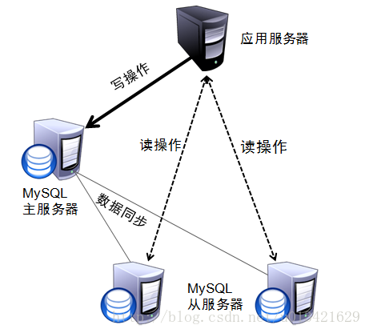
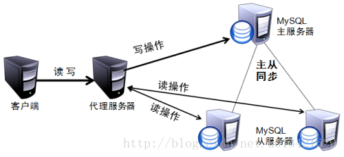
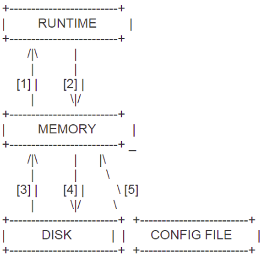

现在微服务几乎成为所有公司的标配，那么业务项目和数据存储的松耦合就成为基本配置，而mysql数据库在互联网公司中应用很广，几乎所有的项目都会有连它的需求。但是如果业务请求量很大，那么最先想到也是最常用的是数据库的读写分离。通常是由dba把数据库分为读写库，对数据进行更新，写入时连接读写库。查询数据时，连接读库。这样可以大大减轻写库的压力。



但是这样是由业务根据需求来区分连哪个数据库，但有些开发说我想只配置一个数据库，运维你根据请求类型来区分定义是连接只读库还是读写库。而且业务对时效性也不是很严格。那要怎么做呢？如下图：



我们就需要增加数据库的代理层，由代理层根据定义的规则来自动区分是连接读写库还是只读库。本文就是聊聊数据库的代理层--ProxySQL。


<!--more-->

## 简介

ProxySQL是灵活强大的MySQL代理层, 是一个能实实在在用在生产环境的MySQL中间件，可以实现读写分离，支持 Query 路由功能，支持动态指定某个 SQL 进行 cache，支持动态加载配置、故障切换和一些 SQL的过滤功能。还有一些同类产品比如 DBproxy、MyCAT、OneProxy 等。但经过反复对比和测试之后，还是觉得ProxySQL是一款性能不谙，靠谱稳定的MySQL 中间件产品 ！


## **亮点**

- 几乎所有的配置均可在线更改（其配置数据基于SQLite存储），无需重启proxysql
- 基于正则和client_addr的强大和灵活的路由规则
- 详细的状态统计，统计结果和pt-query-digest对慢日志的分析结果类似，相当于有了统一的查看sql性能和sql语句统计的入口（Designed by a DBA for DBAs）
- 自动重连和重新执行机制(auto-reconnect and automatic re-execution of queries using it’s Connections Pool ): 若一个请求在链接或执行过程中意外中断，proxysql会根据其内部机制重新执行该操作
- query cache功能：比mysql自带QC更灵活，可在mysql_query_rules表中依据digest,match_pattern,client_addr等维度控制哪类语句可以缓存
- 支持连接池（connection pool）并且支持multiplexing,区别于atlas之流的连接池实现。

## **特点**

ProxySQL是一个高性能的MySQL中间件，拥有强大的规则引擎。它是用C++语言开发的，虽然是一个轻量级产品，但性能很好（据测试，能处理千亿级的数据），功能也足够，能满足中间件所需的绝大多数功能。具有以下特性：

- 连接池，而且是 multiplexing；
- 主机和用户的最大连接数限制；
- 自动下线后端DB；
  \-  延迟超过阀值
  \-  ping 延迟超过阀值
  \-  网络不通或宕机
- 强大的规则路由引擎；
  \-  实现读写分离
  \-  查询重写
  \-  sql流量镜像
- 支持prepared statement；
- 支持Query Cache；
- 支持负载均衡，与gelera结合自动failover；
-  将所有配置保存写入到SQLit表中。
-  支持动态加载配置，即一般可以在线修改配置，但有少部分参数还是需要重启来生效。
- 支持query cache。
- 支持对query的路由，可以针对某个语句进行分配去哪个实例执行。
- 不支持分表，可以分库，但是利用规则配置实现分表。

如上可知，ProxySQL集合了很多优秀特性于一身，那么它的缺点呢就是项目不够成熟，好在官方网站一直在及时更新，并且受到 Percona 官方的支持。


## **管理配置**

ProxySQL有一个完备的配置系统，配置ProxySQL是基于sql命令的方式完成的。ProxySQL支持配置修改之后的在线保存、应用，不需要重启即可生效。整个配置系统分三层设计。

\-  **runtime**：运行中使用的配置文件
\-  **memory**：提供用户动态修改配置文件
\-  **disk**：将修改的配置保存到磁盘SQLit表中（即：proxysql.db）
\-  **config**：一般不使用它（即：proxysql.cnf）


如下图所示:




**ProxySQL配置系统分为三层的目的：**
1) 自动更新;
2) 尽可能的不重启proxysql就可以修改配置;
3) 方便回滚错误配置;

简单说就是配置proxysql分为三个级别，RUNTIME是即时生效的，MEMORY是保存在内存中但并不立即生效的，DISK|CONFIG FILE是持久化或写在配置文件中的。

这三个级别的配置文件互不干扰，在某个层级修改了配置文件，想要加载或保存到另一个层级，需要额外的LOAD或SAVE操作："LOAD xx_config FROM xx_level | LOAD xx_config TO xx_level | SAVE xx_config TO xx_level | SAVE xx_config FROM xx_level"，达到加载配置或者持久化配置的目的。这三层中每层的功能与含义如下：
\-  **RUNTIME层**
代表的是ProxySQL当前生效的配置，包括 global_variables, mysql_servers, mysql_users, mysql_query_rules。无法直接修改这里的配置，必须要从下一层load进来。该层级的配置时在proxysql管理库(sqlite)的main库中以runtime_开头的表，这些表的数据库无法直接修改，只能从其他层级加载；该层代表的是ProxySQL当前生效的正在使用的配置，包括global_variables, mysql_servers, mysql_users, mysql_query_rules表。无法直接修改这里的配置，必须要从下一层load进来。也就是说RUNTIME这个顶级层，是proxysql运行过程中实际使用的那一份配置，这一份配置会直接影响到生产环境的，所以要将配置加载进RUNTIME层时需要三思而行。

\-  **MEMORY层**
是平时在mysql命令行修改的 main 里头配置，可以认为是SQLite数据库在内存的镜像。该层级的配置在main库中以mysql_开头的表以及global_variables表，这些表的数据可以直接修改；用户可以通过MySQL客户端连接到此接口（admin接口），然后可以在mysql命令行查询不同的表和数据库，并修改各种配置，可以认为是SQLite数据库在内存的镜像。也就是说MEMORY这个中间层，上面接着生产环境层RUNTIME，下面接着持久化层DISK和CONFIG FILE。MEMORY层是我们修改proxysql的唯一正常入口。一般来说在修改一个配置时，首先修改Memory层，确认无误后再接入RUNTIME层，最后持久化到DISK和CONFIG FILE层。也就是说memeory层里面的配置随便改，不影响生产，也不影响磁盘中保存的数据。通过admin接口可以修改mysql_servers、mysql_users、mysql_query_rules、global_variables等表的数据。

\-  **DISK|CONFIG FILR层**
持久存储的那份配置，一般在$(DATADIR)/proxysql.db，在重启的时候会从硬盘里加载。 /etc/proxysql.cnf文件只在第一次初始化的时候用到，完了后，如果要修改监听端口，还是需要在管理命令行里修改，再 save 到硬盘。该层级的配置在磁盘上的sqlite库或配置文件里。DISK/CONFIG FILE层表示持久存储的那份配置，持久层对应的磁盘文件是$(DATADIR)/proxysql.db，在重启ProxySQL的时候，会从proxysql.db文件中加载信息。而 /etc/proxysql.cnf文件只在第一次初始化的时候使用，之后如果要修改配置，就需要在管理端口的SQL命令行里进行修改，然后再save到硬盘。 也就是说DISK和CONFIG FILE这一层是持久化层，我们做的任何配置更改，如果不持久化下来，重启后，配置都将丢失。

**需要注意**                                       
1) ProxySQL每一个配置项在三层中都存在，但是这三层是互相独立的，也就是说proxysql可以同时拥有三份配置，每层都是独立的，可能三份配置都不一样，也可能三份都一样。
2) RUNTIME层代表 ProxySQL 当前生效的正在使用的配置，无法直接修改这里的配置，必须要从下一层 "load" 进来。
3) MEMORY这一层上面连接 RUNTIME 层，下面连接持久化层。在这层可以正常操作 ProxySQL 配置，随便修改，不会影响生产环境。修改一个配置一般都是先在 MEMORY 层完成，然后确认正常之后再加载到 RUNTIME 和持久化到磁盘上。
4) DISK 和 CONFIG FILE层持久化配置信息，重启后内存中的配置信息会丢失，所以需要将配置信息保留在磁盘中。重启时，可以从磁盘快速加载回来。

**ProxySQL配置文件的修改流程一般是：**
\- 启动时：先修改必要的CONFIG FILE配置，比如管理端口，然后启动；
\- 其他配置：修改MEMORY中的表，然后加载到RUNTIME并持久化。

**ProxySQL具有一个复杂但易于使用的配置系统，可以满足以下需求：**
\-  允许轻松动态更新配置（这是为了让ProxySQL用户可以在需要零宕机时间配置的大型基础架构中使用它）。与MySQL兼容的管理界面可用于此目的。
\-  允许尽可能多的配置项目动态修改，而不需要重新启动ProxySQL进程
\-  可以毫不费力地回滚无效配置
\-  这是通过多级配置系统实现的，其中设置从运行时移到内存，并根据需要持久保存到磁盘。

一般，修改的配置都是在memory层。可以load到runtime，使配置在不用重启proxysql的情况下也可以生效，也可以save到disk，将对配置的修改持久化！

需要修改配置时，直接操作的是 MEMORAY，以下命令可用于加载或保存 users (mysql_users):  **(序号对应上图“运行机制”草图)**

```
[1]: LOAD MYSQL USERS TO RUNTIME / LOAD MYSQL USERS FROM MEMORY   #常用。将修改后的配置(在memory层)用到实际生产
[2]: SAVE MYSQL USERS TO MEMORY / SAVE MYSQL USERS FROM RUNTIME        #将生产配置拉一份到memory中
[3]: LOAD MYSQL USERS TO MEMORY / LOAD MYSQL USERS FROM DISK           #将磁盘中持久化的配置拉一份到memory中来
[4]: SAVE MYSQL USERS TO DISK /  SAVE MYSQL USERS FROM MEMORY     #常用。将memoery中的配置保存到磁盘中去
[5]: LOAD MYSQL USERS FROM CONFIG                                      #将配置文件中的配置加载到memeory中
```

个人还是比较习惯用 TO，记住往上层是 LOAD，往下层是 SAVE。以下命令加载或保存servers (mysql_servers):

```
[1]: LOAD MYSQL SERVERS TO RUNTIME  #常用，让修改的配置生效
[2]: SAVE MYSQL SERVERS TO MEMORY
[3]: LOAD MYSQL SERVERS TO MEMORY
[4]: SAVE MYSQL SERVERS TO DISK     #常用，将修改的配置持久化
[5]: LOAD MYSQL SERVERS FROM CONFIG
```

后面的使用方法也基本相同，一并列出。以下命令加载或保存query rules (mysql_query_rules):

```
[1]: load mysql query rules to run    #常用
[2]: save mysql query rules to mem
[3]: load mysql query rules to mem
[4]: save mysql query rules to disk   #常用
[5]: load mysql query rules from config
```

以下命令加载或保存 mysql variables (global_variables):

```
[1]: load mysql variables to runtime
[2]: save mysql variables to memory
[3]: load mysql variables to memory
[4]: save mysql variables to disk
[5]: load mysql variables from config
```

以下命令加载或保存admin variables (select * from global_variables where variable_name like 'admin-%'):

```
[1]: load admin variables to runtime
[2]: save admin variables to memory
[3]: load admin variables to memory
[4]: save admin variables to disk
[5]: load admin variables from config
```


**ProxySQL启动过程总结:**
当proxysql启动时，首先读取配置文件CONFIG FILE(/etc/proxysql.cnf)，然后从该配置文件中获取datadir，datadir中配置的是sqlite的数据目录。如果该目录存在，且sqlite数据文件存在，那么正常启动，将sqlite中的配置项读进内存，并且加载进RUNTIME，用于初始化proxysql的运行。如果datadir目录下没有sqlite的数据文件，proxysql就会使用config file中的配置来初始化proxysql，并且将这些配置保存至数据库。sqlite数据文件可以不存在，/etc/proxysql.cnf文件也可以为空，但/etc/proxysql.cnf配置文件必须存在，否则，proxysql无法启动。


