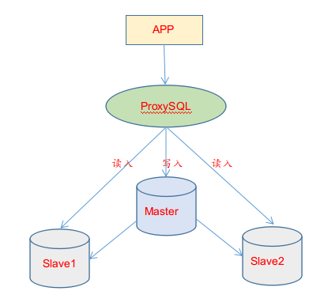
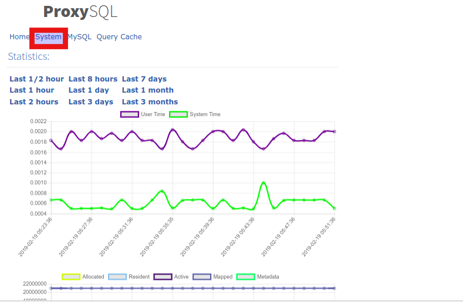

前面文章对数据库中间层进行了选型，那么要怎么安装，怎么验证，怎么优化，又有哪些坑可以避免呢？本文就详细介绍下。

<!--more-->

## **ProxySQL 安装 (两种方式)**

```bash
1) 采用yum方式安装
[root@mysql-proxy ~]# vim /etc/yum.repos.d/proxysql.repo
[proxysql_repo]
name= ProxySQL YUM repository
baseurl=http://repo.proxysql.com/ProxySQL/proxysql-1.4.x/centos/\$releasever
gpgcheck=1
gpgkey=http://repo.proxysql.com/ProxySQL/repo_pub_key
 
执行安装
[root@mysql-proxy ~]# yum clean all
[root@mysql-proxy ~]# yum makecache
[root@mysql-proxy ~]# yum -y install proxysql
  
[root@mysql-proxy ~]# proxysql --version
ProxySQL version 1.4.13-15-g69d4207, codename Truls
  
启动ProxySQL
[root@mysql-proxy ~]# chkconfig proxysql on
[root@mysql-proxy ~]# systemctl start proxysql      
[root@mysql-proxy ~]# systemctl status proxysql
 
启动后会监听两个端口，
默认为6032和6033。6032端口是ProxySQL的管理端口，6033是ProxySQL对外提供服务的端口 (即连接到转发后端的真正数据库的转发端口)。
[root@mysql-proxy ~]# netstat -tunlp
Active Internet connections (only servers)
Proto Recv-Q Send-Q Local Address           Foreign Address         State       PID/Program name  
tcp        0      0 0.0.0.0:6032            0.0.0.0:*               LISTEN      23940/proxysql    
tcp        0      0 0.0.0.0:6033            0.0.0.0:*               LISTEN      23940/proxysql
 
2）采用rpm包方式安装
proxysql的rpm包下载地址: https://pan.baidu.com/s/1S1_b5DKVCpZSOUNmtCXrrg
提取密码: 5t1c
  
[root@mysql-proxy ~]# wget https://github.com/sysown/proxysql/releases/download/v1.4.8/proxysql-1.4.8-1-centos7.x86_64.rpm
[root@mysql-proxy ~]# rpm -ivh proxysql-1.4.8-1-centos7.x86_64.rpm --force
 
[root@mysql-proxy ~]# /etc/init.d/proxysql start
Starting ProxySQL: DONE!
 
[root@mysql-proxy ~]# ss -lntup|grep proxy
tcp    LISTEN     0      128       *:6032                  *:*                   users:(("proxysql",pid=2943,fd=24))
tcp    LISTEN     0      128       *:6033                  *:*                   users:(("proxysql",pid=2943,fd=22))
tcp    LISTEN     0      128       *:6033                  *:*                   users:(("proxysql",pid=2943,fd=21))
tcp    LISTEN     0      128       *:6033                  *:*                   users:(("proxysql",pid=2943,fd=20))
tcp    LISTEN     0      128       *:6033                  *:*                   users:(("proxysql",pid=2943,fd=19))
 
如上可以看出转发端口6033是启动了四个线程
 
==============================================================
以上两种方式采用任何一种都可以顺利安装proxysql插件。
 
另外，记得在proxysql服务器上安装mysql客户端，用于在本机连接到ProxySQL的管理接口
[root@mysql-proxy ~]# vim /etc/yum.repos.d/mariadb.repo
[mariadb]
name = MariaDB
baseurl = http://yum.mariadb.org/10.3.5/centos6-amd64
gpgkey=https://yum.mariadb.org/RPM-GPG-KEY-MariaDB
gpgcheck=1
   
安装mysql-clinet客户端
[root@mysql-proxy ~]# yum install -y MariaDB-client
  
--------------------------------------------------------------------------------------------------------------------------------------------------------
如果遇到报错：
Error: MariaDB-compat conflicts with 1:mariadb-libs-5.5.60-1.el7_5.x86_64
 You could try using --skip-broken to work around the problem
 You could try running: rpm -Va --nofiles --nodigest
   
解决办法：
[root@mysql-proxy ~]# rpm -qa|grep mariadb*
mariadb-libs-5.5.56-2.el7.x86_64
[root@mysql-proxy ~]# rpm -e mariadb-libs-5.5.56-2.el7.x86_64 --nodeps
[root@mysql-proxy ~]# yum install -y MariaDB-client
```

## **ProxySQL配置**

ProxySQL有配置文件/etc/proxysql.cnf和配置数据库文件/var/lib/proxysql/proxysql.db。**这里需要特别注意：如果存在如果存在"proxysql.db"文件(在/var/lib/proxysql目录下)，则ProxySQL服务只有在第一次启动时才会去读取proxysql.cnf文件并解析；后面启动会就不会读取proxysql.cnf文件了！如果想要让proxysql.cnf文件里的配置在重启proxysql服务后生效(即想要让proxysql重启时读取并解析proxysql.cnf配置文件)，则需要先删除/var/lib/proxysql/proxysql.db数据库文件，然后再重启proxysql服务。这样就相当于初始化启动proxysql服务了，会再次生产一个纯净的proxysql.db数据库文件(如果之前配置了proxysql相关路由规则等，则就会被抹掉)。** 官方推荐用admin interface方式！(即在proxysql本机使用mysql客户端连接管理端口)

```bash
[root@mysql-proxy ~]# egrep -v "^#|^$" /etc/proxysql.cnf
datadir="/var/lib/proxysql"                                   #数据目录
admin_variables=
{
        admin_credentials="admin:admin"                       #连接管理端的用户名与密码
        mysql_ifaces="0.0.0.0:6032"                           #管理端口，用来连接proxysql的管理数据库
}
mysql_variables=
{
        threads=4                                             #指定转发端口开启的线程数量
        max_connections=2048
        default_query_delay=0
        default_query_timeout=36000000
        have_compress=true
        poll_timeout=2000
        interfaces="0.0.0.0:6033"                             #指定转发端口，用于连接后端mysql数据库的，相当于代理作用
        default_schema="information_schema"
        stacksize=1048576
        server_version="5.5.30"                               #指定后端mysql的版本
        connect_timeout_server=3000
        monitor_username="monitor"
        monitor_password="monitor"
        monitor_history=600000
        monitor_connect_interval=60000
        monitor_ping_interval=10000
        monitor_read_only_interval=1500
        monitor_read_only_timeout=500
        ping_interval_server_msec=120000
        ping_timeout_server=500
        commands_stats=true
        sessions_sort=true
        connect_retries_on_failure=10
}
mysql_servers =
(
)
mysql_users:
(
)
mysql_query_rules:
(
)
scheduler=
(
)
mysql_replication_hostgroups=
(
)
 
 
proxysql的数据目录
[root@mysql-proxy ~]# ll /var/lib/proxysql/
total 1014052
-rw------- 1 root root     122880 Jan 25 14:33 proxysql.db
-rw------- 1 root root 1023288179 Jan 28 12:30 proxysql.log
-rw-r--r-- 1 root root          6 Jan 25 14:20 proxysql.pid
-rw------- 1 root root    1736704 Jan 28 12:29 proxysql_stats.db
 
查看main库（默认登陆后即在此库）的global_variables表信息
MySQL [(none)]> show databases;
+-----+---------------+-------------------------------------+
| seq | name          | file                                |
+-----+---------------+-------------------------------------+
| 0   | main          |                                     |
| 2   | disk          | /var/lib/proxysql/proxysql.db       |
| 3   | stats         |                                     |
| 4   | monitor       |                                     |
| 5   | stats_history | /var/lib/proxysql/proxysql_stats.db |
+-----+---------------+-------------------------------------+
5 rows in set (0.000 sec)
 
MySQL [(none)]> use main;
Reading table information for completion of table and column names
You can turn off this feature to get a quicker startup with -A
 
Database changed
MySQL [main]> show tables;
+--------------------------------------------+
| tables                                     |
+--------------------------------------------+
| global_variables                           |
| mysql_collations                           |
| mysql_group_replication_hostgroups         |
| mysql_query_rules                          |
| mysql_query_rules_fast_routing             |
| mysql_replication_hostgroups               |
| mysql_servers                              |
| mysql_users                                |
| proxysql_servers                           |
| runtime_checksums_values                   |
| runtime_global_variables                   |
| runtime_mysql_group_replication_hostgroups |
| runtime_mysql_query_rules                  |
| runtime_mysql_query_rules_fast_routing     |
| runtime_mysql_replication_hostgroups       |
| runtime_mysql_servers                      |
| runtime_mysql_users                        |
| runtime_proxysql_servers                   |
| runtime_scheduler                          |
| scheduler                                  |
+--------------------------------------------+
20 rows in set (0.000 sec)
 
MySQL [main]> select * from global_variables;
+-----------------------------------------------------+---------------------------+
| variable_name                                       | variable_value            |
+-----------------------------------------------------+---------------------------+
| mysql-shun_on_failures                              | 5                         |
| mysql-shun_recovery_time_sec                        | 10                        |
| mysql-query_retries_on_failure                      | 1                         |
| mysql-connect_retries_delay                         | 1                         |
| mysql-connection_delay_multiplex_ms                 | 0                         |
| mysql-connection_max_age_ms                         | 0                         |
| mysql-connect_timeout_server_max                    | 10000                     |
| mysql-eventslog_filename                            |                           |
| mysql-eventslog_filesize                            | 104857600                 |
| mysql-default_charset                               | utf8                      |
| mysql-free_connections_pct                          | 10                        |
| mysql-session_idle_ms                               | 1000                      |
| mysql-client_found_rows                             | true                      |
| mysql-monitor_enabled                               | true                      |
| mysql-monitor_connect_timeout                       | 600                       |
| mysql-monitor_ping_max_failures                     | 3                         |
| mysql-monitor_ping_timeout                          | 1000                      |
| mysql-monitor_read_only_max_timeout_count           | 3                         |
| mysql-monitor_replication_lag_interval              | 10000                     |
| mysql-monitor_replication_lag_timeout               | 1000                      |
| mysql-monitor_groupreplication_healthcheck_interval | 5000                      |
| mysql-monitor_groupreplication_healthcheck_timeout  | 800                       |
| mysql-monitor_replication_lag_use_percona_heartbeat |                           |
| mysql-monitor_query_interval                        | 60000                     |
| mysql-monitor_query_timeout                         | 100                       |
| mysql-monitor_slave_lag_when_null                   | 60                        |
| mysql-monitor_wait_timeout                          | true                      |
| mysql-monitor_writer_is_also_reader                 | true                      |
| mysql-max_allowed_packet                            | 4194304                   |
| mysql-throttle_connections_per_sec_to_hostgroup     | 1000000                   |
| mysql-max_transaction_time                          | 14400000                  |
| mysql-multiplexing                                  | true                      |
| mysql-forward_autocommit                            | false                     |
| mysql-enforce_autocommit_on_reads                   | false                     |
| mysql-autocommit_false_not_reusable                 | false                     |
| mysql-autocommit_false_is_transaction               | false                     |
| mysql-verbose_query_error                           | false                     |
| mysql-hostgroup_manager_verbose                     | 1                         |
| mysql-threshold_query_length                        | 524288                    |
| mysql-threshold_resultset_size                      | 4194304                   |
| mysql-query_digests_max_digest_length               | 2048                      |
| mysql-query_digests_max_query_length                | 65000                     |
| mysql-wait_timeout                                  | 28800000                  |
| mysql-throttle_max_bytes_per_second_to_client       | 2147483647                |
| mysql-throttle_ratio_server_to_client               | 0                         |
| mysql-max_stmts_per_connection                      | 20                        |
| mysql-max_stmts_cache                               | 10000                     |
| mysql-mirror_max_concurrency                        | 16                        |
| mysql-mirror_max_queue_length                       | 32000                     |
| mysql-default_max_latency_ms                        | 1000                      |
| mysql-query_processor_iterations                    | 0                         |
| mysql-query_processor_regex                         | 1                         |
| mysql-long_query_time                               | 1000                      |
| mysql-query_cache_size_MB                           | 256                       |
| mysql-poll_timeout_on_failure                       | 100                       |
| mysql-server_capabilities                           | 45578                     |
| mysql-session_idle_show_processlist                 | true                      |
| mysql-query_digests                                 | true                      |
| mysql-query_digests_lowercase                       | false                     |
| mysql-servers_stats                                 | true                      |
| mysql-default_reconnect                             | true                      |
| mysql-ssl_p2s_ca                                    |                           |
| mysql-ssl_p2s_cert                                  |                           |
| mysql-ssl_p2s_key                                   |                           |
| mysql-ssl_p2s_cipher                                |                           |
| mysql-init_connect                                  |                           |
| mysql-default_sql_mode                              |                           |
| mysql-default_time_zone                             | SYSTEM                    |
| mysql-connpoll_reset_queue_length                   | 50                        |
| mysql-stats_time_backend_query                      | false                     |
| mysql-stats_time_query_processor                    | false                     |
| mysql-threads                                       | 4                         |
| mysql-max_connections                               | 2048                      |
| mysql-default_query_delay                           | 0                         |
| mysql-default_query_timeout                         | 36000000                  |
| mysql-have_compress                                 | true                      |
| mysql-poll_timeout                                  | 2000                      |
| mysql-interfaces                                    | 0.0.0.0:6033              |
| mysql-default_schema                                | information_schema        |
| mysql-stacksize                                     | 1048576                   |
| mysql-server_version                                | 5.5.30                    |
| mysql-connect_timeout_server                        | 3000                      |
| mysql-monitor_username                              | proxysql                  |
| mysql-monitor_password                              | proxysql                  |
| mysql-monitor_history                               | 600000                    |
| mysql-monitor_connect_interval                      | 60000                     |
| mysql-monitor_ping_interval                         | 10000                     |
| mysql-monitor_read_only_interval                    | 1500                      |
| mysql-monitor_read_only_timeout                     | 500                       |
| mysql-ping_interval_server_msec                     | 120000                    |
| mysql-ping_timeout_server                           | 500                       |
| mysql-commands_stats                                | true                      |
| mysql-sessions_sort                                 | true                      |
| mysql-connect_retries_on_failure                    | 10                        |
| admin-stats_credentials                             | stats:stats               |
| admin-stats_mysql_connections                       | 60                        |
| admin-stats_mysql_connection_pool                   | 60                        |
| admin-stats_mysql_query_cache                       | 60                        |
| admin-stats_system_cpu                              | 60                        |
| admin-stats_system_memory                           | 60                        |
| admin-telnet_admin_ifaces                           | (null)                    |
| admin-telnet_stats_ifaces                           | (null)                    |
| admin-refresh_interval                              | 2000                      |
| admin-read_only                                     | false                     |
| admin-hash_passwords                                | true                      |
| admin-cluster_username                              |                           |
| admin-cluster_password                              |                           |
| admin-cluster_check_interval_ms                     | 1000                      |
| admin-cluster_check_status_frequency                | 10                        |
| admin-cluster_mysql_query_rules_diffs_before_sync   | 3                         |
| admin-cluster_mysql_servers_diffs_before_sync       | 3                         |
| admin-cluster_mysql_users_diffs_before_sync         | 3                         |
| admin-cluster_proxysql_servers_diffs_before_sync    | 3                         |
| admin-cluster_mysql_query_rules_save_to_disk        | true                      |
| admin-cluster_mysql_servers_save_to_disk            | true                      |
| admin-cluster_mysql_users_save_to_disk              | true                      |
| admin-cluster_proxysql_servers_save_to_disk         | true                      |
| admin-checksum_mysql_query_rules                    | true                      |
| admin-checksum_mysql_servers                        | true                      |
| admin-checksum_mysql_users                          | true                      |
| admin-web_enabled                                   | false                     |
| admin-web_port                                      | 6080                      |
| admin-admin_credentials                             | admin:admin|
| admin-mysql_ifaces                                  | 0.0.0.0:6032              |
| admin-version                                       | 1.4.8-32-g669c149         |
+-----------------------------------------------------+---------------------------+
125 rows in set (0.003 sec)
 
#登陆成功后，可通过对main库（默认登陆后即在此库）的global_variables表中的"admin-admin_credentials" 和 "admin-mysql_ifaces"
#两个变量进行更改来修改登录认证! 比如说修改密码或定义一个非admin的用户用于远程登录(下面会说到)。
```

proxysql的6032端口是管理入口，账号密码是admin(可以动态修改),允许客户端连接；6033端口就是客户端入口，账号密码通过管理接口去设置。在proxysql本机使用mysql客户端连接到ProxySQL的管理接口(admin interface), 该接口的默认管理员用户和密码都是admin。

**mysql_ifaces**
也就是说proxysql有一个admin接口专门来做配置，相当于一个mysql shell可以通过sql来让配置实时生效。
mysql_ifaces配置了允许连接proxysql的ip和port

```bash
[root@mysql-proxy ~]# vim /etc/proxysql.cnf
........
# 将admin_variables中的mysql_ifaces修改成允许远程访问
#      mysql_ifaces="127.0.0.1:6032;/tmp/proxysql_admin.sock"
       mysql_ifaces="0.0.0.0:6032"
```

如果ip配置为0.0.0.0表示不限制ip，但是出于安全考虑，admin用户无论怎么设置都只能在本机登录!!!

**admin_credentials**
这个key保存所有可以操作proxysql的用户名和密码，格式为：user:pass;user1:pass1，这里可以修改密码或定义一个非admin的用户用于远程登录。 前提是保证想要管理proxysql的机器安装有mysql client客户端！

```bash
先在proxysql本机登录 (因为初始账号密码是admin:admin，只能在本机登录), 这里的proxysql本机地址是172.16.60.214
 
修改远程连接proxysql管理端口的账号和密码radmin:radmin.
[root@mysql-proxy ~]# mysql -uadmin -padmin -h127.0.0.1 -P6032       
Welcome to the MariaDB monitor.  Commands end with ; or \g.
Your MySQL connection id is 34
Server version: 5.5.30 (ProxySQL Admin Module)
 
Copyright (c) 2000, 2018, Oracle, MariaDB Corporation Ab and others.
 
Type 'help;' or '\h' for help. Type '\c' to clear the current input statement.
 
MySQL [(none)]> update global_variables set variable_value = 'admin:admin;radmin:radmin' where variable_name = 'admin-admin_credentials';
Query OK, 1 row affected (0.002 sec)
 
MySQL [(none)]> LOAD ADMIN VARIABLES TO RUNTIME;
Query OK, 0 rows affected (0.000 sec)
 
MySQL [(none)]> SAVE ADMIN VARIABLES TO DISK;
Query OK, 31 rows affected (0.077 sec)
 
 
这样就可以使用下面的命令在其他机器上使用radmin用户登录（其他机器上需要有mysql client）
[root@MGR-node3 ~]# mysql -uradmin -pradmin -h172.16.60.214 -P6032        
mysql: [Warning] Using a password on the command line interface can be insecure.
Welcome to the MySQL monitor.  Commands end with ; or \g.
Your MySQL connection id is 35
Server version: 5.5.30 (ProxySQL Admin Module)
 
Copyright (c) 2000, 2018, Oracle and/or its affiliates. All rights reserved.
 
Oracle is a registered trademark of Oracle Corporation and/or its
affiliates. Other names may be trademarks of their respective
owners.
 
Type 'help;' or '\h' for help. Type '\c' to clear the current input statement.
 
mysql> show databases;
+-----+---------------+-------------------------------------+
| seq | name          | file                                |
+-----+---------------+-------------------------------------+
| 0   | main          |                                     |
| 2   | disk          | /var/lib/proxysql/proxysql.db       |
| 3   | stats         |                                     |
| 4   | monitor       |                                     |
| 5   | stats_history | /var/lib/proxysql/proxysql_stats.db |
+-----+---------------+-------------------------------------+
5 rows in set (0.00 sec)
```

**ProxySQL的库、表说明** （默认管理端口是6032，客户端服务端口是6033。默认的用户名密码都是 admin）

```bash
通过管理端口6032去连接的 (注意, 下面连接命令中后面的--prompt 'admin'字段可以不加，也是可以登录进去的)
  
[root@mysql-proxy ~]# mysql -uadmin -padmin -P6032 -h127.0.0.1
或者
[root@mysql-proxy ~]# mysql -uadmin -padmin -P6032 -h127.0.0.1 --prompt 'admin> '
Welcome to the MariaDB monitor.  Commands end with ; or \g.
Your MySQL connection id is 33
Server version: 5.5.30 (ProxySQL Admin Module)
  
Copyright (c) 2000, 2018, Oracle, MariaDB Corporation Ab and others.
  
Type 'help;' or '\h' for help. Type '\c' to clear the current input statement.
  
admin> show databases;
+-----+---------------+-------------------------------------+
| seq | name          | file                                |
+-----+---------------+-------------------------------------+
| 0   | main          |                                     |
| 2   | disk          | /var/lib/proxysql/proxysql.db       |
| 3   | stats         |                                     |
| 4   | monitor       |                                     |
| 5   | stats_history | /var/lib/proxysql/proxysql_stats.db |
+-----+---------------+-------------------------------------+
5 rows in set (0.000 sec)
  
ProxySQL提供了几个库，每个库都有各自的意义；
-  main 内存配置数据库，表里存放后端db实例、用户验证、路由规则等信息。表名以 runtime_开头的表示proxysql当前运行的配置内容，
不能通过dml语句修改，只能修改对应的不以 runtime_ 开头的（在内存）里的表，然后 LOAD 使其生效， SAVE 使其存到硬盘以供下次重启加载。
-  disk 是持久化到硬盘的配置，sqlite数据文件。
-  stats 是proxysql运行抓取的统计信息，包括到后端各命令的执行次数、流量、processlist、查询种类汇总/执行时间等等。
-  monitor 库存储 monitor 模块收集的信息，主要是对后端db的健康/延迟检查。
  
1) main 库 （disk库的表字段和main一样）
admin> show tables from main;
+--------------------------------------------+
| tables                                     |
+--------------------------------------------+
| global_variables                           |
| mysql_collations                           |
| mysql_group_replication_hostgroups         |
| mysql_query_rules                          |
| mysql_query_rules_fast_routing             |
| mysql_replication_hostgroups               |
| mysql_servers                              |
| mysql_users                                |
| proxysql_servers                           |
| runtime_checksums_values                   |
| runtime_global_variables                   |
| runtime_mysql_group_replication_hostgroups |
| runtime_mysql_query_rules                  |
| runtime_mysql_query_rules_fast_routing     |
| runtime_mysql_replication_hostgroups       |
| runtime_mysql_servers                      |
| runtime_mysql_users                        |
| runtime_proxysql_servers                   |
| runtime_scheduler                          |
| scheduler                                  |
+--------------------------------------------+
20 rows in set (0.001 sec)
 
常用的几个表介绍
===============================================
global_variables      
设置变量，包括监听的端口、管理账号等。
 
mysql_collations      
相关字符集和校验规则。
 
mysql_query_rules     
定义查询路由规则。
 
mysql_replication_hostgroups  
监视指定主机组中所有服务器的read_only值，并且根据read_only的值将服务器分配给写入器或读取器主机组。ProxySQL monitor模块会监控hostgroups
后端所有servers 的read_only 变量，如果发现从库的read_only变为0、主库变为1，则认为角色互换了，自动改写mysql_servers表里面 hostgroup关系，
达到自动 Failover 效果。
 
mysql_servers
设置后端MySQL的表
 
mysql_users
配置后端数据库的程序账号和监控账号。
 
scheduler
调度器是一个类似于cron的实现，集成在ProxySQL中，具有毫秒的粒度。通过脚本检测来设置ProxySQL。
 
2）stats库
MySQL [(none)]> show tables from stats;
+--------------------------------------+
| tables                               |
+--------------------------------------+
| global_variables                     |
| stats_memory_metrics                 |
| stats_mysql_commands_counters        |
| stats_mysql_connection_pool          |
| stats_mysql_connection_pool_reset    |
| stats_mysql_global                   |
| stats_mysql_prepared_statements_info |
| stats_mysql_processlist              |
| stats_mysql_query_digest             |
| stats_mysql_query_digest_reset       |
| stats_mysql_query_rules              |
| stats_mysql_users                    |
| stats_proxysql_servers_checksums     |
| stats_proxysql_servers_metrics       |
| stats_proxysql_servers_status        |
+--------------------------------------+
15 rows in set (0.001 sec)
 
常用的几个表介绍
===============================================
stats_mysql_commands_counters
统计各种SQL类型的执行次数和时间，通过参数mysql-commands_stats控制开关，默认是ture。
 
stats_mysql_connection_pool
连接后端MySQL的连接信息。
 
stats_mysql_processlist
类似MySQL的show processlist的命令，查看各线程的状态。
 
stats_mysql_query_digest
表示SQL的执行次数、时间消耗等。通过变量mysql-query_digests控制开关，默认是开。
 
stats_mysql_query_rules
路由命中次数统计。
 
3）monitor库
MySQL [(none)]> show tables from monitor;            
+------------------------------------+
| tables                             |
+------------------------------------+
| mysql_server_connect_log           |
| mysql_server_group_replication_log |
| mysql_server_ping_log              |
| mysql_server_read_only_log         |
| mysql_server_replication_lag_log   |
+------------------------------------+
5 rows in set (0.000 sec)
 
常用的几个表介绍
===============================================
mysql_server_connect_log
连接到所有MySQL服务器以检查它们是否可用，该表用来存放检测连接的日志。
 
mysql_server_ping_log
使用mysql_ping API ping后端MySQL服务器，检查它们是否可用，该表用来存放ping的日志。
 
mysql_server_replication_lag_log
后端MySQL服务主从延迟的检测。
 
runtime_开头的是运行时的配置，这些是不能修改的。要修改ProxySQL的配置，需要修改了非runtime_表，
修改后必须执行"LOAD ... TO RUNTIME"才能加载到RUNTIME生效，执行save ... to disk才能将配置持久化保存到磁盘。
```

global_variables 有80多个变量可以设置，其中就包括监听的端口、管理账号、禁用monitor等

```bash
(admin@127.0.0.1:6032) [(none)]> show tables;
+--------------------------------------------+
| tables                                     |
+--------------------------------------------+
| global_variables                           |
| mysql_collations                           |
| mysql_group_replication_hostgroups         |
| mysql_query_rules                          |
| mysql_query_rules_fast_routing             |
| mysql_replication_hostgroups               |
| mysql_servers                              |
| mysql_users                                |
| proxysql_servers                           |
| runtime_checksums_values                   |
| runtime_global_variables                   |
| runtime_mysql_group_replication_hostgroups |
| runtime_mysql_query_rules                  |
| runtime_mysql_query_rules_fast_routing     |
| runtime_mysql_replication_hostgroups       |
| runtime_mysql_servers                      |
| runtime_mysql_users                        |
| runtime_proxysql_servers                   |
| runtime_scheduler                          |
| scheduler                                  |
+--------------------------------------------+
20 rows in set (0.001 sec)
  
(admin@127.0.0.1:6032) [(none)]> show tables from stats;
+--------------------------------------+
| tables                               |
+--------------------------------------+
| global_variables                     |
| stats_memory_metrics                 |
| stats_mysql_commands_counters        |
| stats_mysql_connection_pool          |
| stats_mysql_connection_pool_reset    |
| stats_mysql_global                   |
| stats_mysql_prepared_statements_info |
| stats_mysql_processlist              |
| stats_mysql_query_digest             |
| stats_mysql_query_digest_reset       |
| stats_mysql_query_rules              |
| stats_mysql_users                    |
| stats_proxysql_servers_checksums     |
| stats_proxysql_servers_metrics       |
| stats_proxysql_servers_status        |
+--------------------------------------+
15 rows in set (0.000 sec)
  
(admin@127.0.0.1:6032) [(none)]> show create table mysql_servers\G;
*************************** 1. row ***************************
       table: mysql_servers
Create Table: CREATE TABLE mysql_servers (
    hostgroup_id INT CHECK (hostgroup_id>=0) NOT NULL DEFAULT 0,
    hostname VARCHAR NOT NULL,
    port INT NOT NULL DEFAULT 3306,
    status VARCHAR CHECK (UPPER(status) IN ('ONLINE','SHUNNED','OFFLINE_SOFT', 'OFFLINE_HARD')) NOT NULL DEFAULT 'ONLINE',
    weight INT CHECK (weight >= 0) NOT NULL DEFAULT 1,
    compression INT CHECK (compression >=0 AND compression <= 102400) NOT NULL DEFAULT 0,
    max_connections INT CHECK (max_connections >=0) NOT NULL DEFAULT 1000,
    max_replication_lag INT CHECK (max_replication_lag >= 0 AND max_replication_lag <= 126144000) NOT NULL DEFAULT 0,
    use_ssl INT CHECK (use_ssl IN(0,1)) NOT NULL DEFAULT 0,
    max_latency_ms INT UNSIGNED CHECK (max_latency_ms>=0) NOT NULL DEFAULT 0,
    comment VARCHAR NOT NULL DEFAULT '',
    PRIMARY KEY (hostgroup_id, hostname, port) )
1 row in set (0.000 sec)
  
ERROR: No query specified
  
(admin@127.0.0.1:6032) [(none)]> select * from mysql_servers;
+--------------+---------------+------+--------+--------+-------------+-----------------+---------------------+---------+----------------+---------+
| hostgroup_id | hostname      | port | status | weight | compression | max_connections | max_replication_lag | use_ssl | max_latency_ms | comment |
+--------------+---------------+------+--------+--------+-------------+-----------------+---------------------+---------+----------------+---------+
| 10           | 172.16.60.211 | 3306 | ONLINE | 1      | 0           | 1000            | 0                   | 0       | 0              |         |
| 20           | 172.16.60.212 | 3306 | ONLINE | 1      | 0           | 1000            | 0                   | 0       | 0              |         |
| 20           | 172.16.60.213 | 3306 | ONLINE | 1      | 0           | 1000            | 0                   | 0       | 0              |         |
+--------------+---------------+------+--------+--------+-------------+-----------------+---------------------+---------+----------------+---------+
3 rows in set (0.000 sec)
```

**-**  hostgroup_id: ProxySQL通过 hostgroup (**下称HG**) 的形式组织后端db实例。一个 HG 代表同属于一个角色
**-**  该表的主键是 (hostgroup_id, hostname, port)，可以看到一个 hostname:port 可以在多个hostgroup里面，如上面的 10.0.100.100:3307，这样可以避免 HG 1000 的从库全都不可用时，依然可以把读请求发到主库上。
**-**  一个 HG 可以有多个实例，即多个从库，可以通过 weight 分配权重
**-**  hostgroup_id 0 是一个特殊的HG，路由查询的时候，没有匹配到规则则默认选择 HG 0
**-**  status:
**-**  ONLINE: 当前后端实例状态正常
   **-**  SHUNNED: 临时被剔除，可能因为后端 too many connections error，或者超过了可容忍延迟阀值 max_replication_lag
   **-**  OFFLINE_SOFT: “软离线”状态，不再接受新的连接，但已建立的连接会等待活跃事务完成。
   **-**  OFFLINE_HARD: “硬离线”状态，不再接受新的连接，已建立的连接或被强制中断。当后端实例宕机或网络不可达，会出现。
**-**  max_connections: 允许连接到该后端mysql实例的最大连接数。不要大于MySQL设置的 max_connections，如果后端实例 hostname:port 在多个 hostgroup 里，以较大者为准，而不是各自独立允许的最大连接数。
**-**  max_replication_lag: 允许的最大延迟，主库不受这个影响，默认0。如果 > 0， monitor 模块监控主从延迟大于阀值时，会临时把它变为 SHUNNED 。
**-**  max_latency_ms: mysql_ping 响应时间，大于这个阀值会把它从连接池剔除（即使是ONLINE）
**-**  comment: 备注，不建议留空。可以通过它的内容如json格式的数据，配合自己写的check脚本，完成一些自动化的工作。

表 mysql_users

```bash
MySQL [(none)]> show create table mysql_users\G;
*************************** 1. row ***************************
       table: mysql_users
Create Table: CREATE TABLE mysql_users (
    username VARCHAR NOT NULL,
    password VARCHAR,
    active INT CHECK (active IN (0,1)) NOT NULL DEFAULT 1,
    use_ssl INT CHECK (use_ssl IN (0,1)) NOT NULL DEFAULT 0,
    default_hostgroup INT NOT NULL DEFAULT 0,
    default_schema VARCHAR,
    schema_locked INT CHECK (schema_locked IN (0,1)) NOT NULL DEFAULT 0,
    transaction_persistent INT CHECK (transaction_persistent IN (0,1)) NOT NULL DEFAULT 1,
    fast_forward INT CHECK (fast_forward IN (0,1)) NOT NULL DEFAULT 0,
    backend INT CHECK (backend IN (0,1)) NOT NULL DEFAULT 1,
    frontend INT CHECK (frontend IN (0,1)) NOT NULL DEFAULT 1,
    max_connections INT CHECK (max_connections >=0) NOT NULL DEFAULT 10000,
    PRIMARY KEY (username, backend),
    UNIQUE (username, frontend))
1 row in set (0.000 sec)
  
ERROR: No query specified
  
MySQL [(none)]> select * from mysql_users;
+-----------+------------+--------+---------+-------------------+----------------+---------------+------------------------+--------------+---------+----------+-----------------+
| username  | password   | active | use_ssl | default_hostgroup | default_schema | schema_locked | transaction_persistent | fast_forward | backend | frontend | max_connections |
+-----------+------------+--------+---------+-------------------+----------------+---------------+------------------------+--------------+---------+----------+-----------------+
| proxysql  | proxysql   | 1      | 0       | 2                 | NULL           | 0             | 1                      | 0            | 1       | 1        | 10000           |
| root      | passwd     | 1      | 0       | 10                | NULL           | 0             | 1                      | 0            | 1       | 1        | 10000           |
| sqlsender | P@ssword1! | 1      | 0       | 10                | NULL           | 0             | 1                      | 0            | 1       | 1        | 10000           |
+-----------+------------+--------+---------+-------------------+----------------+---------------+------------------------+--------------+---------+----------+-----------------+
3 rows in set (0.000 sec)
  
MySQL [(none)]> select username,password,transaction_persistent,active,backend,frontend,max_connections from runtime_mysql_users;
+-----------+-------------------------------------------+------------------------+--------+---------+----------+-----------------+
| username  | password                                  | transaction_persistent | active | backend | frontend | max_connections |
+-----------+-------------------------------------------+------------------------+--------+---------+----------+-----------------+
| proxysql  | *BF27B4C7AAD278126E228AA8427806E870F64F39 | 1                      | 1      | 0       | 1        | 10000           |
| root      | *59C70DA2F3E3A5BDF46B68F5C8B8F25762BCCEF0 | 1                      | 1      | 0       | 1        | 10000           |
| sqlsender | *50572A5FABC7DA9CEE5EB5977EDDE59E38967422 | 1                      | 1      | 0       | 1        | 10000           |
| proxysql  | *BF27B4C7AAD278126E228AA8427806E870F64F39 | 1                      | 1      | 1       | 0        | 10000           |
| root      | *59C70DA2F3E3A5BDF46B68F5C8B8F25762BCCEF0 | 1                      | 1      | 1       | 0        | 10000           |
| sqlsender | *50572A5FABC7DA9CEE5EB5977EDDE59E38967422 | 1                      | 1      | 1       | 0        | 10000           |
+-----------+-------------------------------------------+------------------------+--------+---------+----------+-----------------+
6 rows in set (0.001 sec)
```

**-**  username, password: 连接后端db的用户密码。
这个密码你可以插入明文，也可以插入hash加密后的密文，proxysql会检查你插入的时候密码是否以 * 开头来判断，而且密文要在其它地方使用 PASSWORD()生成。但到 runtime_mysql_users 里，都统一变成了密文，所以可以明文插入，再 SAVE MYSQL USERS TO MEM，此时看到的也是HASH密文。
**-**  active: 是否生效该用户。
**-**  default_hostgroup: 这个用户的请求没有匹配到规则时，默认发到这个 hostgroup，默认0
**-**  default_schema: 这个用户连接时没有指定 database name 时，默认使用的schema
注意表面上看默认为NULL，但实际上受到变量 mysql-default_schema 的影响，默认为 information_schema。关于这个参考我所提的 issue #988
**-**  transaction_persistent: 如果设置为1，连接上ProxySQL的会话后，如果在一个hostgroup上开启了事务，那么后续的sql都继续维持在这个hostgroup上，不伦是否会匹配上其它路由规则，直到事务结束。
虽然默认是0，但我建议还是设成1，虽然一般来说由于前段应用的空值，为0出问题的情况几乎很小。作者也在考虑默认设成 1，refer this issue #793
**-**  frontend, backend: 目前版本这两个都需要使用默认的1，将来有可能会把 Client -> ProxySQL (frontend) 与 ProxySQL -> BackendDB (backend)的认证分开。从 runtime_mysql_users 表内容看到，记录数比 mysql_users 多了一倍，就是把前端认证与后端认证独立出来的结果。
**-**  fast_forward: 忽略查询重写/缓存层，直接把这个用户的请求透传到后端DB。相当于只用它的连接池功能，一般不用，路由规则 .* 就行了。

表 mysql_replication_hostgroups

```bash
MySQL [(none)]> show create table mysql_replication_hostgroups\G;
*************************** 1. row ***************************
       table: mysql_replication_hostgroups
Create Table: CREATE TABLE mysql_replication_hostgroups (
    writer_hostgroup INT CHECK (writer_hostgroup>=0) NOT NULL PRIMARY KEY,
    reader_hostgroup INT NOT NULL CHECK (reader_hostgroup<>writer_hostgroup AND reader_hostgroup>0),
    comment VARCHAR NOT NULL DEFAULT '', UNIQUE (reader_hostgroup))
1 row in set (0.001 sec)
  
ERROR: No query specified
  
MySQL [(none)]> select * from mysql_replication_hostgroups;
+------------------+------------------+---------+
| writer_hostgroup | reader_hostgroup | comment |
+------------------+------------------+---------+
| 10               | 20               | 1       |
+------------------+------------------+---------+
1 row in set (0.000 sec)
```

定义 hostgroup 的主从关系。ProxySQL monitor 模块会监控 HG 后端所有servers 的 `read_only` 变量，如果发现从库的 read_only 变为0、主库变为1，则认为角色互换了，自动改写 mysql_servers 表里面 hostgroup 关系，达到自动 Failover 效果。

表 mysql_query_rules
mysql_query_rules 是ProxySQL非常核心一个表，定义查询路由规则

```bash
MySQL [(none)]> show create table mysql_query_rules\G;
*************************** 1. row ***************************
       table: mysql_query_rules
Create Table: CREATE TABLE mysql_query_rules (
    rule_id INTEGER PRIMARY KEY AUTOINCREMENT NOT NULL,
    active INT CHECK (active IN (0,1)) NOT NULL DEFAULT 0,
    username VARCHAR,
    schemaname VARCHAR,
    flagIN INT NOT NULL DEFAULT 0,
    client_addr VARCHAR,
    proxy_addr VARCHAR,
    proxy_port INT,
    digest VARCHAR,
    match_digest VARCHAR,
    match_pattern VARCHAR,
    negate_match_pattern INT CHECK (negate_match_pattern IN (0,1)) NOT NULL DEFAULT 0,
    re_modifiers VARCHAR DEFAULT 'CASELESS',
    flagOUT INT,
    replace_pattern VARCHAR,
    destination_hostgroup INT DEFAULT NULL,
    cache_ttl INT CHECK(cache_ttl > 0),
    reconnect INT CHECK (reconnect IN (0,1)) DEFAULT NULL,
    timeout INT UNSIGNED,
    retries INT CHECK (retries>=0 AND retries <=1000),
    delay INT UNSIGNED,
    next_query_flagIN INT UNSIGNED,
    mirror_flagOUT INT UNSIGNED,
    mirror_hostgroup INT UNSIGNED,
    error_msg VARCHAR,
    OK_msg VARCHAR,
    sticky_conn INT CHECK (sticky_conn IN (0,1)),
    multiplex INT CHECK (multiplex IN (0,1,2)),
    log INT CHECK (log IN (0,1)),
    apply INT CHECK(apply IN (0,1)) NOT NULL DEFAULT 0,
    comment VARCHAR)
1 row in set (0.001 sec)
  
ERROR: No query specified
  
MySQL [(none)]> select * from mysql_query_rules;
+---------+--------+----------+------------+--------+-------------+------------+------------+--------+----------------------+---------------+----------------------+--------------+---------+-----------------+-----------------------+-----------+-----------+---------+---------+-------+-------------------+----------------+------------------+-----------+--------+-------------+-----------+-----+-------+---------+
| rule_id | active | username | schemaname | flagIN | client_addr | proxy_addr | proxy_port | digest | match_digest         | match_pattern | negate_match_pattern | re_modifiers | flagOUT | replace_pattern | destination_hostgroup | cache_ttl | reconnect | timeout | retries | delay | next_query_flagIN | mirror_flagOUT | mirror_hostgroup | error_msg | OK_msg | sticky_conn | multiplex | log | apply | comment |
+---------+--------+----------+------------+--------+-------------+------------+------------+--------+----------------------+---------------+----------------------+--------------+---------+-----------------+-----------------------+-----------+-----------+---------+---------+-------+-------------------+----------------+------------------+-----------+--------+-------------+-----------+-----+-------+---------+
| 1       | 1      | NULL     | NULL       | 0      | NULL        | NULL       | NULL       | NULL   | ^SELECT.*FOR UPDATE$ | NULL          | 0                    | CASELESS     | NULL    | NULL            | 10                    | NULL      | NULL      | NULL    | NULL    | NULL  | NULL              | NULL           | NULL             | NULL      | NULL   | NULL        | NULL      | NULL | 1     | NULL    |
| 2       | 1      | NULL     | NULL       | 0      | NULL        | NULL       | NULL       | NULL   | ^SELECT              | NULL          | 0                    | CASELESS     | NULL    | NULL            | 20                    | NULL      | NULL      | NULL    | NULL    | NULL  | NULL              | NULL           | NULL             | NULL      | NULL   | NULL        | NULL      | NULL | 1     | NULL    |
+---------+--------+----------+------------+--------+-------------+------------+------------+--------+----------------------+---------------+----------------------+--------------+---------+-----------------+-----------------------+-----------+-----------+---------+---------+-------+-------------------+----------------+------------------+-----------+--------+-------------+-----------+-----+-------+---------+
2 rows in set (0.000 sec)
```

**-**  rule_id: 表主键，自增。规则处理是以 rule_id 的顺序进行。
**-**  active: 只有 active=1 的规则才会参与匹配。
**-**  username: 如果非 NULL，只有连接用户是 username 的值才会匹配。
**-**  schemaname: 如果非 NULL，只有查询连接使用的db是 schemaname 的值才会匹配。
   注意如果是 NULL，不代表连接没有使用schema，而是不伦任何schema都进一步匹配。
**-**  flagIN, flagOUT, apply: 用来定义路由链 chains of rules。
   **-**  首先会检查 flagIN=0 的规则，以rule_id的顺序；如果都没匹配上，则走这个用户的 default_hostgroup。
   **-**  当匹配一条规则后，会检查 flagOUT。
      **-**  如果不为NULL，并且 flagIN != flagOUT ，则进入以flagIN为上一个flagOUT值的新规则链。
      **-**  如果不为NULL，并且 flagIN = flagOUT，则应用这条规则。
      **-**  如果为NULL，或者 apply=1，则结束，应用这条规则。
      **-**  如果最终没有匹配到，则找到这个用户的 default_hostgroup。
**-**  client_addr: 匹配客户端来源IP
**-**  proxy_addr, proxy_port: 匹配本地proxysql的IP、端口。我目前没有想到它的应用场景，可能是把proxysql监听在多个接口上，分发到不同的业务？
**-**  digest: 精确的匹配一类查询。
**-**  match_digest: 正则匹配一类查询。query digest 是指对查询去掉具体值后进行“模糊化”后的查询，类似 pt-fingerprint / pt-query-digest 的效果。
**-**  match_pattern: 正则匹配查询。

以上都是匹配查询的规则，1.3.5版本使用的正则引擎只有 RE2 ，1.4版本可以通过变量 mysql-query_processor_regex 设置 RE2 或者 PCRE，且1.4开始默认是PCRE。
推荐用 match_digest 。关于每条查询都会计算digest对性能的影响，计算query digest确实会有性能损失，但是这却是proxysql里面非常重要的特性，主要是两点：
   **-**  proxysql无法知道连接复用(multipexing)是否必须被自动禁用，比如连接里面有variables/tmp tables/lock table等特殊命令，是不能复用的。
   **-**  完整的查询去匹配正则的效率，一般没有参数化后的查询匹配效率高，因为有很长的字符串内容需要处理。再者，SELECT * FROM randomtable WHERE comment LIKE ‘%INTO sbtest1 %                FROM sbtest2 %’字符串里有类似这样的语句，很难排除误匹配。
**-**  negate_match_pattern: 反向匹配，相当于对 match_digest/match_pattern 的匹配取反。
**-**  re_modifiers: 修改正则匹配的参数，比如默认的：忽略大小写CASELESS、禁用GLOBAL.

**上面都是匹配规则，下面是匹配后的行为**
**-**  replace_pattern: 查询重写，默认为空，不rewrite。
**-**  rewrite规则要遵守 RE2::Replace 。
destination_hostgroup: 路由查询到这个 hostgroup。当然如果用户显式 start transaction 且 transaction_persistent=1，那么即使匹配到了，也依然按照事务里第一条sql的路由规则去走。
**-**  cache_ttl: 查询结果缓存的毫秒数。
proxysql这个 Query Cache 与 MySQL 自带的query cache不是同一个。proxysql query cache也不会关心后端数据是否被修改，它所做的就是针对某些特定种类的查询结果进行缓存，比如一些历史数据的count结果。一般不设。
**-**  timeout: 这一类查询执行的最大时间（毫秒），超时则自动kill。
这是对后端DB的保护机制，相当于阿里云RDS loose_max_statement_time 变量的功能，但是注意不同的是，阿里云这个变量的时间时不包括DML操作出现InnoDB行锁等待的时间，而ProxySQL的这个 timeout 是计算从发送sql到等待响应的时间。默认mysql-default_query_timeout给的是 10h .
**-**  retries: 语句在执行时失败时，重试次数。默认由 mysql-query_retries_on_failure变量指定，为1 。
   个人建议把它设成0，即不重试。因为执行失败，对select而言很少见，主要是dml，但自己重试对数据不放心。
**-**  delay: 查询延迟执行，这是ProxySQL提供的限流机制，会让其它的查询优先执行。
   默认值 mysql-default_query_delay，为0。我们一般不用，其实还是要配合应用端使用，比如这边延迟执行，但上层等待你返回，那前端不就堵住了，没准出现雪崩效应。
**-**  mirror_flagOUT,mirror_hostgroup
这两个高级了，目前这部分文档不全，功能是SQL镜像。顾名思义，就是把匹配到的SQL除了发送到 destination_hostgroup，同时镜像一份到这里的hostgroup，比如我们的测试库。比如这种场景，数据库要从5.6升级到5.7，要验证现有查询语句对5.7的适用情况，就可以把生产流量镜像到5.7新库上验证。
**-**  error_msg: 默认为NULL，如果指定了则这个查询直接被 block 掉，马上返回这个错误信息。
这个功能也很实用，比如线上突然冒出一个 “坏查询”，应用端不方便马上发版解决，我们就可以在这配置一个规则，把查询屏蔽掉，想正常的mysql报错那样抛异常。下一篇文章有演示。
**-**  multiplex: 连接是否复用。
**-**  log: 是否记录查询日志。可以看到log是否记录的对象是根据规则。
要开启日志记录，需要设置变量 mysql-eventslog_filename 来指定文件名，然后这个 log 标记为1。但是目前proxysql记录的日志是二进制格式，需要特定的工具才能读取： eventslog_reader_sample 。这个工具在源码目录 tools下面。

proxysql对后端server健康检查

```bash
MySQL [monitor]> show variables like "mysql-monitor%";
+-----------------------------------------------------+------------+
| Variable_name                                       | Value      |
+-----------------------------------------------------+------------+
| mysql-monitor_enabled                               | true       |
| mysql-monitor_connect_timeout                       | 600        |
| mysql-monitor_ping_max_failures                     | 3          |
| mysql-monitor_ping_timeout                          | 1000       |
| mysql-monitor_read_only_max_timeout_count           | 3          |
| mysql-monitor_replication_lag_interval              | 10000      |
| mysql-monitor_replication_lag_timeout               | 1000       |
| mysql-monitor_groupreplication_healthcheck_interval | 5000       |
| mysql-monitor_groupreplication_healthcheck_timeout  | 800        |
| mysql-monitor_replication_lag_use_percona_heartbeat |            |
| mysql-monitor_query_interval                        | 60000      |
| mysql-monitor_query_timeout                         | 100        |
| mysql-monitor_slave_lag_when_null                   | 60         |
| mysql-monitor_wait_timeout                          | true       |
| mysql-monitor_writer_is_also_reader                 | true       |
| mysql-monitor_username                              | monitor    |
| mysql-monitor_password                              | P@ssword1! |
| mysql-monitor_history                               | 600000     |
| mysql-monitor_connect_interval                      | 60000      |
| mysql-monitor_ping_interval                         | 10000      |
| mysql-monitor_read_only_interval                    | 1500       |
| mysql-monitor_read_only_timeout                     | 500        |
+-----------------------------------------------------+------------+
22 rows in set (0.001 sec)
```

## **ProxySQL配置后端DB server**

**两种方式，区别在于**
1)  一种是在往mysql_servers表中添加server时就为其划分好hostgroup_id（例如0表示写组，1表示读组）
2)  另一种往mysql_servers表中添加server时不区分hostgroup_id（例如全部设为0），然后通过mysql_replication_hostgroups表中的值，
根据proxysql检测到的各server的read_only变量值来自动为后端server设置hostgroup_id

**这里强烈推荐用第一种方式**
因为第一种是完全由我们控制的;而第二种假如我们误将读server的read_only属性设置为0，则proxysql会将其重新分配到写组，这绝对是不期望的。

**ProxySQL下添加与修改配置**

```bash
1) 添加配置
需要添加配置时，直接操作的是MEMORAY，例如：添加一个程序用户，在mysql_users表中执行一个插入操作：
MySQL [(none)]> insert into mysql_users(username,password,active,default_hostgroup,transaction_persistent) values('myadmin','mypass',1,0,1);
  
这样就完成了一个用户的添加。要让这个insert生效，还需要执行如下操作：
MySQL [(none)]>load mysql users to runtime;
表示将修改后的配置(MEMORY层)用到实际生产环境（RUNTIME层）
  
如果想保存这个设置永久生效，还需要执行如下操作：
MySQL [(none)]>save mysql users to disk;
表示将memoery中的配置保存到磁盘中去。
  
除了上面两个操作，还可以执行如下操作：
MySQL [(none)]>load mysql users to memory;
表示将磁盘中持久化的配置拉一份到memory中来。
  
MySQL [(none)]>load mysql users from config;
表示将配置文件中的配置加载到memeory中。
  
2) 持久化配置
以上SQL命令是对mysql_users进行的操作，同理，还可以对mysql_servers表、mysql_query_rules表、global_variables表等执行类似的操作。
如对mysql_servers表插入完成数据后，要执行保存和加载操作，可执行如下SQL命令：
MySQL [(none)]> load mysql servers to runtime;
MySQL [(none)]> save mysql servers to disk;
  
对mysql_query_rules表插入完成数据后，要执行保存和加载操作，可执行如下SQL命令：
MySQL [(none)]> load mysql query rules to runtime;
MySQL [(none)]> save mysql query rules to disk;
  
对global_variables表插入完成数据后，要执行保存和加载操作，可执行如下SQL命令：
  
以下命令加载或保存mysql variables（global_variables）:
MySQL [(none)]>load mysql variables to runtime;
MySQL [(none)]>save mysql variables to disk;
  
以下命令加载或保存admin variables（select * from global_variables where variable_name like 'admin-%'）:
MySQL [(none)]> load admin variables to runtime;
MySQL [(none)]>save admin variables to disk;
```

## 实战功能验证 

针对GTID模式的主从同步，另两个从库都要设置read_only=on
接下来通过实战操作来全面了解一下 ProxySQL 的特性和使用场景。



### **实验环境**

```bash
172.16.60.211    mysql-master       安装Mysql5.7
172.16.60.212    mysql-slave1       安装Mysql5.7
172.16.60.213    mysql-slave2       安装Mysql5.7
172.16.60.214    mysql-proxy        安装ProxySQL，Mysql-client
 
系统都是CentOS7.5，MySQL版本是5.7，准备一主两从架构(基于GTID的同步,两个从库都要开启read_only=on)来配合ProxySQL。
[root@mysql-master ~]# cat /etc/redhat-release
CentOS Linux release 7.5.1804 (Core)
 
1) 三个节点各自设置主机名
[root@mysql-master ~]# hostnamectl --static set-hostname mysql-master
[root@mysql-master ~]# hostname
mysql-master
  
[root@mysql-slave1 ~]# hostnamectl --static set-hostname mysql-slave1
[root@mysql-slave1 ~]# hostname
mysql-slave
 
[root@mysql-slave2 ~]# hostnamectl --static set-hostname mysql-slave2
[root@mysql-slave2 ~]# hostname
mysql-slave
 
[root@mysql-proxy ~]# hostnamectl --static set-hostname mysql-proxy
[root@mysql-proxy ~]# hostname
mysql-proxy
  
2) 所有节点关闭selinux和iptables防火墙
[root@mysql-master ~]# setenforce 0
[root@mysql-master ~]# cat /etc/sysconfig/selinux |grep "SELINUX=disabled"
SELINUX=disabled
  
[root@mysql-master ~]# iptables -F
[root@mysql-master ~]# systemctl disable firewalld
[root@mysql-master ~]# systemctl stop firewalld 
[root@mysql-master ~]# firewall-cmd --state
not running
```

### **安装Mysql 5.7  (在三个mysql节点上安装)**

```bash
在三个mysql节点机上使用yum方式安装Mysql5.7，参考：https://www.cnblogs.com/kevingrace/p/8340690.html
     
安装MySQL yum资源库
[root@mysql-master ~]# yum localinstall https://dev.mysql.com/get/mysql57-community-release-el7-8.noarch.rpm
     
安装MySQL 5.7
[root@mysql-master ~]# yum install -y mysql-community-server
     
启动MySQL服务器和MySQL的自动启动
[root@mysql-master ~]# systemctl start mysqld.service
[root@mysql-master ~]# systemctl enable mysqld.service
     
设置登录密码
由于MySQL从5.7开始不允许首次安装后使用空密码进行登录！为了加强安全性，系统会随机生成一个密码以供管理员首次登录使用，
这个密码记录在/var/log/mysqld.log文件中，使用下面的命令可以查看此密码：
[root@mysql-master ~]# cat /var/log/mysqld.log|grep 'A temporary password'
2019-01-11T05:53:17.824073Z 1 [Note] A temporary password is generated for root@localhost: TaN.k:*Qw2xs
     
使用上面查看的密码TaN.k:*Qw2xs 登录mysql，并重置密码为123456
[root@mysql-master ~]# mysql -p                 #输入默认的密码：TaN.k:*Qw2xs
.............
mysql> set global validate_password_policy=0;
Query OK, 0 rows affected (0.00 sec)
     
mysql> set global validate_password_length=1;
Query OK, 0 rows affected (0.00 sec)
     
mysql> set password=password("123456");
Query OK, 0 rows affected, 1 warning (0.00 sec)
     
mysql> flush privileges;
Query OK, 0 rows affected (0.00 sec)
     
查看mysql版本
[root@mysql-master ~]# mysql -p123456
........
mysql> select version();
+-----------+
| version() |
+-----------+
| 5.7.24    |
+-----------+
1 row in set (0.00 sec)
    
=====================================================================
温馨提示
mysql5.7通过上面默认安装后，执行语句可能会报错：
ERROR 1819 (HY000): Your password does not satisfy the current policy requirements
    
这个报错与Mysql 密码安全策略validate_password_policy的值有关，validate_password_policy可以取0、1、2三个值：
解决办法：
set global validate_password_policy=0;
set global validate_password_length=1;
```

### **配置Mysql基于GTID的主从同步  **

在mysql-master 和 mysql-slave1、mysql-slave2节点上

```bash
1) 主数据库mysql-master (172.16.60.211)的配置操作
[root@mysql-master ~]# >/etc/my.cnf
[root@mysql-master ~]# vim /etc/my.cnf
[mysqld]
datadir = /var/lib/mysql
socket = /var/lib/mysql/mysql.sock
        
symbolic-links = 0
        
log-error = /var/log/mysqld.log
pid-file = /var/run/mysqld/mysqld.pid
    
#GTID:
server_id = 1
gtid_mode = on
enforce_gtid_consistency = on
      
#binlog
log_bin = master-bin
log-slave-updates = 1
binlog_format = row
sync-master-info = 1    
sync_binlog = 1        
     
#relay log
skip_slave_start = 1
 
配置完成之后，别忘了重启Mysql
[root@mysql-master ~]# systemctl restart mysqld
 
登录mysql，查看一下master状态， 发现多了一项"Executed_Gtid_Set "
[root@mysql-master ~]# mysql -p123456
.........
mysql> show master status;
+-------------------+----------+--------------+------------------+------------------------------------------+
| File              | Position | Binlog_Do_DB | Binlog_Ignore_DB | Executed_Gtid_Set                        |
+-------------------+----------+--------------+------------------+------------------------------------------+
| master-bin.000002 |      550 |              |                  | fc39b161-22ca-11e9-a638-005056ac6820:1-2 |
+-------------------+----------+--------------+------------------+------------------------------------------+
1 row in set (0.00 sec)
 
mysql> show global variables like '%uuid%';
+---------------+--------------------------------------+
| Variable_name | Value                                |
+---------------+--------------------------------------+
| server_uuid   | fc39b161-22ca-11e9-a638-005056ac6820 |
+---------------+--------------------------------------+
1 row in set (0.00 sec)
 
mysql> show global variables like '%gtid%';
+----------------------------------+------------------------------------------+
| Variable_name                    | Value                                    |
+----------------------------------+------------------------------------------+
| binlog_gtid_simple_recovery      | ON                                       |
| enforce_gtid_consistency         | ON                                       |
| gtid_executed                    | fc39b161-22ca-11e9-a638-005056ac6820:1-2 |
| gtid_executed_compression_period | 1000                                     |
| gtid_mode                        | ON                                       |
| gtid_owned                       |                                          |
| gtid_purged                      |                                          |
| session_track_gtids              | OFF                                      |
+----------------------------------+------------------------------------------+
8 rows in set (0.00 sec)
 
主库执行从库复制授权
mysql> grant replication slave,replication client on *.* to slave@'172.16.60.212' identified by "slave@123";
Query OK, 0 rows affected, 1 warning (0.09 sec)
 
mysql> grant replication slave,replication client on *.* to slave@'172.16.60.213' identified by "slave@123";
Query OK, 0 rows affected, 1 warning (0.03 sec)
 
mysql> flush privileges;
Query OK, 0 rows affected (0.03 sec)
 
 
mysql> show grants for slave@'172.16.60.212';
+-------------------------------------------------------------------------------+
| Grants for slave@172.16.60.212                                                |
+-------------------------------------------------------------------------------+
| GRANT REPLICATION SLAVE, REPLICATION CLIENT ON *.* TO 'slave'@'172.16.60.212' |
+-------------------------------------------------------------------------------+
1 row in set (0.00 sec)
 
mysql> show grants for slave@'172.16.60.213';
+-------------------------------------------------------------------------------+
| Grants for slave@172.16.60.213                                                |
+-------------------------------------------------------------------------------+
| GRANT REPLICATION SLAVE, REPLICATION CLIENT ON *.* TO 'slave'@'172.16.60.213' |
+-------------------------------------------------------------------------------+
1 row in set (0.00 sec)
 
在主数据库机器上创建一个测试库kevin（为了测试效果）
mysql> show databases;
+--------------------+
| Database           |
+--------------------+
| information_schema |
| mysql              |
| performance_schema |
| sys                |
+--------------------+
4 rows in set (0.00 sec)
 
mysql> CREATE DATABASE kevin CHARACTER SET utf8 COLLATE utf8_general_ci; 
Query OK, 1 row affected (0.02 sec)
 
mysql> use kevin;
Database changed
mysql> create table if not exists haha (id int(10) PRIMARY KEY AUTO_INCREMENT,name varchar(50) NOT NULL);
Query OK, 0 rows affected (0.17 sec)
 
mysql> insert into kevin.haha values(1,"congcong"),(2,"huihui"),(3,"grace"); 
Query OK, 3 rows affected (0.16 sec)
Records: 3  Duplicates: 0  Warnings: 0
 
mysql> select * from kevin.haha;
+----+----------+
| id | name     |
+----+----------+
|  1 | congcong |
|  2 | huihui   |
|  3 | grace    |
+----+----------+
3 rows in set (0.00 sec)
 
2) 从数据库mysql-slave1 (172.16.60.212)的配置操作
与主服务器配置大概一致，除了server_id不一致外，从服务器还可以在配置文件里面添加："read_only＝on" ,
使从服务器只能进行读取操作，此参数对超级用户无效，并且不会影响从服务器的复制；
[root@mysql-slave1 ~]# >/etc/my.cnf
[root@mysql-slave1 ~]# vim /etc/my.cnf
[mysqld]
datadir = /var/lib/mysql
socket = /var/lib/mysql/mysql.sock
        
symbolic-links = 0
        
log-error = /var/log/mysqld.log
pid-file = /var/run/mysqld/mysqld.pid
    
#GTID:
server_id = 2
gtid_mode = on
enforce_gtid_consistency = on
      
#binlog
log_bin = master-bin
log-slave-updates = 1
binlog_format = row
sync-master-info = 1
sync_binlog = 1
      
#relay log
skip_slave_start = 1
read_only = on
 
配置完成之后，别忘了重启Mysql
[root@mysql-slave1 ~]# systemctl restart mysqld
 
接着登录mysql，做主从同步
[root@mysql-slave1 ~]# mysql -p123456
........
mysql> show databases;
+--------------------+
| Database           |
+--------------------+
| information_schema |
| mysql              |
| performance_schema |
| test               |
+--------------------+
4 rows in set (0.00 sec)
   
在从数据库里，使用change master 配置主从复制
mysql> stop slave;
Query OK, 0 rows affected, 1 warning (0.00 sec)
 
mysql> change master to master_host='172.16.60.211',master_user='slave',master_password='slave@123',master_auto_position=1;
Query OK, 0 rows affected, 2 warnings (0.24 sec)
 
mysql> start slave;
Query OK, 0 rows affected (0.02 sec)
 
mysql> show slave status \G;
*************************** 1. row ***************************
               Slave_IO_State: Waiting for master to send event
                  Master_Host: 172.16.60.211
                  Master_User: slave
                  Master_Port: 3306
                Connect_Retry: 60
              Master_Log_File: master-bin.000002
          Read_Master_Log_Pos: 2069
               Relay_Log_File: mysql-slave1-relay-bin.000002
                Relay_Log_Pos: 2284
        Relay_Master_Log_File: master-bin.000002
             Slave_IO_Running: Yes
            Slave_SQL_Running: Yes
............
............
           Retrieved_Gtid_Set: fc39b161-22ca-11e9-a638-005056ac6820:1-8
            Executed_Gtid_Set: 2afbc2f5-22cb-11e9-b9c0-00505688047c:1-2,
fc39b161-22ca-11e9-a638-005056ac6820:1-8
                Auto_Position: 1
         Replicate_Rewrite_DB:
                 Channel_Name:
           Master_TLS_Version:
1 row in set (0.00 sec)
 
ERROR:
No query specified
 
查看从库的gtid
mysql> show global variables like '%gtid%';
+----------------------------------+------------------------------------------------------------------------------------+
| Variable_name                    | Value                                                                              |
+----------------------------------+------------------------------------------------------------------------------------+
| binlog_gtid_simple_recovery      | ON                                                                                 |
| enforce_gtid_consistency         | ON                                                                                 |
| gtid_executed                    | 2afbc2f5-22cb-11e9-b9c0-00505688047c:1-2,
fc39b161-22ca-11e9-a638-005056ac6820:1-8 |
| gtid_executed_compression_period | 1000                                                                               |
| gtid_mode                        | ON                                                                                 |
| gtid_owned                       |                                                                                    |
| gtid_purged                      | 2afbc2f5-22cb-11e9-b9c0-00505688047c:1-2                                           |
| session_track_gtids              | OFF                                                                                |
+----------------------------------+------------------------------------------------------------------------------------+
8 rows in set (0.01 sec)
 
接着查看从数据库的数据，发现kevin库已经同步过来了!
mysql> show databases;
+--------------------+
| Database           |
+--------------------+
| information_schema |
| kevin              |
| mysql              |
| performance_schema |
| sys                |
+--------------------+
5 rows in set (0.00 sec)
 
mysql> select * from kevin.haha;
+----+----------+
| id | name     |
+----+----------+
|  1 | congcong |
|  2 | huihui   |
|  3 | grace    |
+----+----------+
3 rows in set (0.00 sec)
 
3) 从数据库mysql-slave2 (172.16.60.213)的配置操作
[root@mysql-slave2 ~]# >/etc/my.cnf
[root@mysql-slave2 ~]# vim /etc/my.cnf
[mysqld]
datadir = /var/lib/mysql
socket = /var/lib/mysql/mysql.sock
        
symbolic-links = 0
        
log-error = /var/log/mysqld.log
pid-file = /var/run/mysqld/mysqld.pid
    
#GTID:
server_id = 3
gtid_mode = on
enforce_gtid_consistency = on
      
#binlog
log_bin = master-bin
log-slave-updates = 1
binlog_format = row
sync-master-info = 1
sync_binlog = 1
      
#relay log
skip_slave_start = 1
read_only = on
 
重启mysqld
[root@mysql-slave2 ~]#  systemctl restart mysqld 
 
登录mysql，做主从复制
[root@mysql-slave2 ~]# mysql -p123456
.........
mysql> stop slave;
Query OK, 0 rows affected, 1 warning (0.00 sec)
 
mysql> change master to master_host='172.16.60.211',master_user='slave',master_password='slave@123',master_auto_position=1;
Query OK, 0 rows affected, 2 warnings (0.17 sec)
 
mysql> start slave;
Query OK, 0 rows affected (0.01 sec)
 
mysql> show slave status \G;
*************************** 1. row ***************************
               Slave_IO_State: Waiting for master to send event
                  Master_Host: 172.16.60.211
                  Master_User: slave
                  Master_Port: 3306
                Connect_Retry: 60
              Master_Log_File: master-bin.000002
          Read_Master_Log_Pos: 2069
               Relay_Log_File: mysql-slave2-relay-bin.000002
                Relay_Log_Pos: 2284
        Relay_Master_Log_File: master-bin.000002
             Slave_IO_Running: Yes
            Slave_SQL_Running: Yes
..........
..........
           Retrieved_Gtid_Set: fc39b161-22ca-11e9-a638-005056ac6820:1-8
            Executed_Gtid_Set: 26e410b4-22cb-11e9-be44-005056880888:1-2,
fc39b161-22ca-11e9-a638-005056ac6820:1-8
                Auto_Position: 1
         Replicate_Rewrite_DB:
                 Channel_Name:
           Master_TLS_Version:
1 row in set (0.00 sec)
 
ERROR:
No query specified
 
查看从库的gtid
mysql> show global variables like '%gtid%';
+----------------------------------+------------------------------------------------------------------------------------+
| Variable_name                    | Value                                                                              |
+----------------------------------+------------------------------------------------------------------------------------+
| binlog_gtid_simple_recovery      | ON                                                                                 |
| enforce_gtid_consistency         | ON                                                                                 |
| gtid_executed                    | 26e410b4-22cb-11e9-be44-005056880888:1-2,
fc39b161-22ca-11e9-a638-005056ac6820:1-8 |
| gtid_executed_compression_period | 1000                                                                               |
| gtid_mode                        | ON                                                                                 |
| gtid_owned                       |                                                                                    |
| gtid_purged                      | 26e410b4-22cb-11e9-be44-005056880888:1-2                                           |
| session_track_gtids              | OFF                                                                                |
+----------------------------------+------------------------------------------------------------------------------------+
8 rows in set (0.01 sec)
 
接着查看从数据库的数据，发现kevin库已经同步过来了!
mysql> show databases;
+--------------------+
| Database           |
+--------------------+
| information_schema |
| kevin              |
| mysql              |
| performance_schema |
| sys                |
+--------------------+
5 rows in set (0.00 sec)
 
mysql> select * from kevin.haha;
+----+----------+
| id | name     |
+----+----------+
|  1 | congcong |
|  2 | huihui   |
|  3 | grace    |
+----+----------+
3 rows in set (0.00 sec)
 
4）再回到主数据库mysql-master (172.16.60.211)上
 
查看master状态，发现已经有两个slave节点正常存在同步关系了
mysql> show slave hosts;
+-----------+------+------+-----------+--------------------------------------+
| Server_id | Host | Port | Master_id | Slave_UUID                           |
+-----------+------+------+-----------+--------------------------------------+
|         3 |      | 3306 |         1 | 26e410b4-22cb-11e9-be44-005056880888 |
|         2 |      | 3306 |         1 | 2afbc2f5-22cb-11e9-b9c0-00505688047c |
+-----------+------+------+-----------+--------------------------------------+
2 rows in set (0.00 sec)
 
5）测试数据同步
在主数据库mysql-master (172.16.60.211)上更新数据
mysql> insert into kevin.haha values(10,"heifei"),(11,"huoqiu"),(12,"chengxihu");
Query OK, 3 rows affected (0.05 sec)
Records: 3  Duplicates: 0  Warnings: 0
 
然后在两个slave从数据库上查看，发现已正常同步过来了
mysql> select * from kevin.haha;
+----+-----------+
| id | name      |
+----+-----------+
|  1 | congcong  |
|  2 | huihui    |
|  3 | grace     |
| 10 | heifei    |
| 11 | huoqiu    |
| 12 | chengxihu |
+----+-----------+
6 rows in set (0.00 sec)
```

### **安装配置ProxySQL**

已经在上面第一步中介绍了安装方法，这里采用rpm包方式安装，安装过程省略........

#### **ProxySQL实现读写分离**

**向ProxySQL中添加MySQL节点**

```bash
使用insert语句添加主机到mysql_servers表中，其中：hostgroup_id 为10表示写组，为20表示读组。
  
[root@mysql-proxy ~]# mysql -uadmin -padmin -P6032 -h127.0.0.1
............
MySQL [(none)]> insert into mysql_servers(hostgroup_id,hostname,port) values(10,'172.16.60.211',3306);
Query OK, 1 row affected (0.000 sec)
  
MySQL [(none)]> insert into mysql_servers(hostgroup_id,hostname,port) values(10,'172.16.60.212',3306);
Query OK, 1 row affected (0.000 sec)
  
MySQL [(none)]> insert into mysql_servers(hostgroup_id,hostname,port) values(10,'172.16.60.213',3306);
Query OK, 1 row affected (0.000 sec)
 
==========================================================================================================
如果在插入过程中，出现报错：
ERROR 1045 (#2800): UNIQUE constraint failed: mysql_servers.hostgroup_id, mysql_servers.hostname, mysql_servers.port
 
说明可能之前就已经定义了其他配置，可以清空这张表 或者 删除对应host的配置
MySQL [(none)]> select * from mysql_servers;
MySQL [(none)]> delete from mysql_servers;
Query OK, 6 rows affected (0.000 sec)
=========================================================================================================
  
查看这3个节点是否插入成功，以及它们的状态。
MySQL [(none)]> select * from mysql_servers\G;
*************************** 1. row ***************************
       hostgroup_id: 10
           hostname: 172.16.60.211
               port: 3306
             status: ONLINE
             weight: 1
        compression: 0
    max_connections: 1000
max_replication_lag: 0
            use_ssl: 0
     max_latency_ms: 0
            comment:
*************************** 2. row ***************************
       hostgroup_id: 10
           hostname: 172.16.60.212
               port: 3306
             status: ONLINE
             weight: 1
        compression: 0
    max_connections: 1000
max_replication_lag: 0
            use_ssl: 0
     max_latency_ms: 0
            comment:
*************************** 3. row ***************************
       hostgroup_id: 10
           hostname: 172.16.60.213
               port: 3306
             status: ONLINE
             weight: 1
        compression: 0
    max_connections: 1000
max_replication_lag: 0
            use_ssl: 0
     max_latency_ms: 0
            comment:
6 rows in set (0.000 sec)
  
ERROR: No query specified
  
如上修改后，加载到RUNTIME，并保存到disk
MySQL [(none)]> load mysql servers to runtime;
Query OK, 0 rows affected (0.006 sec)
  
MySQL [(none)]> save mysql servers to disk;
Query OK, 0 rows affected (0.348 sec)
```

**监控后端MySQL节点**
添加Mysql节点之后，还需要监控这些后端节点。对于后端是主从复制的环境来说，这是必须的，因为ProxySQL需要通过每个节点的read_only值来自动调整
它们是属于读组还是写组。

首先在后端master主数据节点上创建一个用于监控的用户名(只需在master上创建即可，因为会复制到slave上)，这个用户名只需具有USAGE权限即可。如果还需
要监控复制结构中slave是否严重延迟于master(这个俗语叫做"拖后腿"，术语叫做"replication lag")，则还需具备replication client权限。

```bash
在mysql-master主数据库节点行执行：
[root@mysql-master ~]# mysql -p123456
..........
 
mysql> create user monitor@'172.16.60.%' identified by 'P@ssword1!';
Query OK, 0 rows affected (0.03 sec)
 
mysql> grant replication client on *.* to monitor@'172.16.60.%';
Query OK, 0 rows affected (0.02 sec)
 
mysql> flush privileges;
Query OK, 0 rows affected (0.02 sec)
 
然后回到mysql-proxy代理层节点上配置监控
[root@mysql-proxy ~]# mysql -uadmin -padmin -P6032 -h127.0.0.1
..........
MySQL [(none)]> set mysql-monitor_username='monitor';
Query OK, 1 row affected (0.000 sec)
 
MySQL [(none)]> set mysql-monitor_password='P@ssword1!';
Query OK, 1 row affected (0.000 sec)
 
修改后，加载到RUNTIME，并保存到disk
MySQL [(none)]> load mysql variables to runtime;
Query OK, 0 rows affected (0.001 sec)
 
MySQL [(none)]> save mysql variables to disk;
Query OK, 94 rows affected (0.079 sec)
 
验证监控结果：ProxySQL监控模块的指标都保存在monitor库的log表中。
  
以下是连接是否正常的监控(对connect指标的监控)：
注意：可能会有很多connect_error，这是因为没有配置监控信息时的错误，配置后如果connect_error的结果为NULL则表示正常。
MySQL [(none)]> select * from mysql_server_connect_log;
+---------------+------+------------------+-------------------------+---------------+
| hostname      | port | time_start_us    | connect_success_time_us | connect_error |
+---------------+------+------------------+-------------------------+---------------+
| 172.16.60.211 | 3306 | 1548665195883957 | 762                     | NULL          |
| 172.16.60.212 | 3306 | 1548665195894099 | 399                     | NULL          |
| 172.16.60.213 | 3306 | 1548665195904266 | 483                     | NULL          |
| 172.16.60.211 | 3306 | 1548665255883715 | 824                     | NULL          |
| 172.16.60.212 | 3306 | 1548665255893942 | 656                     | NULL          |
| 172.16.60.211 | 3306 | 1548665495884125 | 615                     | NULL          |
| 172.16.60.212 | 3306 | 1548665495894254 | 441                     | NULL          |
| 172.16.60.213 | 3306 | 1548665495904479 | 638                     | NULL          |
| 172.16.60.211 | 3306 | 1548665512917846 | 487                     | NULL          |
| 172.16.60.212 | 3306 | 1548665512928071 | 994                     | NULL          |
| 172.16.60.213 | 3306 | 1548665512938268 | 613                     | NULL          |
+---------------+------+------------------+-------------------------+---------------+
20 rows in set (0.000 sec)
 
以下是对心跳信息的监控(对ping指标的监控)
MySQL [(none)]> select * from mysql_server_ping_log;
+---------------+------+------------------+----------------------+------------+
| hostname      | port | time_start_us    | ping_success_time_us | ping_error |
+---------------+------+------------------+----------------------+------------+
| 172.16.60.211 | 3306 | 1548665195883407 | 98                   | NULL       |
| 172.16.60.212 | 3306 | 1548665195885128 | 119                  | NULL       |
...........
| 172.16.60.213 | 3306 | 1548665415889362 | 106                  | NULL       |
| 172.16.60.213 | 3306 | 1548665562898295 | 97                   | NULL       |
+---------------+------+------------------+----------------------+------------+
110 rows in set (0.001 sec)
 
read_only日志此时也为空(正常来说，新环境配置时，这个只读日志是为空的)
MySQL [(none)]> select * from mysql_server_read_only_log;
Empty set (0.000 sec)
 
replication_lag的监控日志为空
MySQL [(none)]> select * from mysql_server_replication_lag_log;
Empty set (0.000 sec)
 
指定写组的id为10，读组的id为20。
MySQL [(none)]> insert into mysql_replication_hostgroups values(10,20,1);
Query OK, 1 row affected (0.000 sec)
 
在该配置加载到RUNTIME生效之前，先查看下各mysql server所在的组。
MySQL [(none)]> select hostgroup_id,hostname,port,status,weight from mysql_servers;
+--------------+---------------+------+--------+--------+
| hostgroup_id | hostname      | port | status | weight |
+--------------+---------------+------+--------+--------+
| 10           | 172.16.60.211 | 3306 | ONLINE | 1      |
| 10           | 172.16.60.212 | 3306 | ONLINE | 1      |
| 10           | 172.16.60.213 | 3306 | ONLINE | 1      |
+--------------+---------------+------+--------+--------+
3 rows in set (0.000 sec)
 
3个节点都在hostgroup_id=10的组中。
现在，将刚才mysql_replication_hostgroups表的修改加载到RUNTIME生效。
MySQL [(none)]> load mysql servers to runtime;
Query OK, 0 rows affected (0.003 sec)
 
MySQL [(none)]> save mysql servers to disk;
Query OK, 0 rows affected (0.361 sec)
 
一加载，Monitor模块就会开始监控后端的read_only值，当监控到read_only值后，就会按照read_only的值将某些节点自动移动到读/写组。
例如，此处所有节点都在id=10的写组，slave1和slave2都是slave，它们的read_only=1，这两个节点将会移动到id=20的组。
如果一开始这3节点都在id=20的读组，那么移动的将是Master节点，会移动到id=10的写组。
  
现在看结果
MySQL [(none)]> select hostgroup_id,hostname,port,status,weight from mysql_servers;
+--------------+---------------+------+--------+--------+
| hostgroup_id | hostname      | port | status | weight |
+--------------+---------------+------+--------+--------+
| 10           | 172.16.60.211 | 3306 | ONLINE | 1      |
| 20           | 172.16.60.212 | 3306 | ONLINE | 1      |
| 20           | 172.16.60.213 | 3306 | ONLINE | 1      |
+--------------+---------------+------+--------+--------+
3 rows in set (0.000 sec)
 
MySQL [(none)]> select * from mysql_server_read_only_log;
+---------------+------+------------------+-----------------+-----------+-------+
| hostname      | port | time_start_us    | success_time_us | read_only | error |
+---------------+------+------------------+-----------------+-----------+-------+
| 172.16.60.212 | 3306 | 1548665728919212 | 1684            | 1         | NULL  |
| 172.16.60.211 | 3306 | 1548665728918753 | 3538            | 0         | NULL  |
| 172.16.60.213 | 3306 | 1548665728919782 | 3071            | 1         | NULL  |
```

**配置mysql_users**
上面的所有配置都是关于后端MySQL节点的，现在可以配置关于SQL语句的，包括：发送SQL语句的用户、SQL语句的路由规则、SQL查询的缓存、SQL语句的重写等等。本小节是SQL请求所使用的用户配置，例如root用户。这要求我们需要先在后端MySQL节点添加好相关用户。这里以root和sqlsender两个用户名为例.

```bash
首先，在mysql-master主数据库节点上执行：(只需master执行即可，会复制给两个slave)
[root@mysql-master ~]# mysql -p123456
.........
mysql> grant all on *.* to root@'172.16.60.%' identified by 'passwd';
Query OK, 0 rows affected, 1 warning (0.04 sec)
 
mysql> grant all on *.* to sqlsender@'172.16.60.%' identified by 'P@ssword1!';
Query OK, 0 rows affected, 1 warning (0.03 sec)
 
mysql> flush privileges;
Query OK, 0 rows affected (0.03 sec)
 
然后回到mysql-proxy代理层节点，配置mysql_users表，将刚才的两个用户添加到该表中。
admin> insert into mysql_users(username,password,default_hostgroup) values('root','passwd',10);
Query OK, 1 row affected (0.001 sec)
  
admin> insert into mysql_users(username,password,default_hostgroup) values('sqlsender','P@ssword1!',10);
Query OK, 1 row affected (0.000 sec)
  
admin> load mysql users to runtime;
Query OK, 0 rows affected (0.001 sec)
  
admin> save mysql users to disk;
Query OK, 0 rows affected (0.108 sec)
  
mysql_users表有不少字段，最主要的三个字段为username、password和default_hostgroup：
-  username：前端连接ProxySQL，以及ProxySQL将SQL语句路由给MySQL所使用的用户名。
-  password：用户名对应的密码。可以是明文密码，也可以是hash密码。如果想使用hash密码，可以先在某个MySQL节点上执行
   select password(PASSWORD)，然后将加密结果复制到该字段。
-  default_hostgroup：该用户名默认的路由目标。例如，指定root用户的该字段值为10时，则使用root用户发送的SQL语句默认
   情况下将路由到hostgroup_id=10组中的某个节点。
 
admin> select * from mysql_users\G
*************************** 1. row ***************************
              username: root
              password: passwd
                active: 1
               use_ssl: 0
     default_hostgroup: 10
        default_schema: NULL
         schema_locked: 0
transaction_persistent: 1
          fast_forward: 0
               backend: 1
              frontend: 1
       max_connections: 10000
*************************** 2. row ***************************
              username: sqlsender
              password: P@ssword1!
                active: 1
               use_ssl: 0
     default_hostgroup: 10
        default_schema: NULL
         schema_locked: 0
transaction_persistent: 1
          fast_forward: 0
               backend: 1
              frontend: 1
       max_connections: 10000
2 rows in set (0.000 sec)
  
虽然这里没有详细介绍mysql_users表，但上面标注了"注意本行"的两个字段必须要引起注意。只有active=1的用户才是有效的用户。
至于transaction_persistent字段，当它的值为1时，表示事务持久化：当某连接使用该用户开启了一个事务后，那么在事务提交/回滚之前，
所有的语句都路由到同一个组中，避免语句分散到不同组。在以前的版本中，默认值为0，不知道从哪个版本开始，它的默认值为1。
我们期望的值为1，所以在继续下面的步骤之前，先查看下这个值，如果为0，则执行下面的语句修改为1。
 
MySQL [(none)]> update mysql_users set transaction_persistent=1 where username='root';
Query OK, 1 row affected (0.000 sec)
 
MySQL [(none)]> update mysql_users set transaction_persistent=1 where username='sqlsender';
Query OK, 1 row affected (0.000 sec)
 
MySQL [(none)]> load mysql users to runtime;
Query OK, 0 rows affected (0.001 sec)
 
MySQL [(none)]> save mysql users to disk;
Query OK, 0 rows affected (0.123 sec)
 
然后，分别使用root用户和sqlsender用户测试下它们是否能路由到默认的hostgroup_id=10(它是一个写组)读、写数据。
下面是通过转发端口6033连接的，连接的是转发到后端真正的数据库!
[root@mysql-proxy ~]# mysql -uroot -ppasswd -P6033 -h127.0.0.1 -e "select @@server_id"
+-------------+
| @@server_id |
+-------------+
|           1 |
+-------------+
[root@mysql-proxy ~]# mysql -uroot -ppasswd -P6033 -h127.0.0.1 -e "create database proxy_test"
[root@mysql-proxy ~]# mysql -uroot -ppasswd -P6033 -h127.0.0.1 -e "show databases;"
+--------------------+
| Database           |
+--------------------+
| information_schema |
| kevin              |
| mysql              |
| performance_schema |
| proxy_test         |
| sys                |
+--------------------+
[root@mysql-proxy ~]# mysql -usqlsender -pP@ssword1! -P6033 -h127.0.0.1 -e 'use proxy_test;create table t(id int);'
[root@mysql-proxy ~]# mysql -usqlsender -pP@ssword1! -P6033 -h127.0.0.1 -e 'show tables from proxy_test;'
+----------------------+
| Tables_in_proxy_test |
+----------------------+
| t                    |
+----------------------+
[root@mysql-proxy ~]# mysql -usqlsender -pP@ssword1! -P6033 -h127.0.0.1 -e 'show databases;'           
+--------------------+
| Database           |
+--------------------+
| information_schema |
| kevin              |
| mysql              |
| performance_schema |
| proxy_test         |
| sys                |
+--------------------+
 
然后再删除上面这个测试库
[root@mysql-proxy ~]# mysql -usqlsender -pP@ssword1! -P6033 -h127.0.0.1 -e 'drop database proxy_test;'
[root@mysql-proxy ~]# mysql -usqlsender -pP@ssword1! -P6033 -h127.0.0.1 -e 'show databases;'         
+--------------------+
| Database           |
+--------------------+
| information_schema |
| kevin              |
| mysql              |
| performance_schema |
| sys                |
+--------------------+
```

**读写分离：配置路由规则**
ProxySQL的路由规则非常灵活，可以基于用户、基于schema以及基于每个语句实现路由规则的定制。本案例作为一个入门配置，实现一个最简单的语句级路由规则，从而实现读写分离。

**必须注意:** 这只是实验，实际的路由规则绝不应该仅根据所谓的读、写操作进行分离，而是从各项指标中找出压力大、执行频繁的语句单独写规则、做缓存等等。和查询规则有关的表有两个:mysql_query_rules和mysql_query_rules_fast_routing，后者是前者的扩展表，1.4.7之后才支持该快速路由表。本案例只介绍第一个表。插入两个规则，目的是将select语句分离到hostgroup_id=20的读组，但由于select语句中有一个特殊语句SELECT...FOR UPDATE它会申请写锁，所以应该路由到hostgroup_id=10的写组.

```bash
[root@mysql-proxy ~]# mysql -uadmin -padmin -P6032 -h127.0.0.1                       
............
MySQL [(none)]> insert into mysql_query_rules(rule_id,active,match_digest,destination_hostgroup,apply) VALUES (1,1,'^SELECT.*FOR UPDATE$',10,1), (2,1,'^SELECT',20,1);
Query OK, 2 rows affected (0.000 sec)
 
MySQL [(none)]> load mysql query rules to runtime;
Query OK, 0 rows affected (0.000 sec)
 
MySQL [(none)]> save mysql query rules to disk;
Query OK, 0 rows affected (0.272 sec)
 
需要注意： select ... for update规则的rule_id必须要小于普通的select规则的rule_id，因为ProxySQL是根据rule_id的顺序进行规则匹配的。
    
再来测试下，读操作是否路由给了hostgroup_id=20的读组, 如下发现server_id为2和3的节点 (即slave从节点)在读组内
[root@mysql-proxy ~]# mysql -uroot -ppasswd -P6033 -h127.0.0.1 -e 'select @@server_id'
+-------------+
| @@server_id |
+-------------+
|           3 |
+-------------+
[root@mysql-proxy ~]# mysql -uroot -ppasswd -P6033 -h127.0.0.1 -e 'select @@server_id'
+-------------+
| @@server_id |
+-------------+
|           3 |
+-------------+
[root@mysql-proxy ~]# mysql -uroot -ppasswd -P6033 -h127.0.0.1 -e 'select @@server_id'
+-------------+
| @@server_id |
+-------------+
|           2 |
+-------------+
 
读操作已经路由给读组，再看看写操作。这里以事务持久化进行测试。
[root@mysql-proxy ~]# mysql -uroot -ppasswd -P6033 -h127.0.0.1 -e 'start transaction;select @@server_id;commit;select @@server_id;'
+-------------+
| @@server_id |
+-------------+
|           1 |
+-------------+
+-------------+
| @@server_id |
+-------------+
|           3 |
+-------------+
[root@mysql-proxy ~]# mysql -uroot -ppasswd -P6033 -h127.0.0.1 -e 'start transaction;select @@server_id;commit;select @@server_id;'
+-------------+
| @@server_id |
+-------------+
|           1 |
+-------------+
+-------------+
| @@server_id |
+-------------+
|           2 |
 
显然，一切都按照预期进行。最后，如果想查看路由的信息，可查询stats库中的stats_mysql_query_digest表。
以下是该表的一个输出格式示例(和本案例无关)。
[root@mysql-proxy ~]# mysql -uadmin -padmin -P6032 -h127.0.0.1                       
............
MySQL [(none)]> SELECT hostgroup hg, sum_time, count_star, digest_text FROM stats_mysql_query_digest ORDER BY sum_time DESC;
+----+----------+------------+----------------------------------+
| hg | sum_time | count_star | digest_text                      |
+----+----------+------------+----------------------------------+
| 10 | 283841   | 1          | drop database proxy_test         |
| 10 | 161020   | 1          | create table t(id int)           |
| 10 | 36002    | 1          | create database proxy_test       |
| 20 | 2719     | 5          | select @@server_id               |
| 10 | 1250     | 3          | select @@server_id               |
| 10 | 1102     | 2          | show databases                   |
| 10 | 789      | 2          | start transaction                |
| 10 | 655      | 1          | SELECT DATABASE()                |
| 10 | 629      | 1          | show databases                   |
| 10 | 564      | 1          | show tables from proxy_test      |
| 10 | 286      | 2          | commit                           |
| 10 | 0        | 8          | select @@version_comment limit ? |
| 10 | 0        | 5          | select @@version_comment limit ? |
+----+----------+------------+----------------------------------+
13 rows in set (0.002 sec)
```

**测试读写分离效果**

```bash
由于读写操作都记录在proxysql的stats_mysql_query_digest表内。
为了测试读写分离的效果，可以先清空此表中之前的记录 (即之前在实现读写分配路由配置之前的记录)
 
下面这个命令是专门清空stats_mysql_query_digest表的  (使用"delete from stats_mysql_query_digest"  清空不掉!)
MySQL [(none)]> SELECT 1 FROM stats_mysql_query_digest_reset LIMIT 1;
+---+
| 1 |
+---+
| 1 |
+---+
1 row in set (0.002 sec)
 
MySQL [(none)]> select hostgroup,username,digest_text,count_star from stats_mysql_query_digest;             
Empty set (0.001 sec)
 
在mysql-proxy代理层节点，通过proxysql进行数据写入，并查看
[root@mysql-proxy ~]# mysql -uroot -ppasswd -P6033 -h127.0.0.1 -e 'select * from kevin.haha;'
+----+-----------+
| id | name      |
+----+-----------+
|  1 | congcong  |
|  2 | huihui    |
|  3 | grace     |
| 11 | huoqiu    |
| 12 | chengxihu |
| 21 | zhongguo  |
+----+-----------+
[root@mysql-proxy ~]# mysql -uroot -ppasswd -P6033 -h127.0.0.1 -e 'delete from kevin.haha where id > 3;'
[root@mysql-proxy ~]# mysql -uroot -ppasswd -P6033 -h127.0.0.1 -e 'insert into kevin.haha values(21,"zhongguo"),(22,"xianggang"),(23,"taiwan");'
[root@mysql-proxy ~]# mysql -uroot -ppasswd -P6033 -h127.0.0.1 -e 'update kevin.haha set name="hangzhou" where id=22 ;'                
[root@mysql-proxy ~]# mysql -uroot -ppasswd -P6033 -h127.0.0.1 -e 'select * from kevin.haha;'                                          
+----+----------+
| id | name     |
+----+----------+
|  1 | congcong |
|  2 | huihui   |
|  3 | grace    |
| 21 | zhongguo |
| 22 | hangzhou |
| 23 | taiwan   |
+----+----------+
 
在mysql-master主数据库和mysql-slave1、mysql-slave2从数据上查看
[root@mysql-master ~]# mysql -p123456
.........
mysql> select * from kevin.haha;
+----+----------+
| id | name     |
+----+----------+
|  1 | congcong |
|  2 | huihui   |
|  3 | grace    |
| 21 | zhongguo |
| 22 | hangzhou |
| 23 | taiwan   |
+----+----------+
6 rows in set (0.00 sec)
 
发现在客户端通过proxysql插件更新的数据，已经写到mysql-master主数据库上，并同步到mysql-slave1和mysql-slave2两个从数据库上了！
 
最后在proxysql管理端查看读写分离
[root@mysql-proxy ~]# mysql -uadmin -padmin -h127.0.0.1 -P6032           
............
............
MySQL [(none)]> select hostgroup,username,digest_text,count_star from stats_mysql_query_digest;
+-----------+----------+------------------------------------------------+------------+
| hostgroup | username | digest_text                                    | count_star |
+-----------+----------+------------------------------------------------+------------+
| 10        | root     | insert into kevin.haha values(?,?),(?,?),(?,?) | 1          |
| 10        | root     | delete from kevin.haha where id > ?            | 1          |
| 10        | root     | update kevin.haha set name=? where id=?        | 1          |
| 20        | root     | select * from kevin.haha                       | 2          |
| 10        | root     | select @@version_comment limit ?               | 5          |
+-----------+----------+------------------------------------------------+------------+
5 rows in set (0.001 sec)
 
从上述结果就可以看出proxysql实现的读写分离配置是成功的，读请求是转发到group20的读组内，写请求转发到group10的写组内!!
```

#### **负载均衡测试  (加权轮询)**

如上已经配置好一主(mysql-master，在hostgroup10写组内)、两从(mysql-slave1和mysql-slave2，在hostgroup20读组内) ，并且已经在"mysql_query_rules"表中配置了路由规则，即写操作转发到hostgroup10组，读操作转发到hostgroup20组.

```bash
MySQL [(none)]> select * from mysql_query_rules;           
+---------+--------+----------+------------+--------+-------------+------------+------------+--------+----------------------+---------------+----------------------+--------------+---------+-----------------+-----------------------+-----------+-----------+---------+---------+-------+-------------------+----------------+------------------+-----------+--------+-------------+-----------+-----+-------+---------+
| rule_id | active | username | schemaname | flagIN | client_addr | proxy_addr | proxy_port | digest | match_digest         | match_pattern | negate_match_pattern | re_modifiers | flagOUT | replace_pattern | destination_hostgroup | cache_ttl | reconnect | timeout | retries | delay | next_query_flagIN | mirror_flagOUT | mirror_hostgroup | error_msg | OK_msg | sticky_conn | multiplex | log | apply | comment |
+---------+--------+----------+------------+--------+-------------+------------+------------+--------+----------------------+---------------+----------------------+--------------+---------+-----------------+-----------------------+-----------+-----------+---------+---------+-------+-------------------+----------------+------------------+-----------+--------+-------------+-----------+-----+-------+---------+
| 1       | 1      | NULL     | NULL       | 0      | NULL        | NULL       | NULL       | NULL   | ^SELECT.*FOR UPDATE$ | NULL          | 0                    | CASELESS     | NULL    | NULL            | 10                    | NULL      | NULL      | NULL    | NULL    | NULL  | NULL              | NULL           | NULL             | NULL      | NULL   | NULL        | NULL      | NULL | 1     | NULL    |
| 2       | 1      | NULL     | NULL       | 0      | NULL        | NULL       | NULL       | NULL   | ^SELECT              | NULL          | 0                    | CASELESS     | NULL    | NULL            | 20                    | NULL      | NULL      | NULL    | NULL    | NULL  | NULL              | NULL           | NULL             | NULL      | NULL   | NULL        | NULL      | NULL | 1     | NULL    |
+---------+--------+----------+------------+--------+-------------+------------+------------+--------+----------------------+---------------+----------------------+--------------+---------+-----------------+-----------------------+-----------+-----------+---------+---------+-------+-------------------+----------------+------------------+-----------+--------+-------------+-----------+-----+-------+---------+
2 rows in set (0.000 sec)
  
由于hostgroup10写组内只要一个节点(mysql-master节点)，hostgroup20读组内有两个节点(mysql-slave1、mysql-slave2)
所以这里只能测试读节点的负载均衡
  
[root@mysql-proxy ~]# mysql -uroot -ppasswd -P6033 -h127.0.0.1 -e "select @@hostname"
+--------------+
| @@hostname   |
+--------------+
| mysql-slave1 |
+--------------+
[root@mysql-proxy ~]# mysql -uroot -ppasswd -P6033 -h127.0.0.1 -e "select @@hostname"
+--------------+
| @@hostname   |
+--------------+
| mysql-slave1 |
+--------------+
[root@mysql-proxy ~]# mysql -uroot -ppasswd -P6033 -h127.0.0.1 -e "select @@hostname"
+--------------+
| @@hostname   |
+--------------+
| mysql-slave1 |
+--------------+
[root@mysql-proxy ~]# mysql -uroot -ppasswd -P6033 -h127.0.0.1 -e "select @@hostname"
+--------------+
| @@hostname   |
+--------------+
| mysql-slave2 |
+--------------+
[root@mysql-proxy ~]# mysql -uroot -ppasswd -P6033 -h127.0.0.1 -e "select @@hostname"
+--------------+
| @@hostname   |
+--------------+
| mysql-slave2 |
+--------------+
[root@mysql-proxy ~]# mysql -uroot -ppasswd -P6033 -h127.0.0.1 -e "select @@hostname"
+--------------+
| @@hostname   |
+--------------+
| mysql-slave2 |
+--------------+
  
再实验下mysql -e跟多条语句，看看如何
[root@mysql-proxy ~]# mysql -uroot -ppasswd -P6033 -h127.0.0.1 -e "select @@hostname;select @@hostname;select @@hostname"
+--------------+
| @@hostname   |
+--------------+
| mysql-slave1 |
+--------------+
+--------------+
| @@hostname   |
+--------------+
| mysql-slave1 |
+--------------+
+--------------+
| @@hostname   |
+--------------+
| mysql-slave1 |
+--------------+
[root@mysql-proxy ~]# mysql -uroot -ppasswd -P6033 -h127.0.0.1 -e "select @@hostname;select @@hostname;select @@hostname"
+--------------+
| @@hostname   |
+--------------+
| mysql-slave2 |
+--------------+
+--------------+
| @@hostname   |
+--------------+
| mysql-slave2 |
+--------------+
+--------------+
| @@hostname   |
+--------------+
| mysql-slave2 |
+--------------+
[root@mysql-proxy ~]# mysql -uroot -ppasswd -P6033 -h127.0.0.1 -e "select @@hostname;select @@hostname;select @@hostname"
+--------------+
| @@hostname   |
+--------------+
| mysql-slave1 |
+--------------+
+--------------+
| @@hostname   |
+--------------+
| mysql-slave1 |
+--------------+
+--------------+
| @@hostname   |
+--------------+
| mysql-slave1 |
+--------------+
[root@mysql-proxy ~]# mysql -uroot -ppasswd -P6033 -h127.0.0.1 -e "select @@hostname;select @@hostname;select @@hostname"
+--------------+
| @@hostname   |
+--------------+
| mysql-slave1 |
+--------------+
+--------------+
| @@hostname   |
+--------------+
| mysql-slave1 |
+--------------+
+--------------+
| @@hostname   |
+--------------+
| mysql-slave1 |
+--------------+
[root@mysql-proxy ~]# mysql -uroot -ppasswd -P6033 -h127.0.0.1 -e "select @@hostname;select @@hostname;select @@hostname"
+--------------+
| @@hostname   |
+--------------+
| mysql-slave2 |
+--------------+
+--------------+
| @@hostname   |
+--------------+
| mysql-slave2 |
+--------------+
+--------------+
| @@hostname   |
+--------------+
| mysql-slave2 |
+--------------+
  
由以上结果可能会猜想并可印证：
在一个client的一个链接周期内，所有query路由到同一台后端!
即在同一个client的链接周期内，query路由不会转发到同组内的不同后端节点机上，只能转发到同一台后端节点机上!
  
但是这只是个假象!!!   是因为正好用到了select @ 语句。
如官网所介绍:  sends a query that implicitly disables multiplexing. For example, if you run “SELECT @a” , ProxySQL will disable
multiplexing for that client and will always use the same backend connection
  
最后可以知道: proxysql的负载方式目前仅为加权轮询一种（经验证所确认），并无其他机制!
 
===============================================================================
可以编写一个负载均衡的shell测试脚本:
[root@mysql-proxy ~]# which mysql
/usr/bin/mysql
[root@mysql-proxy ~]# vim /opt/test_proxysql_lb.sh
#!/bin/bash
 
i=0
while(($i<200))
do
        /usr/bin/mysql -uroot -ppasswd -P6033 -h127.0.0.1 -e "select @@hostname;" >> /tmp/test_proxy_sql_lb.txt
        let "i++"
        echo "$i"
        sleep 0.1
done
 
执行测试脚本:
[root@mysql-proxy ~]# sh -x /opt/test_proxysql_lb.sh > /dev/null 2>&1
 
执行后检查结果
[root@mysql-proxy ~]# grep "mysql-slave1" /tmp/test_proxy_sql_lb.txt|wc -l
86
[root@mysql-proxy ~]# grep "mysql-slave2" /tmp/test_proxy_sql_lb.txt|wc -l
114
 
以上查询结果符合预期
```

#### **开启ProxySQL的Web统计功能**

```bash
首先打开web功能
[root@mysql-proxy ~]#  mysql -uadmin -padmin -h127.0.0.1 -P6032 
............
............
MySQL [(none)]> update global_variables set variable_value='true' where variable_name='admin-web_enabled';
Query OK, 1 row affected (0.001 sec)
 
MySQL [(none)]> LOAD ADMIN VARIABLES TO RUNTIME;
Query OK, 0 rows affected (0.001 sec)
 
MySQL [(none)]> SAVE ADMIN VARIABLES TO DISK;
Query OK, 31 rows affected (0.070 sec)
 
然后查看端口和登录web界面的用户名和密码，用户名和密码与stat账户一致：
MySQL [(none)]> select * from global_variables where variable_name LIKE 'admin-web%' or variable_name LIKE 'admin-stats%';
+-----------------------------------+----------------+
| variable_name                     | variable_value |
+-----------------------------------+----------------+
| admin-stats_credentials           | stats:stats    |                #账户密码
| admin-stats_mysql_connections     | 60             |
| admin-stats_mysql_connection_pool | 60             |
| admin-stats_mysql_query_cache     | 60             |
| admin-stats_system_cpu            | 60             |
| admin-stats_system_memory         | 60             |
| admin-web_enabled                 | true           |
| admin-web_port                    | 6080           |                     #端口
+-----------------------------------+----------------+
8 rows in set (0.003 sec)
```

查看web端口是否正常打开

```bash
[root@mysql-proxy ~]# lsof -i:6080
COMMAND    PID USER   FD   TYPE   DEVICE SIZE/OFF NODE NAME
proxysql 22324 root   27u  IPv4 23010645      0t0  TCP *:6080 (LISTEN)
```

访问http://172.16.60.214:6080并使用stats:stats登录即可查看一些统计信息。



#### **scheduler打印proxysql状态到日志**

```bash
[root@mysql-proxy ~]# mkdir -p /opt/proxysql/log
[root@mysql-proxy ~]# vim /opt/proxysql/log/status.sh
#!/bin/bash
DATE=`date "+%Y-%m-%d %H:%M:%S"`
echo "{\"dateTime\":\"$DATE\",\"status\":\"running\"}" >> /opt/proxysql/log/status_log
 
[root@mysql-proxy ~]# chmod 777 /opt/proxysql/log/status.sh
 
然后在proxysql插入一条scheduler (定义每分钟打印一次，即60000毫秒)
[root@mysql-proxy ~]# mysql -uadmin -padmin -h127.0.0.1 -P6032
............
............
MySQL [(none)]> insert into scheduler(active,interval_ms,filename) values (1,60000,'/opt/proxysql/log/status.sh');
Query OK, 1 row affected (0.000 sec)
 
MySQL [(none)]> LOAD SCHEDULER TO RUNTIME;
Query OK, 0 rows affected (0.001 sec)
 
MySQL [(none)]> SAVE SCHEDULER TO DISK;
Query OK, 0 rows affected (0.105 sec)
 
然后查看日志就可以看到proxysql 的运行结果了：
[root@mysql-proxy ~]# tail -f /opt/proxysql/log/status_log
{"dateTime":"2019-02-19 14:24:03","status":"running"}
{"dateTime":"2019-02-19 14:25:03","status":"running"}
{"dateTime":"2019-02-19 14:26:03","status":"running"}
{"dateTime":"2019-02-19 14:27:03","status":"running"}
```

