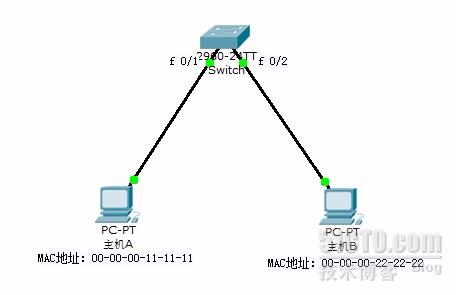
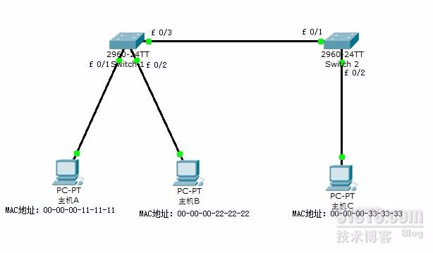
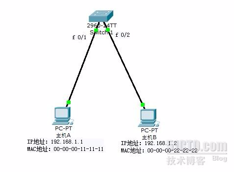
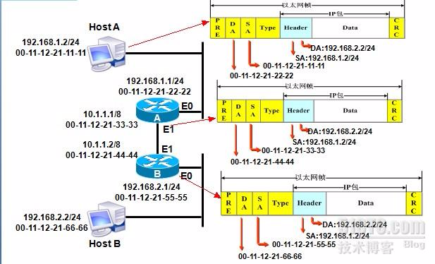
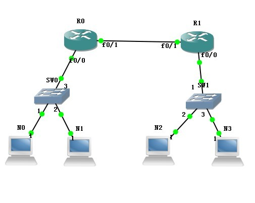

## 目的

本文详细介绍了网络传输过程中3张表：MAC地址表，ARP缓存表和路由表。并且也介绍了数据包在网络传输中从源到目的主机的过程。

<!--more-->

## 表详解

#### MAC地址表详解

说到MAC地址表，就不得不说一下交换机的工作原理了，因为交换机是根据MAC地址表转发数据帧的。在交换机中有一张记录着局域网主机MAC地址与交换机接口的对应关系的表，交换机就是根据这张表负责将数据帧传输到指定的主机上的。

**交换机的工作原理**

交换机在接收到数据帧以后，首先、会记录数据帧中的源MAC地址和对应的接口到MAC表中，接着、会检查自己的MAC表中是否有数据帧中目标MAC地址的信息，如果有则会根据MAC表中记录的对应接口将数据帧发送出去(也就是单播)，如果没有，则会将该数据帧从非接受接口发送出去(也就是广播)。

如下图：详细讲解交换机传输数据帧的过程

　　

1)主机A会将一个源MAC地址为自己，目标MAC地址为主机B的数据帧发送给交换机。

2)交换机收到此数据帧后，首先将数据帧中的源MAC地址和对应的接口(接口为f 0/1) 记录到MAC地址表中。

3)然后交换机会检查自己的MAC地址表中是否有数据帧中的目标MAC地址的信息，如果有，则从MAC地址表中记录的接口发送出去，如果没有，则会将此数据帧从非接收接口的所有接口发送出去(也就是除了f 0/1接口)。

4)这时，局域网的所有主机都会收到此数据帧，但是只有主机B收到此数据帧时会响应这个广播，并回应一个数据帧，此数据帧中包括主机B的MAC地址。

5)当交换机收到主机B回应的数据帧后，也会记录数据帧中的源MAC地址(也就是主机B的MAC地址)，这时，再当主机A和主机B通信时，交换机根据MAC地址表中的记录，实现单播了。

如下图：当局域网存在多个交换机互联的时候，交换机的MAC地址表是怎么记录的呢？

　　

1)主机A将一个源MAC地址为自己，目标MAC地址主机C的数据帧发送给交换机

2)交换机1收到此数据帧后，会学习源MAC地址，并检查MAC地址表，发现没有目标MAC地址的记录，则会将数据帧广播出去，主机B和交换机2都会收到此数据帧。

3)交换机2收到此数据帧后也会将数据帧中的源MAC地址和对应的接口记录到MAC地址表中，并检查自己的MAC地址表，发现没有目标MAC地址的记录，则会广播此数据帧。

4)主机C收到数据帧后，会响应这个数据帧，并回复一个源MAC地址为自己的数据帧，这时交换机1和交换机1都会将主机C的MAC地址记录到自己的MAC地址表中，并且以单播的形式将此数据帧发送给主机A。

5)这时，主机A和主机C通信就是一单播的形式传输数据帧了，主机B和主机C通信如上述过程一样，因此交换机2的MAC地址表中记录着主机A和主机B的MAC地址都对应接口f 0/1。

**总结**：

从上面的两幅图可以看出，交换机具有动态学习源MAC地址的功能，并且交换机的一个接口可以对应多个MAC地址，但是一个MAC地址只能对应一个接口。

注意：交换机动态学习的MAC地址默认只有300S的有效期，如果300S内记录的MAC地址没有通信，则会删除此记录。

------

#### ARP缓存表详解

上面我们讲解了交换机的工作原理，知道交换机是通过MAC地址通信的，但是我们是如何获得目标主机的MAC地址呢？这时我们就需要使用ARP协议了，在每台主机中都有一张ARP表，它记录着主机的IP地址和MAC地址的对应关系。

ARP协议：ARP协议是工作在网络层的协议，它负责将IP地址解析为MAC地址。

如下图：详细讲解ARP的工作原理。

　　

1)如果主机A想发送数据给主机B，主机A首先会检查自己的ARP缓存表，查看是否有主机B的IP地址和MAC地址的对应关系，如果有，则会将主机B的MAC地址作为源MAC地址封装到数据帧中。如果没有，主机A则会发送一个ARP请求信息，请求的目标IP地址是主机B的IP地址，目标MAC地址是MAC地址的广播帧(即FF-FF-FF-FF-FF-FF)，源IP地址和MAC地址是主机A的IP地址和MAC地址。

2)当交换机接受到此数据帧之后，发现此数据帧是广播帧，因此，会将此数据帧从非接收的所有接口发送出去。

3）当主机B接受到此数据帧后，会校对IP地址是否是自己的，并将主机A的IP地址和MAC地址的对应关系记录到自己的ARP缓存表中，同时会发送一个ARP应答，其中包括自己的MAC地址。

4)主机A在收到这个回应的数据帧之后，在自己的ARP缓存表中记录主机B的IP地址和MAC地址的对应关系。而此时交换机已经学习到了主机A和主机B的MAC地址了。

------

#### 路由表详解

路由器负责不同网络之间的通信，它是当今网络中的重要设备，可以说没有路由器就没有当今的互联网。在路由器中也有一张表，这张表叫路由表，记录着到不同网段的信息。路由表中的信息分为直连路由和非直连路由。

直连路由：是直接连接在路由器接口的网段，由路由器自动生成。

非直连路由：就是不是直接连接在路由器接口上的网段，此记录需要手动添加或者是使用动态路由。

路由表中记录的条目有的需要手动添加(称为静态路由)，有的测试动态获取的(称为动态路由)。直连路由属于静态路由。

路由器是工作在网络层的，在网络层可以识别逻辑地址。当路由器的某个接口收到一个包时，路由器会读取包中相应的目标的逻辑地址的网络部分，然后在路由表中进行查找。如果在路由表中找到目标地址的路由条目，则把包转发到路由器的相应接口，如果在路由表中没有找到目标地址的路由条目，那么，如果路由配置默认路由，就科举默认路由的配置转发到路由器的相应接口；如果没有配置默认路由，则将该包丢弃，并返回不可到达的信息。这就是数据路由的过程。

　　如下图：详细介绍路由器的工作原理

　　

1)HostA在网络层将来自上层的报文封装成IP数据包，其中源IP地址为自己，目标IP地址是HostB，HostA会用本机配置的24位子网掩码与目标地址进行“与”运算，得出目标地址与本机不是同一网段，因此发送HostB的数据包需要经过网关路由A的转发。

2)HostA通过ARP请求获取网关路由A的E0口的MAC地址，并在链路层将路由器E0接口的MAC地址封装成目标MAC地址，源MAC地址是自己。

3)路由器A从E0可接收到数据帧，把数据链路层的封装去掉，并检查路由表中是否有目标IP地址网段(即192.168.2.2的网段)相匹配的的项，根据路由表中记录到192.168.2.0网段的数据请发送给下一跳地址10.1.1.2，因此数据在路由器A的E1口重新封装，此时，源MAC地址是路由器A的E1接口的MAC地址，封装的目标MAC地址则是路由器2的E1接口的MAC地址。

4)路由B从E1口接收到数据帧，同样会把数据链路层的封装去掉，对目标IP地址进行检测，并与路由表进行匹配，此时发现目标地址的网段正好是自己E0口的直连网段，路由器B通过ARP广播，获知HostB的MAC地址，此时数据包在路由器B的E0接口再次封装，源MAC地址是路由器B的E0接口的MAC地址，目标MAC地址是HostB的MAC地址。封装完成后直接从路由器的E0接口发送给HostB。

5)此时HostB才会收到来自HostA发送的数据。

**总结**：

路由表负责记录一个网络到另一个网络的路径，因此路由器是根据路由表工作的。

看完上面的文章是不是感觉原来数据在网络中传输是这么的复杂啊！呵呵...其实这些过程都是计算机自己完成的，我们需要做的很少。

## 包传输

 为了便于理解，先从同一广播域内两台主机通信开始叙述吧。只要能理解这些，那也就差不多可以理解跨路由传输过程了（两者不同之处在于源和目标MAC地址的转换）。

#### 情景一：同一广播域内，两台主机通信过程

 

我们知道两主机要通信传送数据时，就要把应用数据封装成IP包（因为我们的网络大多都是TCP/IP的以太网了），然后再交给下一层数据链路层继续封装成帧；之后根据MAC地址才能把数据从一台主机，准确无误的传送到另一台主机。

如图：当NO要和N1通信时，假如N0知道N1的IP但却不知道它的MAC地址，那NO就会发送一个ARP的广播请求（里面源IP是NO 目标IP是N1  源MAC是N0  目标MAC是12个F）给同一广播域中的所有成员，当交换机SW0从自己的1接口上收到这个广播包，然后它会读取这个帧的源MAC地址和目标MAC地址，由于交换机SW0刚启动加电时，它的MAC表为空的。所以它会把NO的MAC地址与之相对应的接口1放到一张表里，这张表就是MAC地址表。然后他再从别的接口广播这个数据帧，当别的主机收到这个广播时，查看目标IP不是自己的，就会丢弃此包。如果N1接收到这个数据帧，它检查目标IP和这个的IP是一样的，就会回应这个ARP请求，把自己的IP和MAC封装成源IP和源MAC，N0的IP和N0的MAC地址为目标IP与目标MAC，并记录NO的MAC与IP，放进自己的ARP缓存表中。此时，这个应答包经过交换机SWO时，它又会检查源MAC 、 目标MAC，把N1的MAC和自己接口2放进MAC地址表中，再查看自己的MAC地址表，发现存在目标MAC与自己的1接口对应（由于刚开始有记录过N0的MAC），那它就会直接把这个应答包从接口1送出去了。主机N0收到这个包后发现目标MAC是自己，就会处理这个包。并把N1的MAC与IP放进自己的ARP缓存表中。这时主机N0就知道N1的MAC地址了，以后要发送数据，就直接把N1的IP与MAC封装进帧中进行点对点的发送了。

#### 情景二：跨路由的数据传输过程

 当NO要和N2通信时，此时NO会检查N2的IP地址跟自己是否处在同一网段，图上得知，两主机肯定不会是同一网段的。因为N2和自己处在不同网段，所以，N0会把数据包发给它的网关，也就是R0上的F0/0接口了。源IP和源MAC地址是N0自己的，目标IP是N2的，目标MAC是R0上接口F0/0的（如果N0不知道F0/0的MAC,就会跟情景一相似，发个ARP广播来得到F0/0的MAC地址）。当这个数据包到达R0时，路由器R0会查看目标IP的是否是自己，由于目标不是自己，所以，会查看自己的路由表，找出到达N2网段的路由；如果没有相关条目，就直接丢弃。当查看路由表后发现到达N2网段的出接口是F0/1。于是，把数据包转到F0/1接口上，再由接口F0/1传给R1。这个过程，数据包的源IP是N0 源MAC是F0/1 目标IP是N2 目标MAC是R1的F0/1接口IP 。

 

当R1收到这个数据包后，同样也要检查包的目标IP是否是自己，它会主动查找自己的路由表，发现目标IP跟自己F0/0接口处在同一网段，于是就把包传到F0/0接口上去发给N2 （假如R1上的ARP缓存表中没有N2的MAC，则接口F0/0会发送一个ARP广播给跟它相连的广播域中；这个ARP广播包的源IP是接口F0/0的IP 源MAC也是F0/0的MAC  目标IP是N2 目标MAC为12个F）,假如N2的MAC地址已经在R1的ARP缓存中了，那就会直接把数据包封装成：源IP为N0 源MAC为R1的F0/0 目标IP为N2 目标MAC为N2了。

 

到了这里，包的跨路由传输就会结束了，当包到达N2，做反向操作即可把包发给N0了。

  

**总结**：

同一广播域中，包的源、目标IP;源、目标MAC是真实的两台主机上的IP与MAC地址。

跨路由中，包的源IP与目标IP始终不会发生变化，源和目标MAC根据所经过的路由接口不同而发生相应变化。