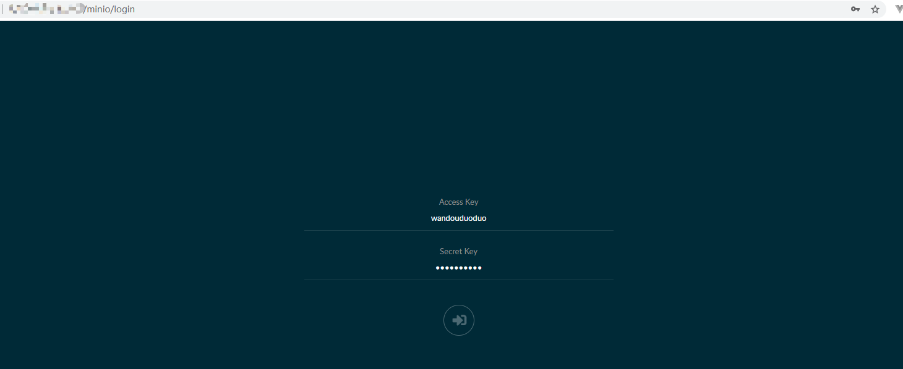
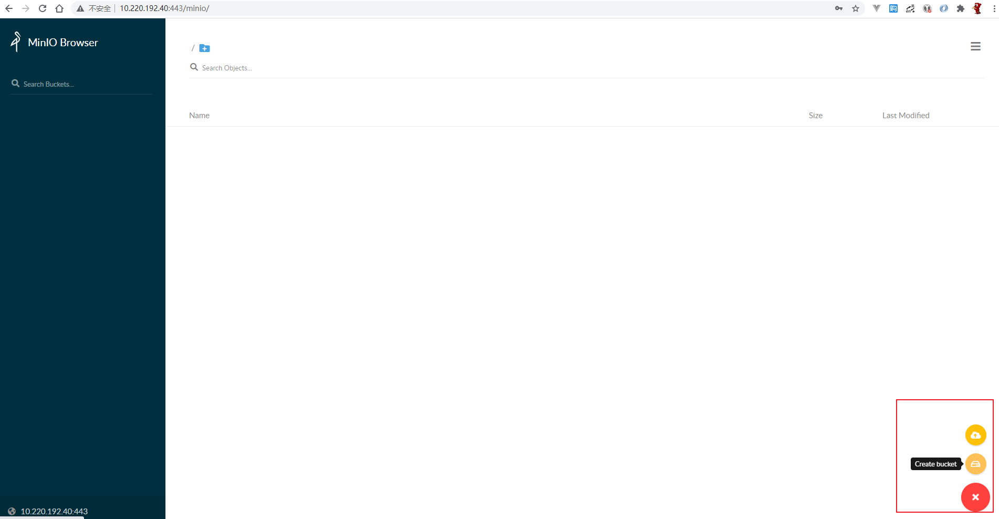

接上篇文章，上篇文章详细介绍了架构和单节点的搭建、配置和优化。本篇详细介绍集群方案。特别提醒没看上篇文章的请返回先看，本篇集群是在上篇文章的基础上配置的，并且上篇文章中的简单步骤，本篇不再说明，直接跳过。详解docker-compose安装sentry集群篇现在开始。


<!--more-->

## 环境

上篇文章中的3个节点，并都已执行完install.sh没有报错。

**主节点**：192.168.1.100

**从节点**：192.168.1.101，192.168.1.102


## 教程

### 规划

#### **任务目标**

Sentry平台三台服务器集群部署

#### **部署方式**

采用docker平台，准确说应该是：docker-compose


#### 主节点

服务端模块：redis、postgres、memcached、stmp、sentry-web、sentry-worker和sentry-corn

功能如下：

```bash
redis  #支持消息队列和任务调度
postgres #数据存储
memcached #kv存储，用于worker数据管理
stmp #邮件服务
sentry-cron #实现定时任务，如定时群发邮件
sentry-worker #处理数据解析等任务，完成异常的分类、入库等操作
sentry-web #网络服务，后台网站和报错接口
```

#### 从节点

剩下2台作为从节点，组件有：sentry-worker、sentry-web和memcached。从节点可以随负载变化动态扩容

### 修改主节点配置

修改主节点配置文件docker-compose.yml，如下：

```text
version: '3.4'

x-defaults: &defaults
  restart: unless-stopped
  build:
    context: .
  depends_on:
    - redis
    - postgres
    - memcached
    - smtp
  env_file: .env
  environment:
    SENTRY_MEMCACHED_HOST: memcached
    SENTRY_REDIS_HOST: redis
    SENTRY_POSTGRES_HOST: postgres
    SENTRY_DB_PASSWORD: postgres
    SENTRY_EMAIL_HOST: smtp
  volumes:
    - sentry-data:/var/lib/sentry/files

services:
  smtp:
    restart: unless-stopped
    image: tianon/exim4
    ports:
      - '192.168.1.100:25:25'

  memcached:
    restart: unless-stopped
    image: memcached:1.5-alpine
    ports:
      - '192.168.1.100:11211:11211'

  redis:
    restart: unless-stopped
    image: redis:3.2-alpine
    ports:
      - '192.168.1.100:6379:6379'

  postgres:
    restart: unless-stopped
    image: postgres:9.5
    ports:
      - '192.168.1.100:5432:5432'
    volumes:
      - sentry-postgres:/var/lib/postgresql/data

  web:
    <<: *defaults
    ports:
      - '9000:9000'
  cron:
    <<: *defaults
    command: run cron

  worker:
    <<: *defaults
    command: run worker
   


volumes:
    sentry-data:
      external: true
    sentry-postgres:
      external: true
```

### 修改从节点配置

修改从节点配置文件docker-compose.yml，配置如下：

```text
version: '3.4'

x-defaults: &defaults
  restart: unless-stopped
  build:
    context: .
  env_file: .env
  environment:
    SENTRY_MEMCACHED_HOST: memcached
    SENTRY_REDIS_HOST: 192.168.1.100
    SENTRY_POSTGRES_HOST: 192.168.1.100
    SENTRY_DB_PASSWORD: postgres
    SENTRY_EMAIL_HOST: 192.168.1.100
  volumes:
    - sentry-data:/var/lib/sentry/files


services:
  web:
    <<: *defaults
    ports:
      - '9000:9000'
  memcached:
    restart: unless-stopped
    image: memcached:1.5-alpine
  worker:
    <<: *defaults
    command: run worker -c 3
volumes:
    sentry-data:
      external: true
```

### 统一存储

集群分布式部署需要一个统一的存储服务，用于sourcemap等文件的存储。采用minio，部署在主节点。

#### 安装

```bash
mkdir -p /opt/minio/{data,config}

docker run -p 6000:9000 --name minio \
    -d --restart=always \
    -e "MINIO_ACCESS_KEY=wandouduoduo" \
    -e "MINIO_SECRET_KEY=wdddxxxx" \
    -v /opt/minio/data:/data \
    -v /opt/minio/config:/root/.minio \
    minio/minio server /data
```

#### 创建bucket

访问minio页面





主从节点的配置文件config.yml添加filestore信息

```text
filestore.backend: 's3'
filestore.options:
  access_key: 'wandouduoduo'
  secret_key: 'wdddxxxx'
  bucket_name: 'sentry'
  endpoint_url: 'http://172.16.1.100:6000'
```

### 启动

启动服务时，可worker数量可根据机器核数进行配置。

#### 主节点启动

启动2个worker和1个web实例

```bash
docker-compose up -d --scale worker=2
```

#### 从节点启动

启动4个worker和一个web实例 

```
docker-compose up -d --scale worker=4
```

*注意：以上配置需要根据服务器和流量的情况调整，以最大化利用机器资源。前端上传sourcemap文件较多时，worker耗费cpu资源会比较厉害*

### 访问

然后负载均衡到所有节点的9000端口，访问即可，到这里集群搭建完成。

*注意：这里做负载均衡时调用策略要用ip  hash方式。如用轮训方式，web页面输入密码，会轮训到下个节点登录不了。*


## 总结

sentry集群方案已全部搭建完成，当然该集群还可以优化，例如redis独立集群等等。