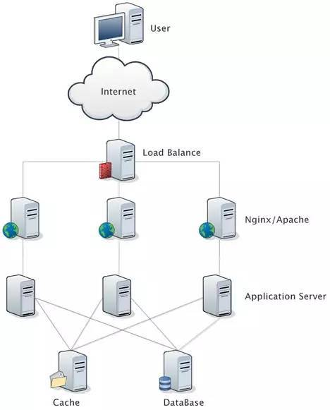
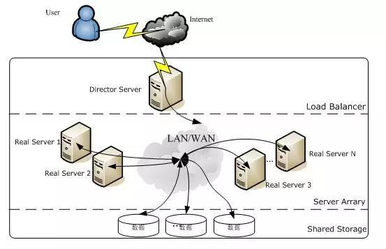
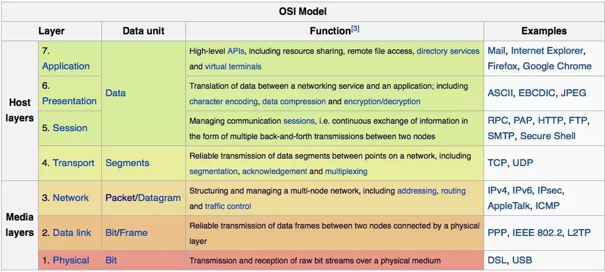
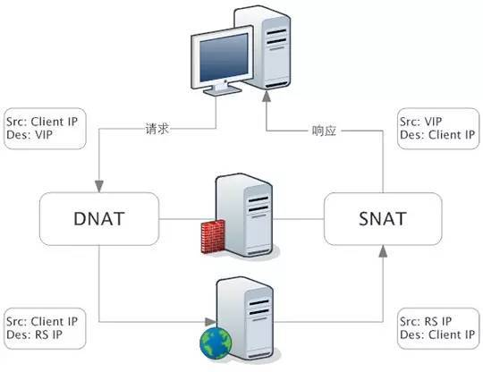
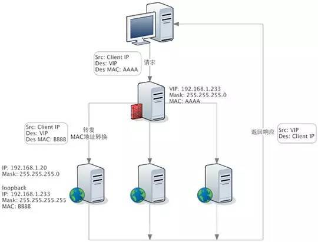
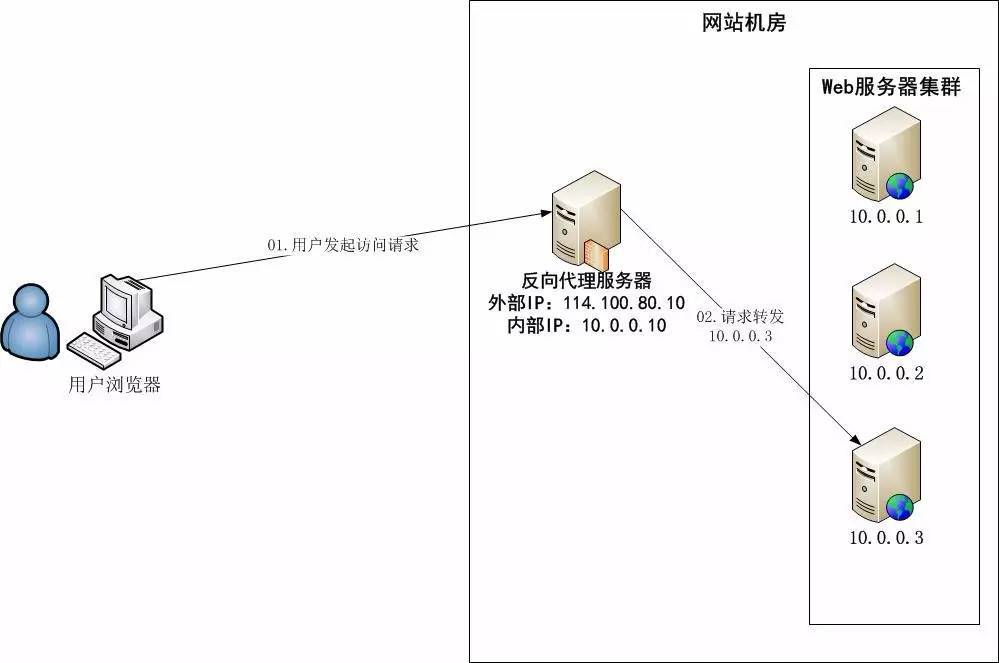
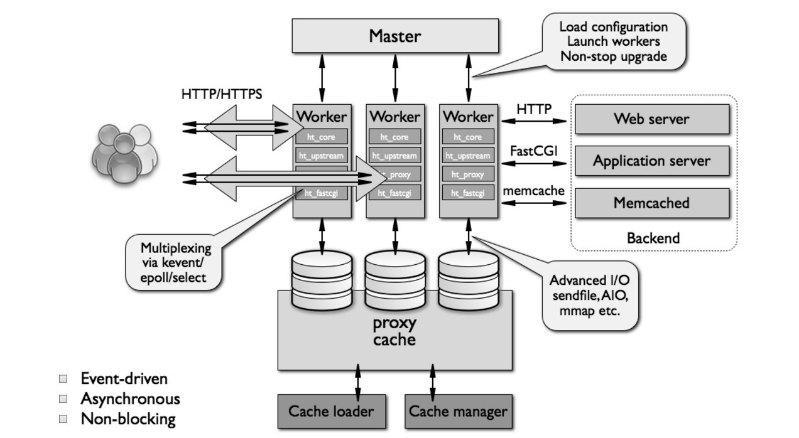
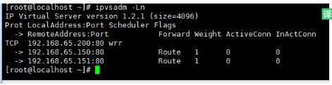
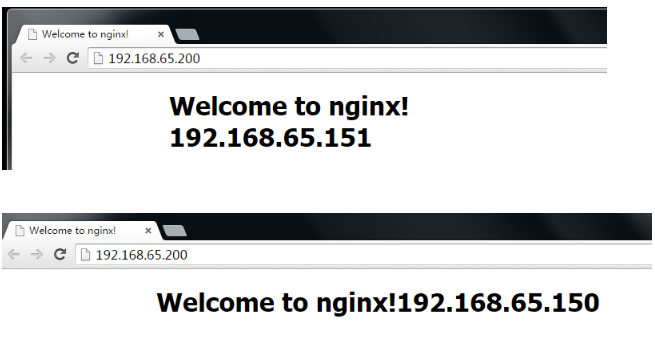
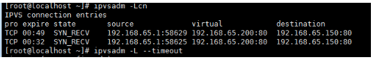

## 目的

负载均衡器分为硬件和软件。硬件如F5等，但是像F5这些设备费用高昂，不是每个公司都有财力用的。而软件业界用的最多的就是lvs，haproxy和nginx，而负载能力最强的就是lvs。本文详细介绍了lvs的安装部署。



在实际应用中，在 Web 服务器集群之前总会有一台负载均衡服务器，负载均衡设备的任务就是作为 Web 服务器流量的入口，挑选最合适的一台 Web 服务器，将客户端的请求转发给它处理，实现客户端到真实服务端的透明转发。

最近几年很火的「云计算」以及分布式架构，本质上也是将后端服务器作为计算资源、存储资源，由某台管理服务器封装成一个服务对外提供，客户端不需要关心真正提供服务的是哪台机器，在它看来，就好像它面对的是一台拥有近乎无限能力的服务器，而本质上，真正提供服务的，是后端的集群。

<!--more-->

## 环境

环境如下:centos6.5
Lvs主调度器：192.168.65.128 vip:192.168.65.200
真实服务器：192.168.65.150 vip:192.168.65.200
真实服务器：192.168.65.151 vip:192.168.65.200
特别注意的是:虚拟地址由keepalived提供

## 优劣势分析

LVS、Nginx、HAProxy 是目前使用最广泛的三种软件负载均衡软件。

一般对负载均衡的使用是随着网站规模的提升根据不同的阶段来使用不同的技术。具体的应用需求还得具体分析，如果是中小型的 Web 应用，比如日 PV 小于1000万，用 Nginx 就完全可以了；如果机器不少，可以用 DNS 轮询，LVS 所耗费的机器还是比较多的；大型网站或重要的服务，且服务器比较多时，可以考虑用 LVS。

目前关于网站架构一般比较合理流行的架构方案：Web 前端采用 Nginx/HAProxy+Keepalived 作负载均衡器；后端采用 MySQ L数据库一主多从和读写分离，采用 LVS+Keepalived 的架构。

### **LVS**

LVS 是 Linux Virtual Server 的简称，也就是 Linux 虚拟服务器。现在 LVS 已经是 Linux 标准内核的一部分，从 Linux2.4 内核以后，已经完全内置了 LVS 的各个功能模块，无需给内核打任何补丁，可以直接使用 LVS 提供的各种功能。

LVS 自从1998年开始，发展到现在已经是一个比较成熟的技术项目了。

**LVS 的体系结构**



LVS 架设的服务器集群系统有三个部分组成：

1. 最前端的负载均衡层，用 Load Balancer 表示
2. 中间的服务器集群层，用 Server Array 表示
3. 最底端的数据共享存储层，用 Shared Storage 表示

**LVS 负载均衡机制**

LVS 是四层负载均衡，也就是说建立在 OSI 模型的第四层——传输层之上，传输层上有我们熟悉的 TCP/UDP，LVS 支持 TCP/UDP 的负载均衡。因为 LVS 是四层负载均衡，因此它相对于其它高层负载均衡的解决办法，比如 DNS 域名轮流解析、应用层负载的调度、客户端的调度等，它的效率是非常高的。

所谓四层负载均衡 ，也就是主要通过报文中的目标地址和端口。七层负载均衡 ，也称为“内容交换”，也就是主要通过报文中的真正有意义的应用层内容。



LVS 的转发主要通过修改 IP 地址（NAT 模式，分为源地址修改 SNAT 和目标地址修改 DNAT）、修改目标 MAC（DR 模式）来实现。

**NAT 模式：网络地址转换**

NAT（Network Address Translation）是一种外网和内网地址映射的技术。

NAT 模式下，网络数据报的进出都要经过 LVS 的处理。LVS 需要作为 RS（真实服务器）的网关。

当包到达 LVS 时，LVS 做目标地址转换（DNAT），将目标 IP 改为 RS 的 IP。RS 接收到包以后，仿佛是客户端直接发给它的一样。RS 处理完，返回响应时，源 IP 是 RS IP，目标 IP 是客户端的 IP。这时 RS 的包通过网关（LVS）中转，LVS 会做源地址转换（SNAT），将包的源地址改为 VIP，这样，这个包对客户端看起来就仿佛是 LVS 直接返回给它的。



**DR 模式：直接路由**

DR 模式下需要 LVS 和 RS 集群绑定同一个 VIP（RS 通过将 VIP 绑定在 loopback 实现），但与 NAT 的不同点在于：请求由 LVS 接受，由真实提供服务的服务器（RealServer，RS）直接返回给用户，返回的时候不经过 LVS。

详细来看，一个请求过来时，LVS 只需要将网络帧的 MAC 地址修改为某一台 RS 的 MAC，该包就会被转发到相应的 RS 处理，注意此时的源 IP 和目标 IP 都没变，LVS 只是做了一下移花接木。RS 收到 LVS 转发来的包时，链路层发现 MAC 是自己的，到上面的网络层，发现 IP 也是自己的，于是这个包被合法地接受，RS 感知不到前面有 LVS 的存在。而当 RS 返回响应时，只要直接向源 IP（即用户的 IP）返回即可，不再经过 LVS。



DR 负载均衡模式数据分发过程中不修改 IP 地址，只修改 mac 地址，由于实际处理请求的真实物理 IP 地址和数据请求目的 IP 地址一致，所以不需要通过负载均衡服务器进行地址转换，可将响应数据包直接返回给用户浏览器，避免负载均衡服务器网卡带宽成为瓶颈。因此，DR 模式具有较好的性能，也是目前大型网站使用最广泛的一种负载均衡手段。

**LVS 的优点**

- 抗负载能力强、是工作在传输层上仅作分发之用，没有流量的产生，这个特点也决定了它在负载均衡软件里的性能最强的，对内存和 cpu 资源消耗比较低。
- 配置性比较低，这是一个缺点也是一个优点，因为没有可太多配置的东西，所以并不需要太多接触，大大减少了人为出错的几率。
- 工作稳定，因为其本身抗负载能力很强，自身有完整的双机热备方案，如 LVS+Keepalived。
- 无流量，LVS 只分发请求，而流量并不从它本身出去，这点保证了均衡器 IO 的性能不会受到大流量的影响。
- 应用范围比较广，因为 LVS 工作在传输层，所以它几乎可以对所有应用做负载均衡，包括 http、数据库、在线聊天室等等。

**LVS 的缺点**

- 软件本身不支持正则表达式处理，不能做动静分离；而现在许多网站在这方面都有较强的需求，这个是 Nginx、HAProxy+Keepalived 的优势所在。
- 如果是网站应用比较庞大的话，LVS/DR+Keepalived 实施起来就比较复杂了，相对而言，Nginx/HAProxy+Keepalived就简单多了。

### **Nginx**

Nginx 是一个强大的 Web 服务器软件，用于处理高并发的 HTTP 请求和作为反向代理服务器做负载均衡。具有高性能、轻量级、内存消耗少，强大的负载均衡能力等优势。



**Nignx 的架构设计**

相对于传统基于进程或线程的模型（Apache就采用这种模型）在处理并发连接时会为每一个连接建立一个单独的进程或线程，且在网络或者输入/输出操作时阻塞。这将导致内存和 CPU 的大量消耗，因为新起一个单独的进程或线程需要准备新的运行时环境，包括堆和栈内存的分配，以及新的执行上下文，当然，这些也会导致多余的 CPU 开销。最终，会由于过多的上下文切换而导致服务器性能变差。

反过来，Nginx 的架构设计是采用模块化的、基于事件驱动、异步、单线程且非阻塞。

Nginx 大量使用多路复用和事件通知，Nginx 启动以后，会在系统中以 daemon 的方式在后台运行，其中包括一个 master 进程，n(n>=1) 个 worker 进程。所有的进程都是单线程（即只有一个主线程）的，且进程间通信主要使用共享内存的方式。

其中，master 进程用于接收来自外界的信号，并给 worker 进程发送信号，同时监控 worker 进程的工作状态。worker 进程则是外部请求真正的处理者，每个 worker 请求相互独立且平等的竞争来自客户端的请求。请求只能在一个 worker 进程中被处理，且一个 worker 进程只有一个主线程，所以同时只能处理一个请求。（原理同 Netty 很像）



**Nginx 负载均衡**

Nginx 负载均衡主要是对七层网络通信模型中的第七层应用层上的 http、https 进行支持。

Nginx 是以反向代理的方式进行负载均衡的。反向代理（Reverse Proxy）方式是指以代理服务器来接受 Internet 上的连接请求，然后将请求转发给内部网络上的服务器，并将从服务器上得到的结果返回给 Internet 上请求连接的客户端，此时代理服务器对外就表现为一个服务器。

Nginx 实现负载均衡的分配策略有很多，Nginx 的 upstream 目前支持以下几种方式：

- 轮询（默认）：每个请求按时间顺序逐一分配到不同的后端服务器，如果后端服务器 down 掉，能自动剔除。
- weight：指定轮询几率，weight 和访问比率成正比，用于后端服务器性能不均的情况。
- ip_hash：每个请求按访问 ip 的 hash 结果分配，这样每个访客固定访问一个后端服务器，可以解决 session 的问题。
- fair（第三方）：按后端服务器的响应时间来分配请求，响应时间短的优先分配。
- url_hash（第三方）：按访问 url 的 hash 结果来分配请求，使每个 url 定向到同一个后端服务器，后端服务器为缓存时比较有效。

**Nginx 的优点**

- 跨平台：Nginx 可以在大多数 Unix like OS编译运行，而且也有 Windows 的移植版本
- 配置异常简单：非常容易上手。配置风格跟程序开发一样，神一般的配置
- 非阻塞、高并发连接：官方测试能够支撑5万并发连接，在实际生产环境中跑到2～3万并发连接数
- 事件驱动：通信机制采用 epoll 模型，支持更大的并发连接
- Master/Worker 结构：一个 master 进程，生成一个或多个 worker 进程
- 内存消耗小：处理大并发的请求内存消耗非常小。在3万并发连接下，开启的10个 Nginx 进程才消耗150M 内存（15M*10=150M）
- 内置的健康检查功能：如果 Nginx 代理的后端的某台 Web 服务器宕机了，不会影响前端访问
- 节省带宽：支持 GZIP 压缩，可以添加浏览器本地缓存的 Header 头
- 稳定性高：用于反向代理，宕机的概率微乎其微

**Nginx 的缺点**

- Nginx 仅能支 持http、https 和 Email 协议，这样就在适用范围上面小些，这个是它的缺点
- 对后端服务器的健康检查，只支持通过端口来检测，不支持通过 ur l来检测。不支持 Session 的直接保持，但能通过 ip_hash 来解决

### **HAProxy**

HAProxy 的优点能够补充 Nginx 的一些缺点，比如支持 Session 的保持，Cookie 的引导；同时支持通过获取指定的 url 来检测后端服务器的状态。

HAProxy 跟 LVS 类似，本身就只是一款负载均衡软件；单纯从效率上来讲 HAProxy 会比 Nginx 有更出色的负载均衡速度，在并发处理上也是优于 Nginx 的。

HAProxy 支持 TCP 协议的负载均衡转发，可以对 MySQL 读进行负载均衡，对后端的 MySQL 节点进行检测和负载均衡，大家可以用 LVS+Keepalived 对 MySQL 主从做负载均衡。

HAProxy 负载均衡策略非常多：Round-robin（轮循）、Weight-round-robin（带权轮循）、source（原地址保持）、RI（请求URL）、rdp-cookie（根据cookie）。

## 部署

### 准备

修改系统内核文件

```
vim /etc/sysctl.conf 修改默认值0为1，开启内核路由转发模式

net.ipv4.ip_forward = 1
```

### **源码安装**

```bash
yum install ipvsadm*
wget http://www.linuxvirtualserver.org/software/kernel-2.6/ipvsadm-1.26.tar.gz
tar -zxvf ipvsadm-1.26.tar.gz
make && make install
```

### 配置

```bash
#添加虚拟IP地址，wrr表示给予权重的轮询。rr表示轮询
ipvsadm -A -t 192.168.65.200:80 -s wrr
#制定后台和轮询的IP地址分别是150和151这两台机器 -g表示路由模式，-w表示权重
ipvsadm -a -t 192.168.65.200:80 -r 192.168.65.150:80 -g -w 5
ipvsadm -a -t 192.168.65.200:80 -r 192.168.65.151:80 -g -w 5
service ipvsadm save

#编辑lvs的配置文件
vim /etc/sysconfig/ipvsadm
-A -t 192.168.65.200:80 -s wrr
-a -t 192.168.65.200:80 -r 192.168.65.150:80 -g -w 5
-a -t 192.168.65.200:80 -r 192.168.65.151:80 -g -w 5

#开机启动脚本 
vim/etc/init.d/ipvsadm

 #!/bin/bash
#
# Startup script handle the initialisation of LVS
# chkconfig: - 28 72
# description: Initialise the Linux Virtual Server
# config: /etc/sysconfig/ipvsadm
#
### BEGIN INIT INFO
# Provides: ipvsadm
# Required-Start: $local_fs $network $named
# Required-Stop: $local_fs $remote_fs $network
# Short-Description: Initialise the Linux Virtual Server
# Description: The Linux Virtual Server is a highly scalable and highly
#   available server built on a cluster of real servers, with the load
#   balancer running on Linux.
### END INIT INFO

# Source function library
. /etc/rc.d/init.d/functions

IPVSADM=ipvsadm
IPVSADMRESTORE=${IPVSADM}-restore
IPVSADMSAVE=${IPVSADM}-save
# Saved IPVS data
IPVSADM_DATA=/etc/sysconfig/$IPVSADM
# Configuration
IPVSADM_CONFIG=/etc/sysconfig/${IPVSADM}-config
IPVS=ip_vs
PROC_IPVS=/proc/net/$IPVS
VAR_SUBSYS_IPVSADM=/var/lock/subsys/$IPVSADM

if [ ! -x /sbin/$IPVSADM ]; then
    echo -n $"${IPVSADM}: /sbin/$IPVSADM does not exist."; warning; echo
    exit 5
fi

# Old or new modutils
/sbin/modprobe --version 2>&1 | grep -q module-init-tools \
    && NEW_MODUTILS=1 \
    || NEW_MODUTILS=0

# Default IPVSADM configuration:
IPVS_MODULES_UNLOAD="yes"
IPVS_SAVE_ON_STOP="no"
IPVS_SAVE_ON_RESTART="no"
IPVS_STATUS_NUMERIC="yes"

# Load IPVSADM configuration.
[ -f "$IPVSADM_CONFIG" ] && . "$IPVSADM_CONFIG"

rmmod_r() {
    # Unload module with all referring modules.
    # At first all referring modules will be unloaded, then the module itself.
    local mod=$1
    local ret=0
    local ref=

    # Get referring modules.
    # New modutils have another output format.
    [ $NEW_MODUTILS = 1 ] \
        && ref=$(lsmod | awk "/^${mod}[[:space:]]/ { print \$4; }" | tr ',' ' ') \
        || ref=$(lsmod | grep ^${mod} | cut -d "[" -s -f 2 | cut -d "]" -s -f 1)

    # recursive call for all referring modules
    for i in $ref; do
        rmmod_r $i
        let ret+=$?;
    done

    # Unload module.
    # The extra test is for 2.6: The module might have autocleaned,
    # after all referring modules are unloaded.
    if grep -q "^${mod}" /proc/modules ; then
        modprobe -r $mod > /dev/null 2>&1
        res=$?
        [ $res -eq 0 ] || echo -n " $mod"
        let ret+=$res;
    fi

    return $ret
}

start() {
    # Do not start if there is no config file.
    [ ! -f "$IPVSADM_DATA" ] && return 6

    # check if ipvs module load is deactivated
    if grep -qIsE "^install[[:space:]]+${IPVS}[[:space:]]+/bin/(true|false)" /etc/modprobe.conf /etc/modprobe.d/* ; then
        echo $"${IPVSADM}: ${IPVS} is disabled."
        return 150
    fi

    # If we don't clear these first, we might be adding to pre-existing rules.
    action $"${IPVSADM}: Clearing the current IPVS table:" $IPVSADM -C

    echo -n $"${IPVSADM}: Applying IPVS configuration: "
    $IPVSADMRESTORE < ${IPVSADM_DATA}
    if [ $? -eq 0 ];then success; echo; else failure; echo; return 1;fi

    touch $VAR_SUBSYS_IPVSADM
}

stop() {
    # Do not stop if ipvs module is not loaded.
    [ ! -e "$PROC_IPVS" ] && return 0

    action $"${IPVSADM}: Clearing the current IPVS table:" $IPVSADM -C

    ret=0

    if [ "x$IPVS_MODULES_UNLOAD" = "xyes" ]; then
        action $"${IPVSADM}: Unloading modules:" rmmod_r $IPVS
        [ $? -ne 0 ] && ret=1
    fi

    rm -f $VAR_SUBSYS_IPVSADM

    return $ret
}

status() {
    # Do not print status if lockfile is missing and ipvs modules are not
    # loaded.
    if [ ! -f "$VAR_SUBSYS_IPVSADM" -a ! -e "$PROC_IPVS" ]; then
        echo $"${IPVSADM}: IPVS is not running."
        return 3
    fi

    # Do show status if ipvs module is not loaded.
    if [ ! -e "$PROC_IPVS" ];then
        echo $"${IPVSADM}: IPVS module is not loaded."
        return 3
    fi

    NUM=""
    [ "x$IPVS_STATUS_NUMERIC" = "xyes" ] && NUM="-n"

    $IPVSADM -L $NUM && echo
}

save() {
    # Check if module is loaded
    [ ! -e "$PROC_IPVS" ] && return 0

    echo -n $"${IPVSADM}: Saving IPVS table to ${IPVSADM_DATA}: "
    $IPVSADMSAVE -n > ${IPVSADM_DATA} 2>/dev/null
    if [ $? -eq 0 ];then success; echo; else failure; echo; return 1;fi

    return 0
}

restart() {
    [ "x$IPVS_SAVE_ON_RESTART" = "xyes" ] && save
    stop
    start
}

# See how we were called.
case "$1" in
    start)
        [ -f "$VAR_SUBSYS_IPVSADM" ] && exit 0

        # If we have no configuration, save the current one
        [ -f ${IPVSADM_DATA} ] || save
        start
        RETVAL=$?
        ;;
    stop)
        [ "x$IPVS_SAVE_ON_STOP" = "xyes" ] && save
        stop
        RETVAL=$?
        ;;
    restart|force-reload)
        restart
        RETVAL=$?
        ;;
    reload)
        # Start will flush everything, so it counts as a reload
        start
        RETVAL=$?
        ;;
    status)
        status
        RETVAL=$?
        ;;
    save)
        save
        RETVAL=$?
        ;;
    *)
        echo "Usage: $0 {start|stop|restart|force-reload|reload|status|save}"
        RETVAL=2
esac

exit $RETVA
```

**配置real server服务器**

```
service iptables stop
iptables -F
vim /etc/sysctl.conf 在文件的末尾添加如下内容
net.ipv4.conf.lo.arp_ignore = 1
net.ipv4.conf.all.arp_ignore = 1
net.ipv4.conf.lo.arp_announce = 2
net.ipv4.conf.all.arp_announce = 2
立即生效配置，禁止arp相应的请求
sysctl -p

设置虚拟网卡，添加如下内容
vim /etc/sysconfig/network-scripts/ifcfg-lo:0
DEVICE=lo:0
BOOTPROTO=static
IPADDR=192.168.65.200
NETMASK=255.255.255.255
ONBOOT=yes

添加路由: route add -host 192.168.65.200 dev lo:0

在lvs调度器查看
ipvsadm -Ln
```



查看你当前ipvsadm的轮询时间，为了使实验有比较好的效果，设置时间为1秒，可以查看转换效果
查看当前的的轮询时间
ipvsadm -L –timeout
设置时间为1秒
ipvsadm –set 1 1 1

在浏览器查看并且过一秒刷新页面地址变化则说明lvs轮询成功


刷新页面之后。可以目前的当前链接的后端服务器轮询

ipvsadm -Lcn



## ipvsadm命令

```bash
ipvsadm是LVS在应用层的管理命令，我们可以通过这个命令去管理LVS的配置。在笔者使用的fedora14系统中，已经集成了LVS相关模块，但是ipvsadm命令仍然需要使用yum单独安装。
 
参数：

-A --add-service      在内核的虚拟服务器表中添加一条新的虚拟服务器记录。也就是增加一台新的虚拟服务器。 
-E --edit-service     编辑内核虚拟服务器表中的一条虚拟服务器记录。 
-D --delete-service   删除内核虚拟服务器表中的一条虚拟服务器记录。 
-C --clear           清除内核虚拟服务器表中的所有记录。 
-R --restore         恢复虚拟服务器规则 
-S --save            保存虚拟服务器规则，输出为-R 选项可读的格式 
-a --add-server      在内核虚拟服务器表的一条记录里添加一条新的真实服务器记录。也就是在一个虚拟服务器中增加一台新的真实服务器 
-e --edit-server     编辑一条虚拟服务器记录中的某条真实服务器记录 
-d --delete-server   删除一条虚拟服务器记录中的某条真实服务器记录 
-L|-l --list         显示内核虚拟服务器表 
-Z --zero            虚拟服务表计数器清零（清空当前的连接数量等） 
--set tcp tcpfin udp 设置连接超时值 
--start-daemon       启动同步守护进程。他后面可以是master 或backup，用来说明LVS Router 是aster 或是backup。在这个功能上也可以采用keepalived 的VRRP 功能。 
--stop-daemon        停止同步守护进程 
-h --help            显示帮助信息 

其他的选项: 

-t --tcp-service service-address     说明虚拟服务器提供的是tcp 的服务[vip:port] or [real-server-ip:port] 
-u --udp-service service-address     说明虚拟服务器提供的是udp 的服务[vip:port] or [real-server-ip:port] 
-f --fwmark-service fwmark           说明是经过iptables 标记过的服务类型。 
-s --scheduler scheduler             使用的调度算法，有这样几个选项rr|wrr|lc|wlc|lblc|lblcr|dh|sh|sed|nq,默认的调度算法是： wlc. 
-p --persistent [timeout]            持久稳固的服务。这个选项的意思是来自同一个客户的多次请求，将被同一台真实的服务器处理。timeout 的默认值为300 秒。 
-M --netmask                         指定客户地址的子网掩码
-r --real-server server-address      真实的服务器[Real-Server:port] 
-g --gatewaying                      指定LVS 的工作模式为直接路由模式（也是LVS 默认的模式） 
-i --ipip                            指定LVS 的工作模式为隧道模式 
-m --masquerading                    指定LVS 的工作模式为NAT 模式 
-w --weight weight                   真实服务器的权值 
--mcast-interface interface          指定组播的同步接口 
-c --connection                      显示LVS目前的连接 如：ipvsadm -L -c 
   --timeout                         显示tcp tcpfin udp 的timeout 值 如：ipvsadm -L --timeout 
   --daemon                          显示同步守护进程状态 
   --stats                           显示统计信息 
   --rate                            显示速率信息 
   --sort                            对虚拟服务器和真实服务器排序输出 
   --numeric -n                      输出IP 地址和端口的数字形式 
-6：                                 如果fwmark用的是ipv6地址需要指定此选项。  

例1：
ipvsadm -A -t 192.168.10.10:80 -s rr -p 600 	#添加地址为192.168.10.10:80的虚拟服务，指定调度算法为轮转
ipvsadm -a -t 192.168.10.10:80 -r 192.168.10.1:80 -g 	#添加真实服务器，指定传输模式为DR
ipvsadm -a -t 192.168.10.10:80 -r 192.168.10.2:80 -m 	#添加真实服务器，指定传输模式为NAT

#以下表示在内核的虚拟服务器列表中又添加了一条192.168.60.188的虚拟服务器，此虚拟服务器的服务端口为21，即FTP服务。使用的调度策略为wlc，即加权最少链接算法。
ipvsadm -A -t 192.168.10.188:21 -s wlc 	

#规则导出导入
ipvsadm-save > ipvs.txt  (其中ipvs.txt保存的是你的配置) 
ipvsadm-restore < ipvs.txt  (将配置导入)

#规则恢复
ipvsadm -R < /root/xxx.rule

#查看规则
ipvsadm -Ln 
TCP  192.168.11.100:80 wrr
  -> 192.168.11.12:80             Route   3      0          0
  -> 192.168.11.13:80             Route   3      0          0

ipvsadm -d -t 192.168.11.100:80 -r 192.168.11.12:80   #删除一条真实服务器记录
```


## 排错

报错：collect2: ld returned 1 exit status
make: * [ipvsadm] Error 1
yum install install kernel-headers popt-static


报错：unexpected argument 192.168.65.130:80
使用上面ipvsad的脚本，添加/etc/sysconfig/ipvsadm
里面的规则，重启ipvsadm服务


报错：
eloading ipvsadm configuration (via systemctl): Failed to issue method call: Job type reload is not applicable for unit ipvsadm.service.
解决办法
添加：/sys/fs/cgroup/systemd/system.slice/ipvsadm.service
