### 简介


Nexus 是Maven仓库管理器，如果你使用Maven，你可以从Maven中央仓库 下载所需要的构件（artifact），但这通常不是一个好的做法，你应该在本地架设一个Maven仓库服务器，在代理远程仓库的同时维护本地仓库，以节省带宽和时间，Nexus就可以满足这样的需要。此外，他还提供了强大的仓库管理功能，构件搜索功能，它基于REST，友好的UI是一个extjs的REST客户端，它占用较少的内存，基于简单文件系统而非数据库。这些优点使其日趋成为最流行的Maven仓库管理器。


<!--more-->

## 环境

操作系统：Linux（以CentOS为例）


## 安装

### 下载

从[官方地址](http://www.sonatype.org/nexus/)下载

### 配置 

将压缩包解压到/usr目录下。

nexus里面有2个文件夹，第一个是核心文件，第二个用来存储下载下来的jar，如下图 
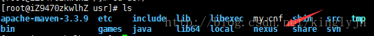
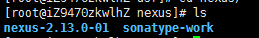

**修改端口**

进入nexus/nexubs-2.13.0-01/conf目录下，编辑nexus.properties文件

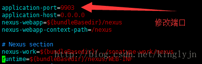

### 启动

进入nexus/nexubs-2.13.0-01/bin目录 
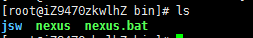
运行命令：./nexus 

//可以查看有那些运行命令 
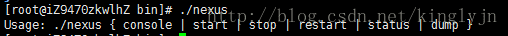
运行命令：./nexus start 

//启动nexus 
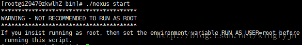
*注意：可能会报错，报上面错误时：需要修改运行的用户*

修改运行文件 nexus，将RUN_AS_USER修改为root； 
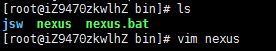

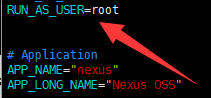 
保存之后，再次启动nexus
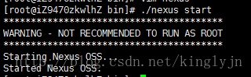

### 验证

查看nexus 控制台，命令：./nexus console 
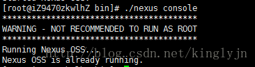

## 优化

设置nexus为Linux系统的服务，并开机自动启动

1. 复制$NEXUS_HOME/bin/jsw/linux-x86-64/nexus 到/etc/init.d/nexus

2. 授于nexus脚本有可执行的权限：

```bash
`    ``chmod` `755 ``/etc/init``.d``/nexus`
```

3. 修改nexus文件，配置以下参数：

​      a) 修改NEXUS_HOME 绝对路径，如：NEXUS_HOME="/usr/local/nexus"

​      b) 设置RUN_AS_USER=nexus，或都其它的用户，前提是创建了此用户。

```
`        ``NEXUS_HOME=``/usr/local/nexus` `        ``PLATFORM=linux-x86-64` `        ``PLATFORM_DIR=``"${NEXUS_HOME}/bin/jsw/${PLATFORM}"` `        ``WRAPPER_CMD=``"${PLATFORM_DIR}/wrapper"` `        ``WRAPPER_CONF=``"${PLATFORM_DIR}/../conf/wrapper.conf"` `        ``PIDDIR=``"${NEXUS_HOME}"`
```

4. Red Hat, Fedora, CentOS增加nexus服务：       

```bash
`    ``cd` `/etc/init``.d` `        ``chkconfig --add nexus` `        ``chkconfig --levels 345 nexus on` `        ``service nexus start` `        ``tail` `-f ``/usr/local/nexus/logs/wrapper``.log`
```

Ubuntu and Debian增加nexus服务        

```bash
`    ``cd` `/etc/init``.d` `        ``update-rc.d nexus defaults` `        ``chkconfig --levels 345 nexus on` `        ``service nexus start` `        ``tail` `-f ``/usr/local/nexus/logs/wrapper``.log`
```

配置完成后，在浏览器进行访问。地址：[http://ip](http://ip/):端口/nexus 

*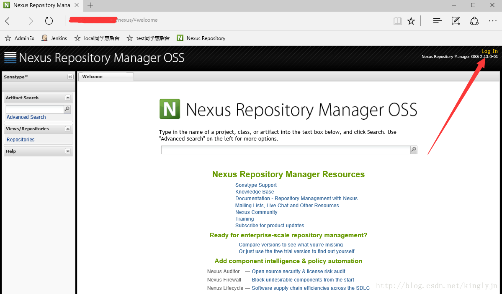在网页上的右上角进行登录，默认用户名：admin，密码：admin123* 

## 使用

常用功能：
Nexus常用功能就是：指定私服的中央地址、将自己的Maven项目指定到私服地址、从私服下载中央库的项目索引、从私服仓库下载依赖组件、将第三方项目jar上传到私服供其他项目组使用。 
开启Nexus服务后访问url地址http://localhost:8081/nexus/(推荐使用自己的ip地址)，之后登录系统，用户名密码分别是：admin/admin123. 
最频繁的就是点击左侧菜单栏的Repositories按钮 
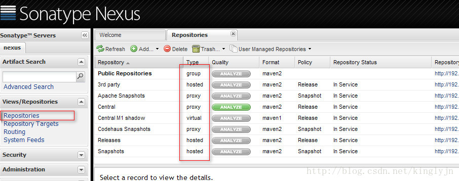
一般用到的仓库种类是hosted、proxy。Hosted代表宿主仓库，用来发布一些第三方不允许的组件，比如Oracle驱动、比如商业软件jar包。Proxy代表代理远程的仓库，最典型的就是Maven官方中央仓库、JBoss仓库等等。如果构建的Maven项目本地仓库没有依赖包，那么就会去这个代理站点去下载，那么如果代理站点也没有此依赖包，就回去远程中央仓库下载依赖，这些中央仓库就是proxy。代理站点下载成功后再下载至本机。笔者认为，其实Maven这个自带的默认仓库一般情况下已经够大多数项目使用了。特殊情况时在配置新的仓库，指定url即可，一般熟悉ExtJS的人操作这个Nexus都没什么问题，单词不是很难，不明白的查查单词基本差不多。就是如果Sonatype公司对其做了国际化的处理就更好了。

- hosted 类型的仓库，内部项目的发布仓库
- releases内部的模块中release模块的发布仓库
- snapshots发布内部的SNAPSHOT模块的仓库
- 3rd party第三方依赖的仓库，这个数据通常是由内部人员自行下载之后发布上去
- proxy 类型的仓库，从远程中央仓库中寻找数据的仓库
- group 类型的仓库，组仓库用来方便我们开发人员进行设置的仓库

maven项目索引 
下载Maven项目索引，项目索引是为了使用者能够在私服站点查找依赖使用的功能 
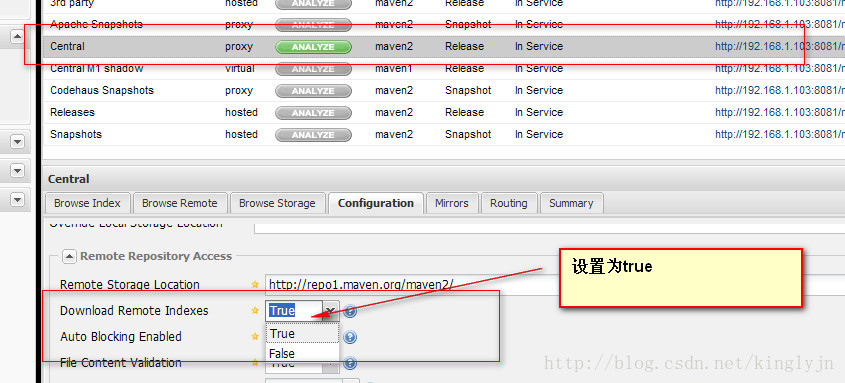
保存后后台会运行一个任务，点击菜单栏的Scheduled Tasks选项即可看到有个任务在RUNNING。 下载完成后，Maven索引就可以使用了，在搜索栏输入要搜索的项，就可以查到相关的信息。例如spring-core 
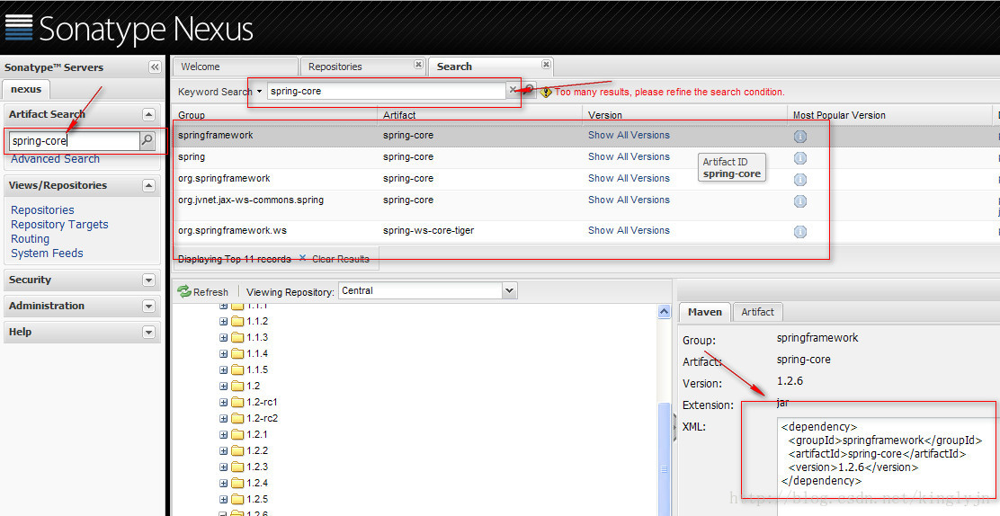
就可以检索出它的相关信息，包括怎么配置依赖信息。我们要想使用这个私服仓库，先在项目pom中配置相关私服信息指定仓库

```xml
<repositories>  
    <repository>  
        <id>nexus</id>  
        <name>nexus</name>             <url>http://xxx:8081/nexus/content/groups/public/</url>  
        <releases>  
            <enabled>true</enabled>  
        </releases>  
        <snapshots>  
            <enabled>true</enabled>  
        </snapshots>  
    </repository>  
</repositories> 
```

指定插件仓库

```xml
<pluginRepositories>  
    <pluginRepository>  
        <id>nexus</id>  
        <name>nexus</name>        <url>http://192.168.1.103:8081/nexus/content/groups/public/</url>  
        <releases>  
            <enabled>true</enabled>  
        </releases>  
        <snapshots>  
            <enabled>true</enabled>  
        </snapshots>  
    </pluginRepository>  
</pluginRepositories> 
```

这样只有本项目才在私服下载组件 
这样这个Maven项目构建的时候会从私服下载相关依赖。当然这个配置仅仅是在此项目中生效，对于其他项目还是不起作用。如果相对Maven的其他项目也生效的话。需要修改全局的settings.xml文件。

修改settings.xml为 
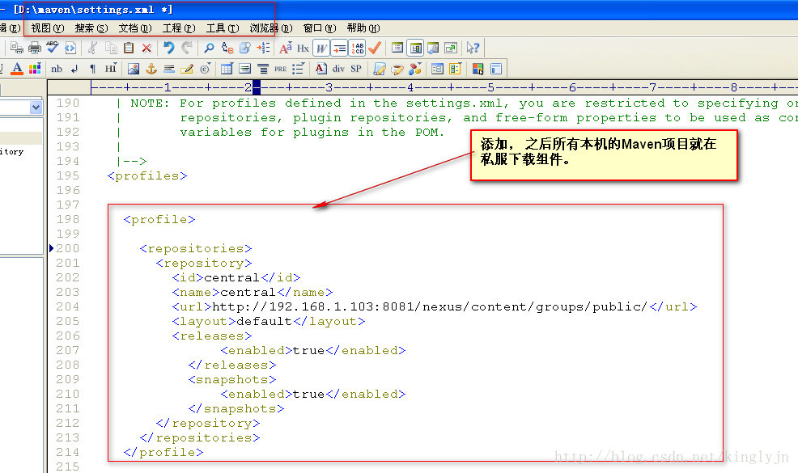

追加激活profile

```xml
<activeProfiles>  
    <activeProfile>central</activeProfile>        
</activeProfiles>  
```

 

之后所有本机的Maven项目就在私服下载组件。（这样比较好）

项目的发布

```xml
<distributionManagement>  
    <repository>  
        <id>user-release</id>  
        <name>User Project Release</name>        <url>http://192.168.1.103:8081/nexus/content/repositories/releases/</url>  
    </repository>  
    <snapshotRepository>  
        <id>user-snapshots</id>  
        <name>User Project SNAPSHOTS</name>    <url>http://192.168.1.103:8081/nexus/content/repositories/snapshots/</url>  
    </snapshotRepository>  
</distributionManagement>
```

 

注意配置了还是发布项目到私服失败，原因为没有权限
配置权限在settings.xml
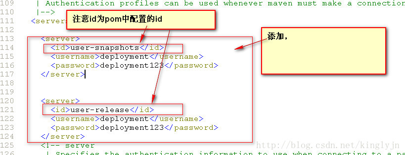
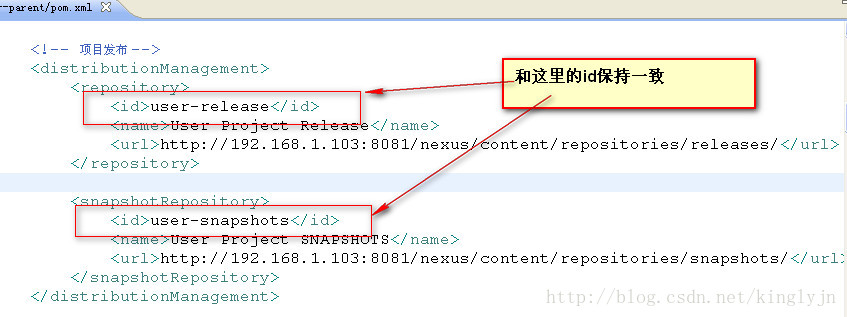
然后运行发布
clean deploy
在控制台发布成功
然后进入到私服上的仓库中，看一下确实存在刚刚发布的项目
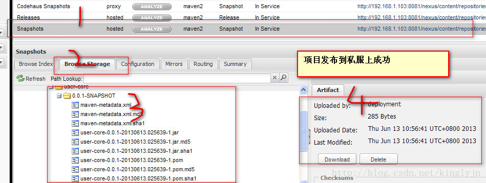

宿主库——3rd party
假如我们下载了Oracle的驱动程序jar包想给其他项目组使用，就需要上传该jar包。选中宿主库——3rd party，之后选择Artifact Upload上传至宿主空间。 
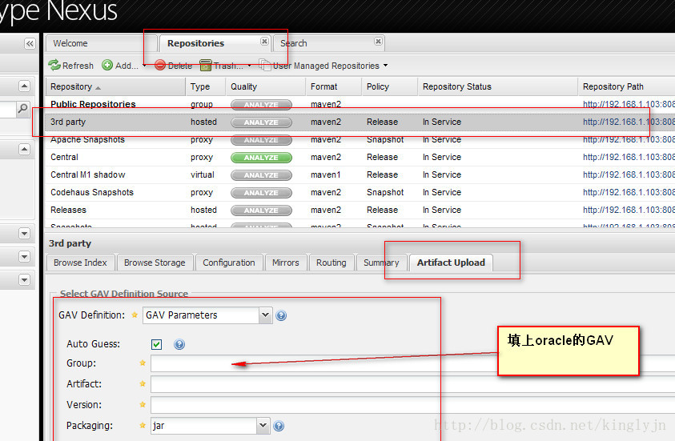
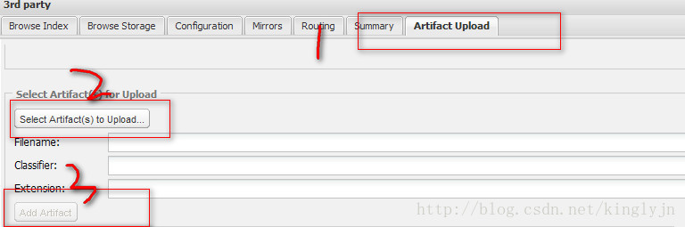
最后点击上传
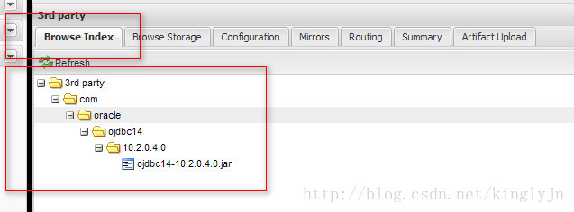 


## 索引更新

索引好比目录，只有有了索引，才能根据索引去仓库下载需要的构件jar包。由于中央仓库向全世界提供下载服务，有很多构件，其索引文件也很大，大概1G左右。 

更新索引方式有两种

1. 在线更新索引 
   安装配置完成Nexus后，电脑联网状态下，Nexus会自动下载索引文件。下载好的索引文件存放在目录：sonatype-work\nexus\indexer
2. 手动更新索引 
   网络环境不佳，或者在线更新有问题时，可以选择手动添加索引方式。 
   首先准备这几个文件: 
   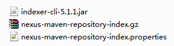
   到http://repo.maven.apache.org/maven2/.index/页面下载下面这两个文件，如图所示文件: 
   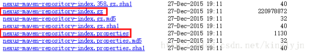
   到[http://search.maven.org](http://search.maven.org/)，搜索g:”org.apache.maven.indexer” AND a:”indexer-cli”下载特定解压文
   indexer-cli-5.1.1.jar，如下图：
   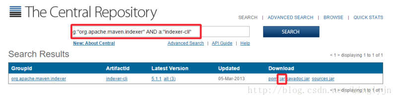
   把这几个文件放在同一个文件路径下面，从cmd进入到这个路径里，输入命令：

```bash
java -jar indexer-cli-5.1.1.jar -u nexus-maven-repository-index.gz -d indexer 
```

执行完之后，把indexer文件夹下的所有内容都复制到%nexus-home%\sonatype-work\nexus\indexer\central-ctx下面。
重新启动nexus，进入管理界面，选择central->Browse Index，就看到更新的索引了。
注意：nexus是需要重新启动的，我是在做上面的所有步骤之前，先停掉nexus，等上面四个步骤完成之后，再启动nexus的。

## 仓库迁移 

Nexus的构件仓库都保存在sonatype-work目录中，该目录的位置由nexus/conf/nexus.properties配置文件指定。
仓库迁移需要两个过程：备份和还原

- - 备份仓库：将sonatype-work文件夹整体备份即可，也可以选择只备份最重要的两个文件夹索引（indexer）和仓库（storage）
  - 还原仓库：将备份好的sonatype-work文件拷贝到新的服务器中。然后修改nexus/conf/nexus.properties配置文件，重新指定仓库的目录。