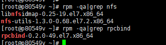
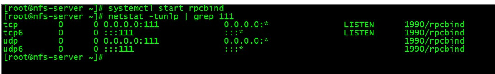
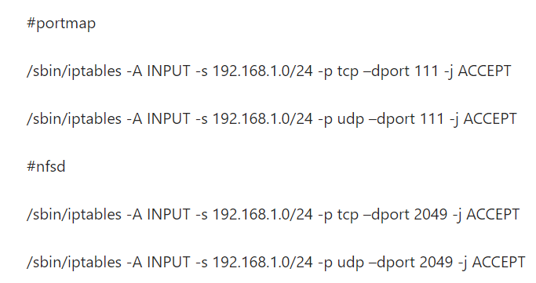
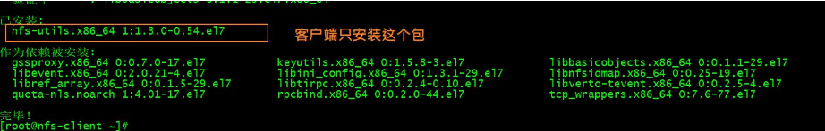
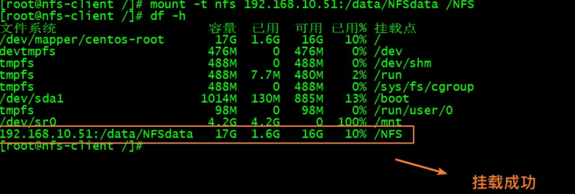
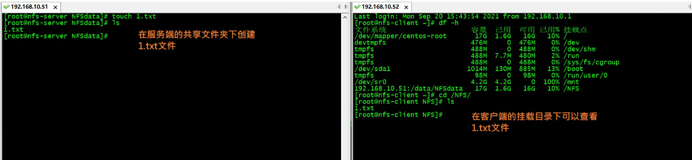

## NFS介绍

NFS(Network File System) 即网络文件系统，它允许网络中服务器之间通过TCP/IP网络共享资源，NFS的一个最大优点是可以节省本地存储空间，一台NFS服务器和若干台客户机。


<!--more-->


## 环境准备

```bash
# 准备两台服务器一台做客户端，一台做服务器，根据自己的电脑网段来做
A:192.168.10.51 	#做服务端
B:192.168.10.52		#做客户端
```


## 服务搭建

### 服务端操作

#### 安装nfs和rpcbind

在A服务端机器安装nfs-utils和rpcbind包

```bash
yum install -y nfs-utils rpcbind

# nfs-utils:提供了NFS服务器程序和对应的管理工具
# rpcbind:获取nfs服务器端的端口等信息
```



#### 启动rpcbind

启动rpcbind并检查是否启动了rpcbind服务并监听111端口

```bash
systemctl start rpcbind
netstat -tunlp | grep 111
```



#### 配置共享目录

配置NFS服务的共享文件

```bash
mkdir -p /data/nfsdata

vim /etc/exports

/data/nfsdata 192.168.10.0/24(rw,sync)


/data/NFSdata	#表示要共享文件的目录
192.168.10.0/24	#表示所有允许访问的客户端IP网段，也可以写成指定的ip，只允许当前客户机访问
(rw,sync)		#rw:表示读写权限，sync:表示数据同步写入内存硬盘

# 如exports做调整，修改后可以重新加载即可
exportfs -r
exportfs # 查看共享目录
```

**补充知识**

```bash
ro：共享目录只读；
rw：共享目录可读可写；
all_squash：所有访问用户都映射为匿名用户或用户组；
no_all_squash(默认)：访问用户先与本机用户匹配，匹配失败后再映射为匿名用户或用户组；
root_squash(默认)：将来访的root用户映射为匿名用户或用户组；
no_root_squash：来访的root用户保持root帐号权限；
anonuid=：指定匿名访问用户的本地用户UID，默认为nfsnobody(65534)；
anongid=：指定匿名访问用户的本地用户组GID，默认为nfsnobody(65534)；
secure(默认)：限制客户端只能从小于1024的tcp/ip端口连接服务器；
insecure：允许客户端从大于1024的tcp/ip端口连接服务器；
sync：将数据同步写入内存缓冲区与磁盘中，效率低，但可以保证数据的一致性；
async：将数据先保存在内存缓冲区中，必要时才写入磁盘；
wdelay(默认)：检查是否有相关的写操作，如果有则将这些写操作一起执行，这样可以提高效率；
no_wdelay：若有写操作则立即执行，应与sync配合使用；
subtree_check(默认) ：若输出目录是一个子目录，则nfs服务器将检查其父目录的权限；
no_subtree_check ：即使输出目录是一个子目录，nfs服务器也不检查其父目录的权限，这样可以提高效率；
```


#### 启动nfs服务

```bash
systemctl start nfs
```


#### 设置开机启动

```bash
systemctl enable rpcbind.service
systemctl enable nfs.service
```

#### 安全加固

**方法一：**

```bash
#防火请关掉很简单，直接命令关掉即可
systemctl stop firewalld
```

**方法二：**

直接关闭防火墙虽然很简单，但在日常服务器上直接关闭防火墙，让其裸跑有很大安全风险。而rpc的服务接口默认是随机的。我们需要在配置中把其固定下来，这样在防火墙或安全组中只需开放对应端口即可。

```bash
vim /etc/sysconfig/nfs

RQUOTAD_PORT=30001
LOCKD_TCPPORT=30002
LOCKD_UDPPORT=30002
MOUNTD_PORT=30003
STATD_PORT=30004
#固定的端口为30001-30004

vim /etc/modprobe.d/lockd.conf

options lockd nlm_tcpport=30002
options lockd nlm_udpport=30002

# 重启nfs服务
systemctl restart nfs-config
systemctl restart nfs-idmap
systemctl restart nfs-lock
systemctl restart nfs-server

# 查看端口状态
rpcinfo -p

# 在安全组或防火墙策略中tcp和udp都放开服务端口（111、2049、30001-30004）
```




### 客户端操作

#### 安装nfs-utils

在B客户端机器安装

```bash
yum -y install nfs-utils
```



#### 设置开机启动

```bash
systemctl enable rpcbind.service	
#客户端不用启动nfs-server，但是要用到nfs-server的一个命令showmount
```

#### 挂载

```bash
mount -t nfs 192.168.10.51:/data/nfsdata /nfs #挂在文件系统
showmount -e 192.168.10.51 #查看是否挂载上
```



#### 测试

分别在服务端或客户端创建文件，观察




## 总结

根据上面教程步骤就可以简单的用单台nfs服务器来实现文件共享和挂载服务，但这只是针对紧急特殊情况。如要在生产上使用建议使用glusterfs多台服务器集群来做文件共享服务。