## 介绍

zabbix支持的主要监控方式：

​        zabbix主要Agent，Trapper，SNMP，JMX，IPMI这几种监控方式，本文章主要通过监控理论和实际操作测试等方式来简单介绍这几种方式的监控原理和优缺点等 。下面对几种监控方式的监控原理进行介绍：

<!--more-->

## 优缺点

###     Agent监控方式

​        在Agent监控方式下，zabbix-agent会主动收集本机的监控信息并通过TCP协议与zabbix-server传递信息。Agent监控方式分为主动和被动模式。在被动模式下，zabbix-agent监听10050端口，等待zabbix-server的监控信息收集信息请求；在主动模式下，zabbix-agent收集监控信息并通过10050端口主动将数据传给zabbix-server所在服务器的10051端口。

​        优点：

​                （1）是zabbix最常用的监控方式，监测指标深入细致有针对性。

​                （2）内置监控功能强大，内置监控项目丰富。

​                （3）TCP方式实现通讯，可靠性也有保证。

​        缺点：

​                （1）需要在被监控机器上安装zabbix-agent客户端，部署相对麻烦，最初需要逐个机器安装代理软件

​                （2）zabbix-agent客户端运行在被监控机上，会收集本机信息

###     Trapper监控方式

​        Trapper监控方式使用zabbix-sender程序主动向zabbix-server发送数据。key的名称和发送的数据内容都可以灵活定义。发送的信息采用JSON格式，遵循zabbix-sender协议。可以自定义脚本利用zabbix-sender协议来zabbix-server发送信息。

​        优点：

​                （1）不需要在被监控机器上安装zabbix-agent

​                （2）不收集被监控机器的信息

​                （3）可以自定义发送的信息内容

​                （4）可以使用自定义脚本发送信息

​        缺点：

​                （1）需要自定义发送的信息内容

​                （2）无内置监控项目

###     SNMP监控方式

​        SNMP全称Simple Network Management Protocol，即网络管理协议，包括进程管理和被管理设备两部分。作为一种国际通用的网络管理协议被广泛的应用于各种交换机，路由器等网络设备的管理上，而现在也越来越多被用于对服务器的监控上。

​        优点：

​                （1）服务器一旦部署SNMPAgent，任何能实现SNMP协议的软件都可以对其进行监测。

​                （2）通过这种手段进行监测不需知道被监测服务器的用户名和密码，比较安全。

​        缺点：

​                （1）很多服务器并非默认安装SNMPAgent，如果通过这种方式监测则需要对所有服务器安装部署。

​                （2）能监测的参数指标比较固定不够深入，无法满足用户的特殊需求。

​                （3）由于SNMP协议是通过UDP方式实现的。在网络状况不佳的情况下其可靠性能以保证。

###     JMX监控方式

​        JMX，全称Java Management Extensions，即Java管理拓展，是Java平台为应用程序，设备，系统等植入管理功能的框架。在zabbix中，JMX数据的获取由zabbix-java-gateway代理程序来负责数据的采集。

​        优点：

​                （1）可以详细的监控各类Java程序的运行状态

​        缺点：

​                （1）被监控机上需要安装zabbix-java-gateway

###     IPMI监控方式

​        IPMI，全称Interlligent Platform Management Interface，即智能平台管理接口，原本是Intel架构中企业系统的周边设备所采用的一种工业标准，以后成为业界通用的标准。用户可以利用IPMI监控服务器的物理特性，如温度，电压，电扇工作状态，电源供应以及机箱***等指标。

​        根据以上对zabbix各主要监控方式的梳理，结论如下：

​        （1）根据被监控机器的环境和客户要求选用适当的监控方式，可同时配合多种监控方式。

​        （2）有条件在监控机上部署zabbix-agent客户端时，该方法为第一选择，因为其功能强大且配置相对简便。

​        （3）需要自定义脚本或者监控信息时，可使用Trapper方式，即使用zabbix-sender程序或者自定义脚本遵循zabbix-sender协议，已JSON形式，通过TCP发送自定义信息。


## 方式的实现

### Agent监控方式

###     1、通过Agent方式监控Linux服务器

​        （1）需要在Linux服务器上安装zabbix-agent客户端安装包，需要先导入软件安装源:

```shell
 rpm -ivh http://repo.zabbix.com/zabbix/3.5/rhel/7/x86_64/zabbix-release-3.5-1.el7.noarch.rpm
```

​       （2） 使用yum源安装zabbix-agent    

```shell
yum install zabbix-agent
```

​        （3）zabbix客户端配置

​        编辑zabbix_server配置文件并启动

```shell
vim /etc/zabbix/zabbix_agent.conf

#修改以下配置信息：

Server=192.168.40.134      #zabbix服务端IP地址

ServerActive=192.168.40.134    #zabbix服务端IP地址

ListenPort=10050          #监控服务端口

#启动zabbix-agent服务

systemctl start zabbix-agent
```

​        （4）zabbix服务器端添加被监控主机

​        选择“配置”-“主机”，然后选择“创建主机”:        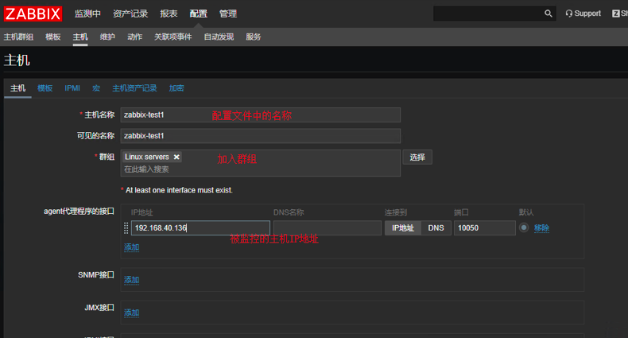

​        选择添加的模板：        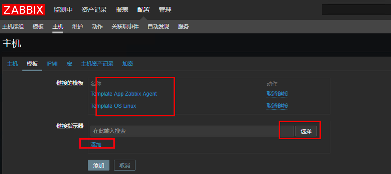

​        添加主机成功：

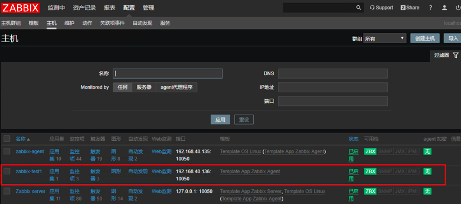

###     

### 2、通过Agent方式监控windows服务器 

​        （1）下载Windows的zabbix客户端

​        下载地址：[Zabbix官网](https://www.zabbix.com/download_agents)

​        选择需要下载的windows版本客户端：

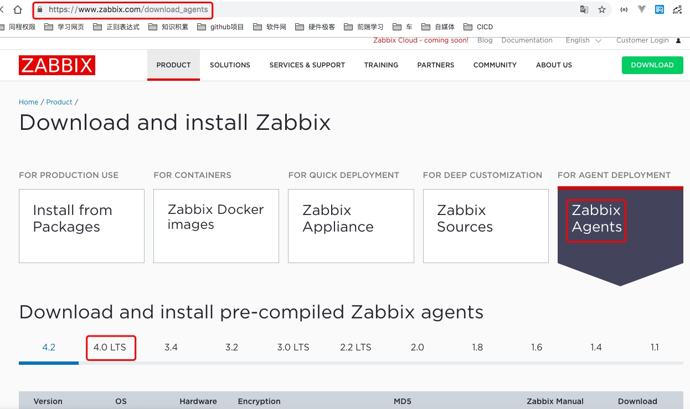         

 （2）确定被监控主机的系统是32位还是64位

​        右键“此电脑”，查看操作系统版本.

​        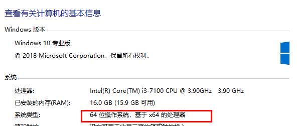

（3）windows上安装agent

​            根据系统信息直接选择msi或zip压缩包，在此需要注意和server端一致。然后解压安装即可.

（4）修改配置文件

​        需要修改的内容为：LogFile、Server、Hostname、ServerActive这几个参数。具体配置如下：

```shell
Server=192.168.40.134
ServerActive=192.168.40.134
Hostname=Windows host 
ListenPort=10050
```

（5）安装zabbix-agent客户端程序

​        用管理员权限打开CMD，进入到zabbix的应用程序目录，执行安装命令：

```
zabbix_agentd.exe -c D:\zabbix-agent\conf\zabbix_agentd.win.conf -i
```

​        安装成功后，执行运行命令：

```
zabbix_agentd.exe -c D:\zabbix-agent\conf\zabbix_agentd.win.conf -s
```

​      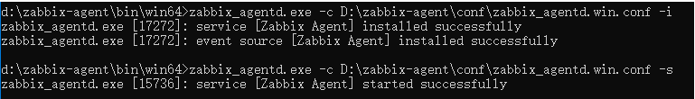

 （6）在zabbix server端配置agent

​        在server端，选择 配置-主机 界面，然后点击“创建主机”，在添加主机的界面，输入被监控主机客户端的信息。

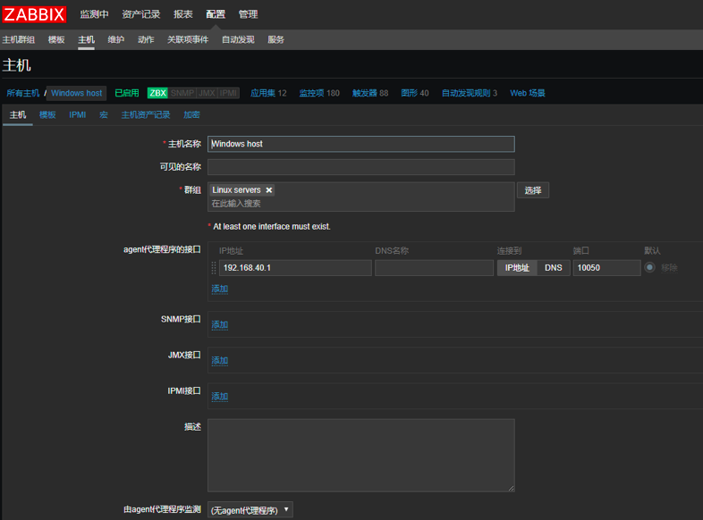

​        点击“添加”，然后过一段时间查看主机状态

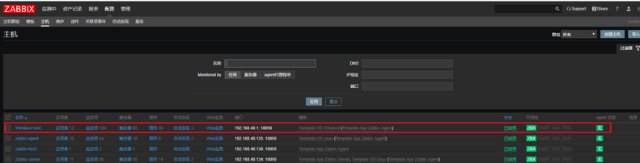

​    

### zabbix Trapper监控方式

###     1、zabbix Trapper 工作原理

​        zabbix获取数据时有时会出现超时，如果一些数据需要执行较长的时间才能获取的话，那么zabbix会出现异常，考虑到这种情况，zabbix增加了Trapper功能，客户端自己提交数据给zabbix。

​        Trapper是被监控主机主动发送数据给zabbix server，与主动模式的区别是不需要安装客户端；Trapper方式发送数据是以主机名处理，不是IP地址，所以主机名要唯一。在配置监控项时候Type of information项要选择text，否则会报not support错误。

​        Trapper工作模式中，使用zabbix监控类型zabbix Trapper（可以称为zabbix捕捉器），在zabbix服务器上必须有一个捕捉项目，然后需要配合zabbix_sender把数据推送给zabbix服务器，该程序由zabbix发行版本自带，源码包解压后在bin目录下，配合crontab定期发送数据给zabbix server。

​        zabbix_sender是一个命令行工具，可以用来发送zabbix服务器处理性能数据。该工具通常用于长时间运行的用户 脚本，用于定期发送可用性和性能数据。

###     2、zabbix_sender命令：

​        rpm导入zabbix_sender安装源：

```
 rpm -ivh http://repo.zabbix.com/zabbix/3.5/rhel/7/x86_64/zabbix-release-3.5-1.el7.noarch.rpm
```

​        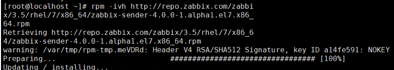

​        使用rpm安装，默认在/bin目录下：

```
cd /bin
ls
./zabbix_sender

​ usage:zabbix_sender [-Vhv] {[-zpsl] -ko | [-zpl] -T -i <file> -r} [-c<file>]

​ 参数说明：
​ -c --config<file>       配置文件绝对路径
​ -z --zabbix-server<server>   zabbix server的IP地址
​ -p --port<server port>   zabbix server 端口默认10051
​ -s --host <hostname>   主机名，zabbix客户端zabbix.agentd.conf配置文件中定义的Hostname（不是服务器的hostname），不是客户端主机的IP地址
​ -l -- source-address <IP address>  源IP
​ -k --key <key>  监控项的key值
​ -o --value<key value> key值
​ -i --input-file<input file>  从文件里面读取hostname、key、value一行为一条数据，使用空格作为分隔符，如果主机名带空格，那么请使用双引号包起来
​ -T --with-timestamps   一行一条数据，空格作为分隔符：<hostname> <key> <timestamp> <value>，配合 --input-file option，timestamp为unix时间戳
​ -r --real-time      将数据实时提交给服务器
​ -v --verbose     详细模式， -vv 更详细
```

###     3、监控项配置

​        创建监控项（Configuration --> Template --> Items --> Create item 或Configuration --> Host --> Items --> Create item）

​        （1）选择“配置”-“主机”-“新建主机”,添加zabbix-Trapper 客户端的用户名：        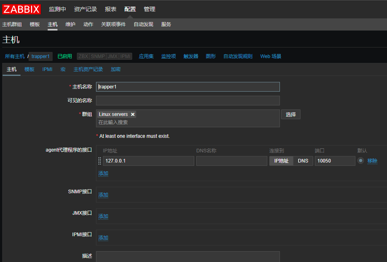

​       （2） 添加完主机后，添加监控项，选择刚添加的主机，点击“监控项”，然后点击“创建监控项”：

​        添加监控信息，然后点击更新：

​    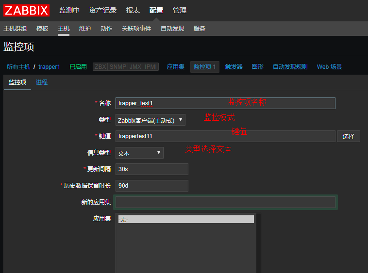

​        （3）客户端使用zabbix_sender发送数据

​          客户端设备操作：

```shell
 cd /bin
./zabbix_sender -s 192.168.40.134 -z 192.168.40.129 -k trappertest11 -o test
```

​        -vv 可以显示具体信息，这里提示无法连接到zabbix server的10051端口

​        服务端：

```
 netstat -anop | grep -i zabbix
```

​         未开放外网的10051端口

```shell
ListenIP=127.0.0.1,192.168.40.134
LIstenPort=10051

systemctl restart zabbix-service
netstat -anop | grep -i zabbix
```

​        客户端：        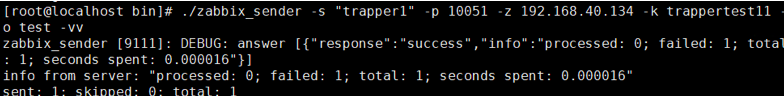

​       

### Zabbix SNMP监控方式

###     1、SNMP监控介绍

​        如果要监控打印机、路由器、交换机、UPS等设备，肯定不能使用zabbix agentd，因为他们不能安装软件，但是一般都支持SNMP协议，可以使用SNMP来监控。SNMP检查基于UDP协议。

​        注意事项：如果监控基于SNMPv3协议的设备，确保msgAuthoritativeEngineID（通常叫做snmpEngineID或“Engine ID”）是唯一的。        

​                        以前SNMPv3协议只支持MD5和DES加密，从zabbix2.2开始支持SHA与AES加密协议。

###     2、Zabbix SNMP监控Linux操作系统

​        （1）zabbix服务器端需要先安装SNMP服务

​              使用yum源在线安装SNMP服务配置    

```shell
  yum -y install net-snmp*    
```

​           (2)  配置SNMP配置文件

```shell
vim /etc/snmp/snmpd.conf

proc mountd   
proc ntalkd  4
proc sendmail  10  1
disk / 10000
load  12 14  14
view  systemview  included  .1.3.6.1.2.1.1
view  systemview  included  .1.3.6.1.2.1.25.1.1
view  systemview  included  .1   
```

​        	(3) 设置开机启动SNMP：

```shell
chkconfig  snmpd on
chkconfig --list | grep snmpd
/etc/init.d/snmpd start     启动snmp服务
```

​        （4）zabbix服务器使用snmpwalk命令测试被监控计算机名

​        2c是指采用SNMP V2版本，192.168.40.134是指监控设备开启了SNMP服务，否则会获取失败，sysName是指被监控设备的计算机名。            

```shell
snmpwalk -v 2c -c public 192.168.40.134 sysName
```

​        （5）被监控设备安装SNMP服务

```shell
yum -y install net-snmp*
```

​        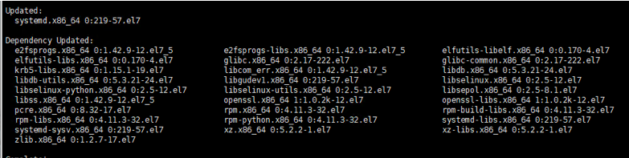

​       (6) 配置SNMP配置文件

```shell
view    systemview    included   .1.3.6.1.2.1.1
view    systemview    included   .1.3.6.1.2.1.25.1.1
view    systemview    included   .1
```

​        com2sec notConfigUser  default       zabbix    #zabbix是被监控的团体名   public团体名称可以修改成自己设置的字符串也可以使用默认public，default字符串默认是所有IP地址都可以访问，如果把default修改成192.168.40.134（zabbix服务器IP地址），表示只允许zabbix服务器访问这台被监控电脑的SNMP服务。

```shell
systemctl  enable snmped
systemctl stop firewalld   关闭防火墙
/etc/init.d/snmpd start    启动SNMP服务 
systemctl stop firewalld   关闭防火墙
```

​        /etc/init.d/snmpd start    启动SNMP服务

（7）zabbix服务端web界面添加主机

​        选择“配置”-“主机”-“创建主机”，添加要被监控设备的主机信息：

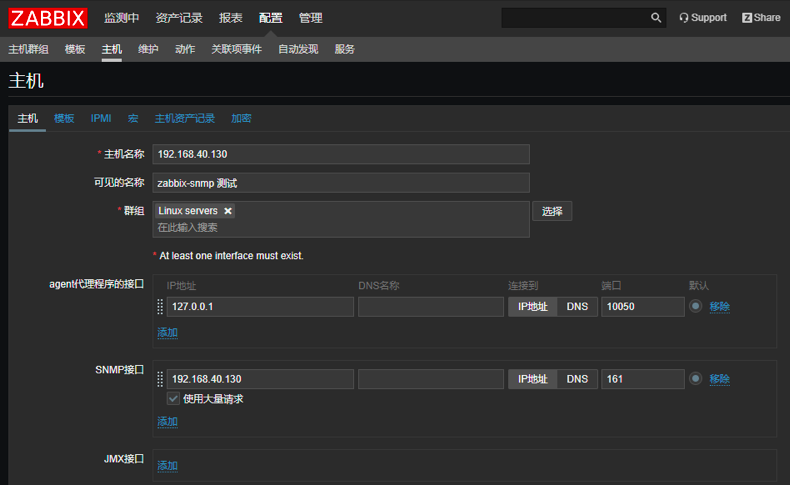

​        添加模块：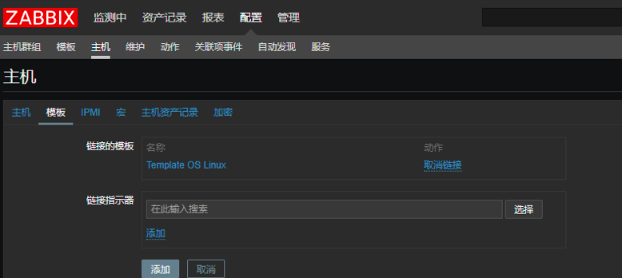

​      添加宏： 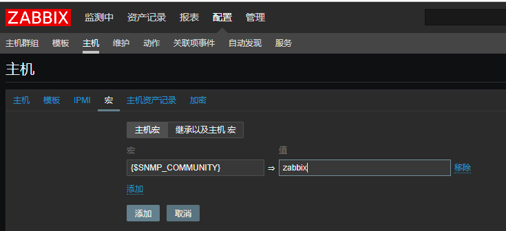


###     3、zabbix SNMP监控windows系统

​        （1）windows系统启动SNMP功能：

​        选择“控制面板”-“程序”-“启用或关闭windows功能”，选择“简单网络管理协议（SNMP）”

​        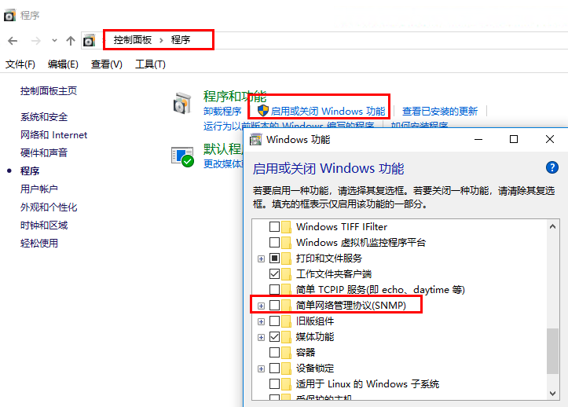

​        （2）右击“计算机”-“管理”-“服务”，选择“snmp server”服务器，右击“属性”：

​        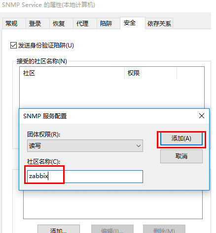

​        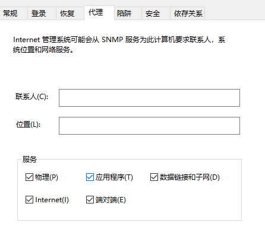

（3）zabbix 服务端web界面，选择“配置”-“主机”，然后点击“创建主机”

​        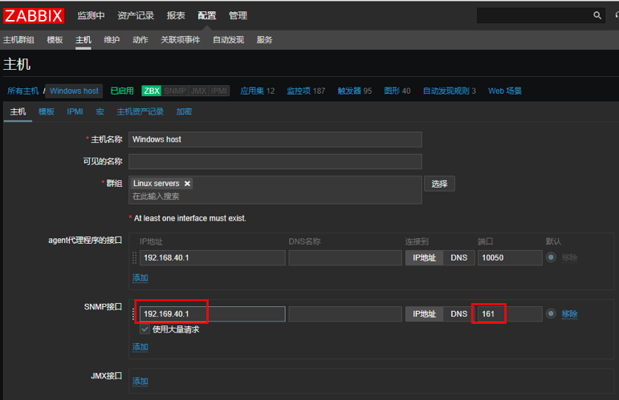

​        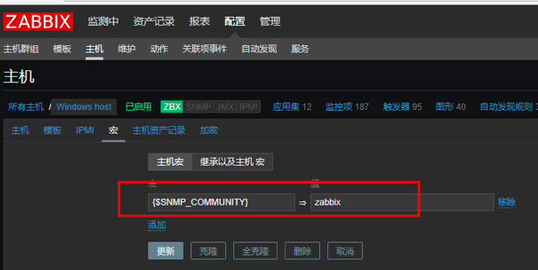

​         大概需要等待五分钟左右，查看主机监控成功。

###    4、zabbix SNMP 监控网设备

​       “配置”-“主机”-“创建主机”，添写要监控的设备信息：

​     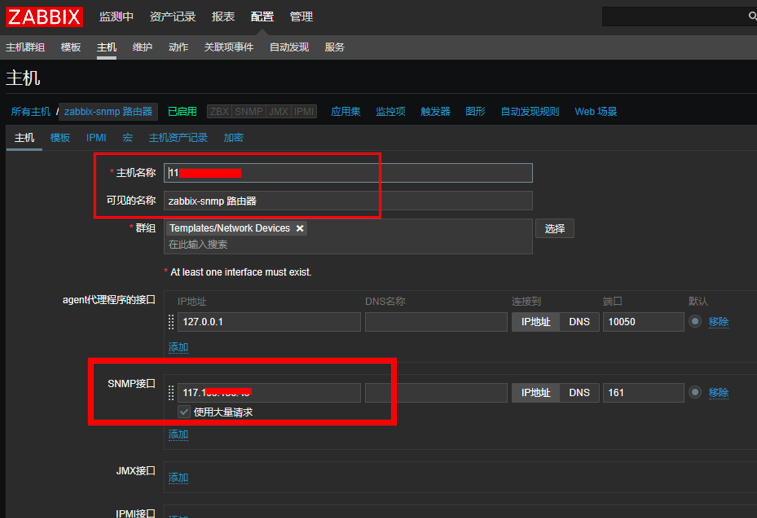   

​     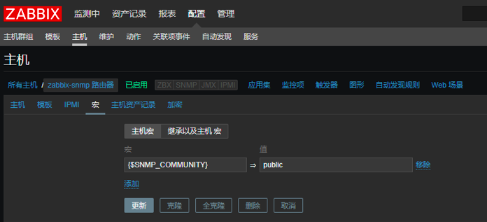

   

   

### zabbix JMX监控方式

###     1、zabbix JMX 简介

​        在企业中，很多程序是基于Java来编写的，java程序运行在JVM之上，而JVM自己就可以监听在某个套接字上，将自己内部的状态信息输出出去，所以监控服务器只需要直接连接JVM的套接字就可以获取到Java进程的相关信息，不需要通过Agent、SNMP；可是zabbix是没办法自己连接JVM套接字的，也就是说，zabbix自身是不能够作为客户端来链接该套接字的。所以，就需要额外安装一个服务来连接JVM套接字的。这个服务就是zabbix-java-gateway.x86_64(Java网关）；可以通过该网关来监听多个JVM；zabbix-agent-gateway可以是一个单独的主机，可以和zabbix server安装到一台主机上；


###     2、zabbix server 安装java gateway

​        zabbix提供了一个java gateway的应用去监控jmx（Java Management Extensions，即Java管理扩展）是一个为应用程序、设备、系统等植入管理功能的框架。JMX可以跨越一系列异构操作平台、系统体系结构和网络传输协议，灵活的开发无缝集成的系统、网络和服务管理应用。

```shell
yum install -y java java-devel zabbix-java-gateway
```

###     3、添加java环境

```shell
vim /etc/profile

​ JAVA_HOME=/usr/lib/jvm/java-1.8.0-openjdk-1.8.0.171-8.b10.el7_5.x86_64
​ PATH=$JAVA_HOME/bin:$PATH
​ CLASSPATH=.:$JAVA_HOME/lib/dt.jar:$JAVA_HOME/lib/tools.jar
​ export JAVA_HOME
​ export PATH
​ export CLASSPATH

#加载环境：
source /etc/profile
```

###     4、修改java-gateway配置文件

```shell
grep ^[a-Z]  /etc/zabbix/zabbix_java_gateway.conf
cd /etc/zabbix
vim zabbix_java_gateway.conf  修改以下信息：

​ LISTEN_IP="0.0.0.0"
​ LISTEN_PORT=10052
​ PID_FILE="/var/run/zabbix/zabbix_java.pid"
​ START_POLLERS=5
​ TIMEOUT=3
```

###     5、重启java-gateway服务

```
 systemctl restart zabbix-java-gateway
```

###     6、修改zabbix_server配置文件

```shell
find / -name zabbix_java_gateway
vim /usr/sbin/zabbix_java_gateway    修改以下配置信息

​ JavaGateway=192.168.40.131<br>
​ JavaGatewayPort=10052<br>
​ StartJavaPollers=5
```

###     7、重启zabbix_server服务

```
 systemctl restart zabbix-server
```

###     8、客户端配置

​        在Tomcat下的/bin/catalina.sh文件中添加以下内容：

```shell
CATALINA_OPTS="$CATALINA_OPTS -Djavax.management.builder.initial= -Dcom.sun.management.jmxremote=true -Dcom.sun.management.jmxremote.port=12345 -Dcom.sun.management.jmxremote.authenticate=false -Dcom.sun.management.jmxremote.ssl=false -Djava.rmi.server.hostname=192.168.40.131"  
```

​        重启Tomcat进程：

​        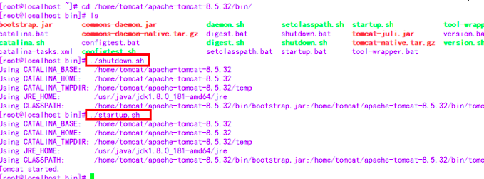

###     9、zabbix中添加监控

​        选择配置：主机-模板-选择-模板-：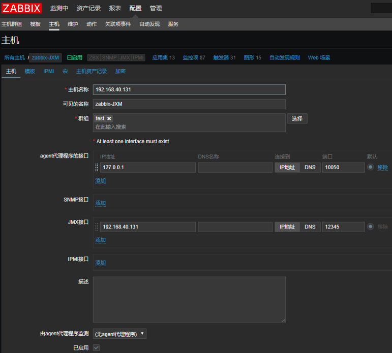


### zabbix IPMI监控方式  

###     介绍

​        IPMI（Intelligent PlatformManagement Interface）既智能平台管理接口是使硬件管理具备“智能化”的新一代通用接口标准。用户可以利用IPMI监视服务器的物理特性，如温度、电压、电扇工作状态、电源供应以及机箱入侵等。Ipmi最大的优势在于它是独立于 CPU BIOS 和OS的，所以用户无论在开机还是关机的状态下，只要接通电源就可以实现对服务器的监控。Ipmi是一种规范的标准，其中最重要的物理部件就是BMC（Baseboard Management Controller），一种嵌入式管理微控制器，它相当于整个平台管理的“大脑”，通过它 ipmi 可以监控各个传感器的数据并记录各种事件的日志。

### 	 条件

​        使用 ipmi 的先决条件，想要实现对服务器的 ipmi 管理，必须在硬件、OS、管理工具等几个方面都满足：

​        a.服务器硬件本身提供对 ipmi 的支持目前惠普、戴尔和 NEC 等大多数厂商的服务器都支持IPMI 1.5，但并不是所有服务器都支持，所以应该先通过产品手册或在 BIOS 中确定服务器是否支持 ipmi，也就是说服务器在主板上要具有 BMC 等嵌入式的管理微控制器。

​         b.操作系统提供相应的 ipmi 驱动通过操作系统监控服务器自身的 ipmi 信息时需要系统内核提供相应的支持，linux 系统通过内核对OpenIPMI（ipmi 驱动）的支持来提供对 ipmi 的系统接口。

###     实例

日常监控中使用IPMI的方式不多，在此不举例说明了。