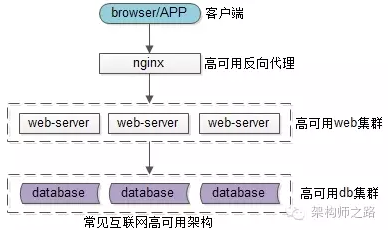
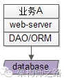
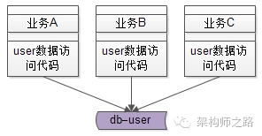
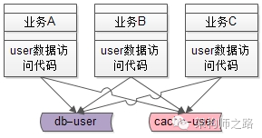
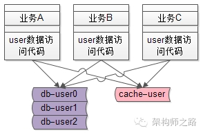
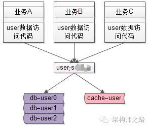
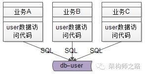
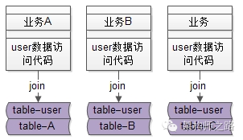
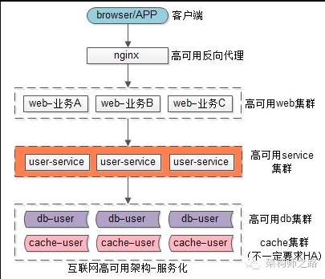
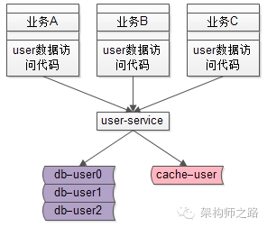

科技改变生活，搞互联网的绕不开BAT、TMD等大厂，那么搞微服务架构就绕不开RPC。知其然知其所以然才行，是什么原因绕不开呢？想要知道这个问题，先要搞清楚为什么要搞微服务呢？本文就来详细和你聊聊。


<!--more-->

## 为什么要搞微服务框架？

有的同学说，技术总监或着是运维经理说要搞微服务，那公司就搞了。或者是看到很多大厂都采用微服务框架，我们不能落后，所以我们也要搞跟上步伐嘛。那么这些同学是否会有疑问为什么总监或着经理要搞呢？为什么各大厂都用微服务呢？这种框架带来哪些好处解决哪些痛点，让这么多公司和技术大牛青睐有加呢？如果你有过这些疑问，并想要搞清楚，那么你才能是一个合格的技术人。**做技术的千万不能有别人都在做，所以我们也要搞的这种想法**。下面通过对比，让你切实感受服务化的好处。


## 传统高可用架构

典型的互联网高可用架构如下图：



```bash
（1）客户端：APP，H5，小程序，PC浏览器；
（2）后端入口：高可用的反向代理web集群(nginx或apache等)；
（3）站点应用：高可用的web-server集群(tomcat或docker等)；
（4）后端存储：高可用db集群（mysql等）；
```

更典型的架构如下图：



web-server集群通过DAO/ORM等技术来访问数据库。

### 传统架构痛点

传统的架构可以看到没有服务层的，那么传统架构存在什么典型痛点呢？


#### **痛点一：代码随处拷贝**

最常见的业务例子：用户的数据访问。互联网公司都用一个数据库来存储用户数据，而且各个业务都有访问用户数据的需求。



**场景**：各个业务线（A,B和C）都需要获取用户数据，通常做法是通过DAO/ORM用SQL语句去操作数据库来获取，这就导致了代码的拷贝重复。


#### **痛点二：架构复杂性扩散**

**缓存机制引入**

随着并发量越来越高，访问用户数据的数据库成为了瓶颈，通常做法加入缓存机制（redis或memcache等）来降低数据库的读压力。那么各个业务线都需要针对底层架构的调整做响应更改，导致了的架构的复杂性扩散。



增加了缓存机制，所有业务代码的读写操作需要升级调整：

```bash
#写操作：
（1）先剔除缓存；
（2）再在数据库中写入数据；

#读请求：
（1）先读cache命中则返回；
（2）没命中则读数据库；
（3）再把数据放入cache中；
```

但是开发就郁闷了，我业务代码没做跑的好好的，没做调整。你底层数据库做调整，我们所有业务的代码都需要被迫升级。

**分库分表引入**

随着数据量的不断增多，数据库需要做水平扩容拆分，于是又引入了数据库的分库分表。各个业务组又都需要去关注数据库分库分表引入导致的复杂性。



这里举了两个例子：各个业务组的开发奔溃了，这完全和业务本身是无关，而所有业务都需要被迫升级来适应架构调整导致的影响。


#### **痛点三：库的复用和耦合**

解决上述两个痛点，我们最容易想到的解决方法是：抽象出统一的库来解决。

抽象出一个user.so库文件，该库文件负责对整个用户数据的存取操作。从而避免了代码的拷贝。架构调整也只需要关注user.so这个库文件即可。



有同学就会说是的这种方法也可以实现，那大家不妨想这样一个场景：

**场景**：业务线A因需求想将user.so这个库由版本1.0升级至版本2.0，那么就需要这个库兼容其他所有业务线，如果不兼容业务线B，就会导致B业务出现问题，获取不到数据。

那么业务线A如果通知了业务线B去升级，而业务线B的开发表示很无辜，业务线B自身的业务没改动，也需要被动升级，郁闷吧。而且是其他业务线也都需要改。造成问题：**库的版本维护会导致业务线之间的耦合关系**


#### **痛点四：SQL质量和业务相互影响**

各个业务线都通过DAO/ORM操作数据库，实质上就是根据各个业务线需求拼装的SQL语句，资深的工程师写出的SQL语句质量比较高，但是经验没有这么丰富的工程师可能会写出一些低效的SQL语句。



**场景**：业务线A新招了个初级程序员，写了一个全表扫描的SQL操作，从而导致整个数据库的CPU100%跑满，其他业务线读写都不能操作，都会受影响。你是该程序员很慌不慌。

#### **痛点五：疯狂的DB耦合**

通常业务线不只访问user表的用户数据，还会结合自己的业务访问自己的数据。典型的就是通过join数据表来实现各自业务线的业务逻辑。



**场景**：各个业务表和user表耦合在一起，例如业务线A的table-user和table-A耦合在一起，结果就是user表和所有业务表都耦合在了一起。那么随着数据量的增大，各个业务线的数据库是无法垂直拆分开的，必须使用一个大库来存储。想想一下一个大库几百个业务表，崩不崩溃。


#### **痛点六：其他等等**

## 微服务架构

服务化后互联网高可用分层架构如下,引入了高可用user-service层，该层统一操作数据库存取用户



### 服务化架构好处

#### **好处一：调用方便清爽**

原来业务访问用户数据，是需要通过DAO/ORM拼装SQL语句操作数据库来存取，现在业务方通过RPC调用就可访得到用户数据，就像调用本地函数一样：

```
User = UserService::GetUserById(uid);
```

传入uid参数，得到User实体，就像调用本地函数一样，不需要关心序列化，网络传输，后端执行，网络传输，反序列化等等就可以得到用户数据。

#### **好处二：代码复用性**

所有user用户数据的存取，都通过user-service来进行的，只此一份。

#### **好处三：屏蔽底层提高专注**

原来所有业务线都需要关注缓存、分库分表等底层细节。


现在只有服务层需要专注关注底层的复杂性，上游业务调用屏蔽了细节。



#### **好处四：SQL质量得到保障**

原来是业务直接拼接SQL语句访问数据库。现在所有业务请求的SQL语句都是服务层提供，业务线不能再为所欲为。

#### **好处五：数据库解耦**

原来各业务的数据库都混在一个大库里，难以拆分。现在数据库被隔离开，可以很方便的拆分出来，进行横向扩容。

#### **好处六：有限接口无限性能**

原先各业务线服务想怎么操纵数据库都可以，遇到性能瓶颈，各业务线容易扯皮，相互推诿。现在服务只提供有限的通用接口，理论上可认为集群可以提供无限的性能，性能出现瓶颈，服务层集中优化即可。

#### **好处七：其他等等**


## 总结

结合公司现状和遇到的问题，以实际问题出发，进行架构设计，才能解决真正问题和痛点。一切脱离业务的架构设计，都是空中楼阁，可能高大上，但真的好用和实用吗？