读了上篇文章充分了解了传统架构的痛点和微服务架构的好处。本篇文章进入主题详解RPC的原理和架构。


 <!--more-->

## **RPC定义**

RPC（Remote Procedure Call Protocol），即远程过程调用。远相对于近，本地函数调用是为近，那么远即是垮服务器或容器的调用。


### 本地调用

当我们写下如下函数：

```
int result = Add(1, 2);
```

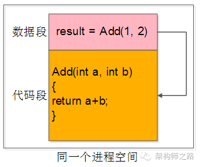

```
动作：
传递两个参数
调用了本地代码中的函数，执行逻辑运算
返回一个出参

三个动作在同一个进程中，这就本地函数调用。
```

 

### **跨进程调用**

典型的是被调进程部署在另一台服务器上。

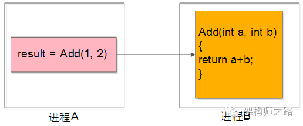


那怎么调用呢？最容易想到的是两个进程约定一个协议格式，如使用Socket来传输通信，然后同样执行调用即可。如果实现，那这就是`远程过程调用`即RPC。


## RPC传递

我们都知道Socket通信只能传递连续的字节流，那么如何将入参和函数都放到连续的字节流中呢？


还以Add函数为例，假设它是一个11字节的请求报文，如下图：


```
描述：
前3个字节填入函数名“add”
中间4个字节填入第一个参数“1”
末尾4个字节填入第二个参数“2”
```

同理一个4字节响应报文：


```
描述：
4个字节填入处理结果“3”
```


**调用方的代码**：

```
request = MakePacket(“add”, 1, 2);
SendRequest_ToService_B(request);
response = RecieveRespnse_FromService_B();
int result = unMakePacket(respnse);
```

步骤如下：

1. 将入参变为字节流；
2. 将字节流发给服务方B；
3. 服务B接受字节流，并逻辑处理后返回字节流；
4. 将返回字节流变为传出结果；

 

**服务方的代码**：

```
request = RecieveRequest();
args/function = unMakePacket(request);
result = Add(1, 2);
response = MakePacket(result);
SendResponse(response);
```

步骤如下：

1. 服务端收到字节流；
2. 将收到的字节流转为函数名与参数；
3. 本地调用函数得到结果；
4. 将结果转变为字节流；
5. 将字节流发送给调用方；

 

过程描述图如下：

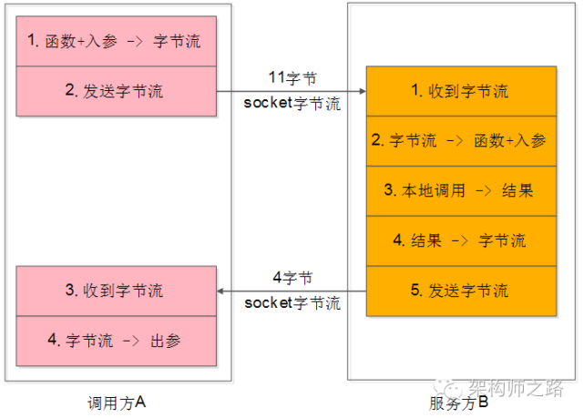


**调用过程很清晰，那最大的问题是什么呢？**

调用方太麻烦，每次调用都要关注很多底层的细节：

```
入参到字节流的转化，即序列化应用层协议细节
字节流socket发送，即网络传输协议细节
字节流socket接收
字节流到出参的转化，即反序列化应用层协议细节
```

 

**可不可以调用层不关注这个细节？**

答案是可以的。RPC框架就是解决这个问题的。它能够让调用方像调用本地函数一样调用远端的函数（服务），而不需要过多关注底层细节。


讲到这里对RPC，序列化和反序列化是不是有点感觉了？那接着往下看。

 

## **RPC框架**

RPC框架的职责是：向调用方和服务提供方都屏蔽各种底层的复杂细节：

```
服务调用方client就像调用本地函数一样来调用服务
服务提供方server就像实现一个本地函数一样来实现服务对外提供服务
```

所以整个RPC框架又分为`client端（服务调用方）`和`server端（服务器提供方）`，如下图： 


业务方的调用过程是：

```
调用方A：传入参数-->执行调用-->拿到结果
服务方B：收到参数-->执行逻辑-->返回结果
```

**RPC框架的作用**就是上图中间虚线框的那部分：

```
client端（调用方）：序列化、反序列化、连接池管理、负载均衡、故障转移、队列管理，超时管理、异步管理等等
server端（服务方）：服务端组件、服务端收发包队列、io线程、工作线程、序列化反序列化等
```


## 详解客户端

server端的技术大家知道比较多，这里不再赘述，接下来重点聊聊client端的技术细节。

## 序列化和反序列化

**为什么要进行序列化呢？**

程序员常用对象来操作数据：

```java
#定义
class User{
	std::String user_name;
	uint64_t user_id;
	uint32_t user_age;
};

#实例
User u = new User(“shenjian”);
u.setUid(123);
u.setAge(35);
```

 但对数据**存储**或**传输**时，对象就不好用了，往往把数据转化成连续空间的二进制字节流。

**典型的场景**：

```
数据库索引的磁盘存储：
数据库的索引在内存的b+树中存储，但这种格式是不能够直接存储在磁盘上的，所以需要把b+树转化为连续空间的二进制字节流，然后才能存储到磁盘上

缓存的KV存储：
redis/memcache是KV类型的缓存，缓存存储的value也必须是连续空间的二进制字节流

数据的网络传输：
socket发送的数据同样必须是连续空间的二进制字节流
```

 **序列化**（Serialization）：

就是将对象形态的数据转化为`连续空间二进制字节流`形态数据的过程。

**反序列化**：

就是序列化的逆过程，有连续空间二进制字节流转化为对象形态数据。

 

**如何序列化呢？**

这个过程容易想到的是转化为xml或json这类具有自描述特性的标记性语言：

```
<class name="User">
<element name="user_name" type="std::String" value="shenjian" />
<element name="user_id" type="uint64_t" value="123" />
<element name="user_age" type="uint32_t" value="35" />
</class>
```

**方法一**：

约定好`转换规则`：

发送方把User类的对象序列化为xml或json；服务方收到xml或json的二进制流后，再将其反序列化为User对象。


**方法二**:

自定义二进制协议来进行序列化，还以User对象为例，设计一个通用协议如下：

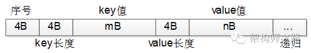

```
最前面4个字节表示序号
序号后面4个字节表示key的长度m
后面m个字节表示key的值
在后面4个字节表示value的长度n
接着n个字节表示value的值
像xml一样递归，直至描述完整个对象
```

 那根据上面协议描述出来的User对象，如下：

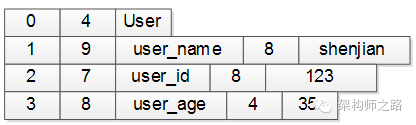

```
第一行：序号4个字节（设0表示类名），类名长度4个字节（长度为4），接下来4个字节是类名（User），共12字节
第二行：序号4个字节（1表示第一个属性），属性长度4个字节（长度为9），接下来9个字节是属性名（user_name），属性值长度4个字节（长度为8），属性值8个字节（值为”shenjian”），共29字节
第三行：序号4个字节（2表示第二个属性），属性长度4个字节（长度为7），接下来7个字节是属性名（user_id），属性值长度4个字节（长度为8），属性值8个字节（值为123），共27字节
第四行：序号4个字节（3表示第三个属性），属性长度4个字节（长度为8），接下来8个字节是属性名（user_name），属性值长度4个字节（长度为4），属性值4个字节（值为35），共24字节

整个二进制字节流共12+29+27+24=92字节。
```

 实际序列化协议要考虑的细节远比这个多。例如：强类型的语言不仅要还原属性名，属性值，还要还原属性类型；复杂的对象不仅要考虑普通类型，还要考虑对象嵌套类型等。无论如何，序列化的思路都是类似的。

 

## **序列化协议考虑因素**

不管使用成熟协议xml/json，还是自定义二进制协议来序列化对象。序列化的协议都需要考虑以下因素：

- **解析效率**：这个应该是序列化协议应首要考虑的因素，像xml/json解析起来比较耗时，需要解析doom树，二进制自定义协议解析起来效率就很高
- **压缩率和传输有效性**：同一对象xml/json传输起来包含有大量的xml标签等，信息的有效性较低，二进制自定义协议占用的空间相对来说就小很多
- **扩展和兼容性**：是否能方便的增减字段，增减字段后旧版客户端是否要强制升级，xml/json和上面的二进制协议都能够方便的扩展
- **可读和可调试性**：很好理解，xml/json的可读性就比二进制协议好很多
- **跨语言**：上面的两个协议都是跨语言，有些序列化协议与开发语言紧密相关。例如dubbo序列化协议只能支持Java的RPC调用
- **通用性**：xml/json非常通用，都有很好的第三方解析库，各个语言解析起来也十分方便。自定义二进制协议虽能够跨语言，但每个语言都要写一个简易的协议客户端

 

## **常见序列化格式**

**xml/json**：解析效率和压缩率较差，但扩展性、可读性和通用性较好

**protobuf**：Google出品，各方面都不错，强烈推荐，属于二进制协议。可读性差点，但有类似的to-string协议帮助调试

**mc_pack**：传说各方面要超越protobuf，但是只能说是传说

**thrift**：由Facebook开发，有兴趣可以了解下

当然还有**Avro**、**CORBA**等等

## 调用方式

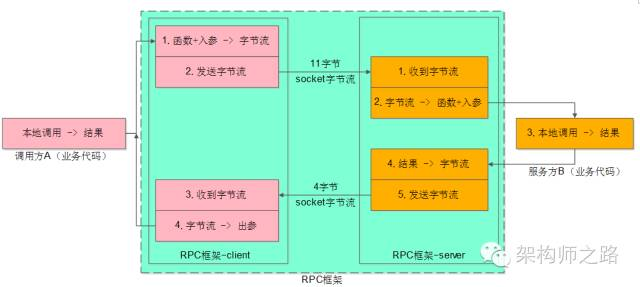

RPC-client 不仅包含序列化和反序列化（上图中的1和4）还包含发送和接收字节流（上图中的2和3）

字节流传输分为`同步调用`和`异步调用`两种

 

同步调用代码片段如：

```
Result = Add(Obj1, Obj2);      //得到Result之前处于阻塞状态
```

异步调用代码片段如：

```
Add(Obj1, Obj2, callback);    //调用后直接返回，不等结果
```

处理结果通过回调为：

```
callback(Result){
...
}                   // 得到处理结果后会调用这个回调函数
```

两类调用在RPC-client中实现方式完全不一样的

 

### **同步调用架构**

在调用得到结果前，一直处于阻塞状态，也会一直占用工作线程，直到的到结果才能再处理调用。如下图：

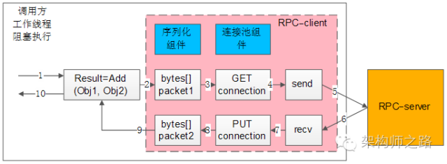

**组件描述**：

左边大框：代表调用方的整个工作线程

右边橙框：代表RPC-server服务提供方

粉色中框：代表RPC-client组件

蓝色小框：代表同步RPC-client两个核心组件（序列化和连接池组件）

白色流程框，以及箭头序号：代表整个工作线程的串行执行步骤

**执行步骤**：

1. 业务代码发起RPC对象调用
2. 序列化组件将对象调用序列化成二进制字节流
3. 通过连接池组件拿到一个可用的连接进程
4. 通过连接进程将包发送给RPC-server
5. 发送的包在网络传输到RPC-server接收
6. RPC-server响应包在网络传输返回给RPC-client
7. 通过连接进程收取响应包
8. 通过连接池组件，将连接进程释放放回连接池中
9. 序列化组件，将响应包反序列化为对象返回给调用方
10. 业务代码获取到结果


**连接池组件**

连接池组件作用：RPC框架锁支持的负载均衡、故障转移、发送超时等特性的实现。

​                                           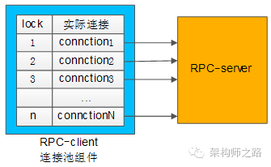
典型连接池组件对外接口代码为：

```
int ConnectionPool::init(…);
Connection ConnectionPool::getConnection();
int ConnectionPool::putConnection**(Connection t);
```

**init**和下游RPC-server，建立N个TCP长连接，即所谓的连接池。

**getconnection**从连接池中得到一个连接，加锁（置个标志位），返回给调用方。

**putConnection**将使用的连接放回连接池中，解锁（也是置个标志位）。


**其他功能实现**

连接池建立了一个与RPC-server集群的连接，连接池在返回连接的时候，需具备随机性，来实现**负载均衡**。

连接池建立了一个与RPC-server集群的连接，当连接池发现某个节点的连接异常后，需要将这个节点的连接剔除掉，返回正常的连接；在节点恢复后，再将连接加回来，来实现**故障转移**。

同步阻塞调用，得到一个连接后，使用带超时的send/recv即可，实现带**超时**的发送和接收。

总的来说：同步RPC-client调用实现是相对较容易的。序列化和连接池组件配合多工作线程数就能够实现了。


### **异步回调架构**

在调用得到结果前，不会处于阻塞状态，理论上任何时候都没有任何线程处于阻塞状态。所以理论上只需要很少工作线程与服务连接就能够达到很高的吞吐量。如下图

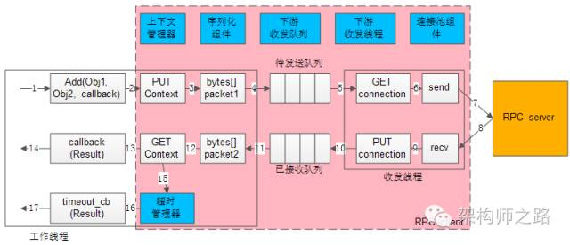

**组件描述**：

左边框框：是少量工作线程，执行调用和回调动作

中间粉框：代表RPC-client组件

右边橙框：代表RPC-server组件

蓝色小框：代表异步RPC-client六个核心组件：**上下文管理器、超时管理器、序列化组件**、**下游收发队列、下游收发线程和连接池组件**

白色流程框，以及箭头序号：代表整个工作线程的串行执行步骤


**执行步骤**：

1. 业务代码发起对象RPC异步调用

2. 上下文管理器将请求回调和上下文存储起来

3. 序列化组件调用序列化将对象转成二进制字节流

4. 下游收发队列将报文放入待发送队列中此时调用返回，不会阻塞工作线程；

5. 下游收发线程从待发送队列中将报文取出，再通过连接池组件拿到一个可用的连接进程

6. 通过连接进程将请求包发送给RPC-server组件

7. 请求包在网络中传输到RPC-server

8. RPC-server响应包在网络中传输，返回给RPC-client

9. 通过连接进程收取从RPC-server的响应包

10. 下游收发线程将响应报文放入已接受队列中，通过连接池组件将连接进程放回到连接池中

11. 下游收发队列里将响应报文取出

12. 序列化组件将响应包反序列化为对象结果

13. 上下文管理器将结果回调和上下文取出

14. 通过回调业务代码返回结果，整个流程结束

    **请求长时间不返回**处理流程是：

15. 上下文管理器的请求将长时间得不到返回结果

16. 超时管理器拿到超时的上下文

17. 通过超时管理器回调业务代码，代码报错

 

**其他功能实现**

由于请求包的发送和响应包的回调都是异步发生的，甚至不在同一个工作线程中完成，所以需要一个组件来记录请求的上下文，来把请求-->响应-->回调等信息匹配起来，这就是**上下文管理器**。

将请求-->响应-->回调信息匹配，假设通过连接向下游服务发送a，b，c三个请求包，那么异步收到了x，y，z三个响应包，如下图：

​                                                             

可以通过**请求id**来实现请求-->响应-->回调信息匹配，如下图：

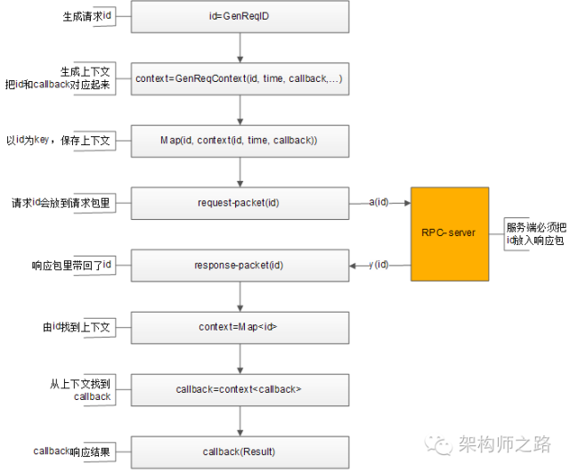
**流程描述**如下：

1. 请求时生成请求id
2. 生成请求上下文内容，上下文内容中包含请求时间和回调函数等信息
3. 上下文管理器记录请求id与上下文内容的映射关系
4. 将请求id放在请求包里发给RPC-server
5. RPC-server也把请求id打在响应包里进行返回
6. 有响应包中的请求id，通过上下文管理器找到原来的上下文内容
7. 从上下文内容中拿到回调函数
8. 回调函数将响应结果返回

 

与同步连接池类似，不同的是同步连接池使用阻塞方式来收发，需要服务与ip建立多条连接；而异步调用的收发是服务和ip只需要建立少量的连接即可，来实现**负载均衡和故障转移**

**超时收发**，与同步阻塞收发差异的是：同步阻塞超时可以直接使用带超时的send/recv来实现，而异步非阻塞的ni网络报文收发，由于请求连接不会一直等待响应回包，所以超时是由超时管理器这个组件来专门管理。

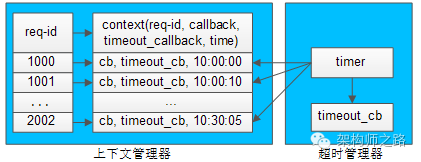

每个请求发送给下游RPC-server时，会在上下文管理器中保存请求id与上下文的信息，而上下文中也保存了请求的很多相关信息。如请求id、回包回调、超时回调和发送时间等等。超时管理器启动定时器对上下文管理器中的内容进行扫描，判断上下文中的请求发送时间是否过长，如果过长，就不再等待回包，直接超时回调，并将上下文删除掉。如果超时回调执行后，正常响应回包又到达，通过请求id在上下文管理器里找不到上下文，就直接将请求丢弃，超时已处理是无法恢复上下文的。

### 总结

异步回调比同步回调，除共有序列化组件和连接池组件外，还会多出上下文管理器、超时管理器、下游收发队列和下游收发线程等组件，并对调用方的调用习惯也有影响，由同步直接得到结果变为了回调才可以。但是异步回调能极大的提高提高系统的吞吐量和处理请求，要结合业务场景合理的选取方式来实现RPC-client。


## **知识梳理**

**RPC调用**：就是像调用本地函数一样去调用远端服务。

**RPC框架优点**：屏蔽调用过程中的序列化，网络传输等技术细节。让调用方只专注于调用，服务方只专注于实现调用。

**序列化**：将对象转化为连续存储空间二进制流的过程，就叫做序列化。而磁盘存储、缓存存储和网络传输等操作只能是二进制流。

**同步RPC客户端核心组件**：序列化组件和连接池组件。通过连接池实现负载均衡和故障转移，通过阻塞收发实现超时处理。

**异步RPC客户端的核心组件**：序列化组件、连接池组件、收发队列、收发线程、上下文管理器和超时管理器。通过请求id将请求包-->响应包-->回调函数进行映射关联，上下文管理器管理上下文，超时管理器定时器触发超时回调。


