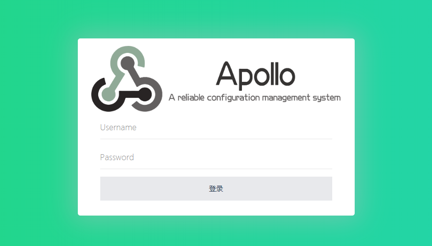

## 简介

Apollo（阿波罗）是携程框架部门研发的分布式配置中心，能够集中化管理应用不同环境、不同集群的配置，配置修改后能够实时推送到应用端，并且具备规范的权限、流程治理等特性，适用于微服务配置管理场景。本文就详细讲解了Apollo这一统一配置中心的搭建过程。


## 参考

[官方地址](https://github.com/ctripcorp/apollo)

[官方详细文档](https://github.com/ctripcorp/apollo/wiki/Apollo%E9%85%8D%E7%BD%AE%E4%B8%AD%E5%BF%83%E4%BB%8B%E7%BB%8D)

[快速部署文档](https://github.com/ctripcorp/apollo/wiki/Quick-Start)

[生产分布式部署指南](https://github.com/ctripcorp/apollo/wiki/分布式部署指南)

<!--more-->

## 环境

系统版本：CentOS7.X

环境组件：JDK1.8，Mysql5.7

说明：本次部署是在单台上部署测试环境，这里只做研究测试，尽量不要用在生产环境。因为生产环境通常为保证服务的稳定性，需要考虑高可用和高负载等方案。


## 部署

### 下载安装包

[官方稳定包下载](https://github.com/ctripcorp/apollo/releases)

依赖的jar包如下:

apollo-adminservice-1.6.1-github.zip

apollo-configservice-1.6.1-github.zip

apollo-portal-1.6.1-github.zip  

### 创建ApolloPortalDB

通过各种MySQL客户端导入[sql/apolloportaldb.sql](https://github.com/nobodyiam/apollo-build-scripts/blob/master/sql/apolloportaldb.sql)即可

导入成功后，可以通过执行以下sql语句来验证

```mysql
select `Id`, `AppId`, `Name` from ApolloPortalDB.App;
```

|  Id  |   AppId   |    Name    |
| :--: | :-------: | :--------: |
|  1   | SampleApp | Sample App |

### 创建ApolloConfigDB

通过各种MySQL客户端导入[sql/apolloconfigdb.sql](https://github.com/nobodyiam/apollo-build-scripts/blob/master/sql/apolloconfigdb.sql)即可
导入成功后，可以通过执行以下sql语句来验证

```mysql
select `NamespaceId`, `Key`, `Value`, `Comment` from ApolloConfigDB.Item;
```

| NamespaceId |   Key   | Value |      Comment       |
| :---------: | :-----: | :---: | :----------------: |
|      1      | timeout |  100  | sample timeout配置 |

### 修改数据库配置文件

```bash
# 创建应用目录
mkdir -p /usr/local/{apollo-adminservice,apollo-configservice,apollo-portal}

# 解压安装包
unzip apollo-adminservice-1.6.1-github.zip -d /usr/local/apollo-adminservice/
unzip apollo-configservice-1.6.1-github.zip -d /usr/local/apollo-configservice/
unzip apollo-portal-1.6.1-github.zip -d /usr/local/apollo-portal/


vim /usr/local/apollo-configservice/config/application-github.properties

# DataSource
spring.datasource.url = jdbc:mysql://localhost:3306/ApolloPortalDB?characterEncoding=utf8
spring.datasource.username = root
spring.datasource.password = 123456


vim /usr/local/apollo-portal/config/application-github.properties

# DataSource
spring.datasource.url = jdbc:mysql://localhost:3306/ApolloConfigDB?characterEncoding=utf8
spring.datasource.username = root
spring.datasource.password = 123456
#apollo.eureka.server.enabled=true
#apollo.eureka.client.enabled=true

# 设置各个环境meta
vim /usr/local/apollo-portal/config/apollo-env.properties

格式：${env}.meta=http://${config-service-url:port}
例如：
dev.meta=http://1.1.1.1:8080
fat.meta=http://apollo.fat.xxx.com
uat.meta=http://apollo.uat.xxx.com
pro.meta=http://apollo.xxx.com
```

### 启动apollo服务

启动顺序

configservice -->   adminservice  -->  portal

一切顺利的话: 通过访问  http://部署服务器地址:端口/8070,  就能看到配置登录页

