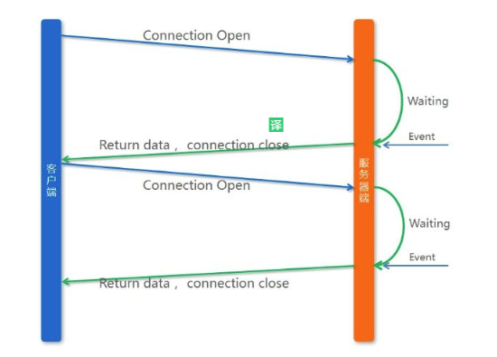
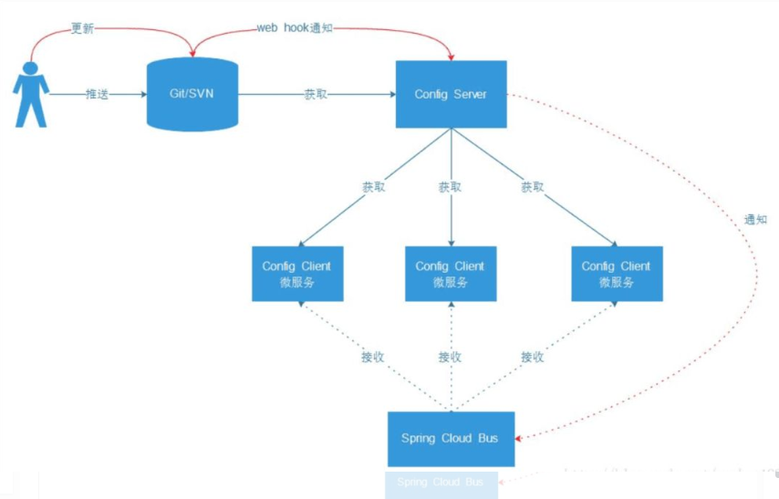
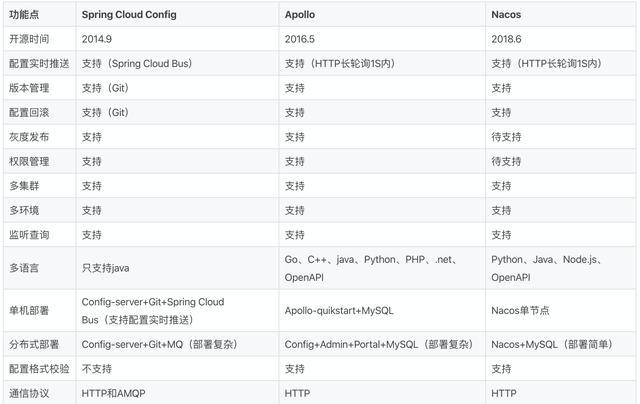
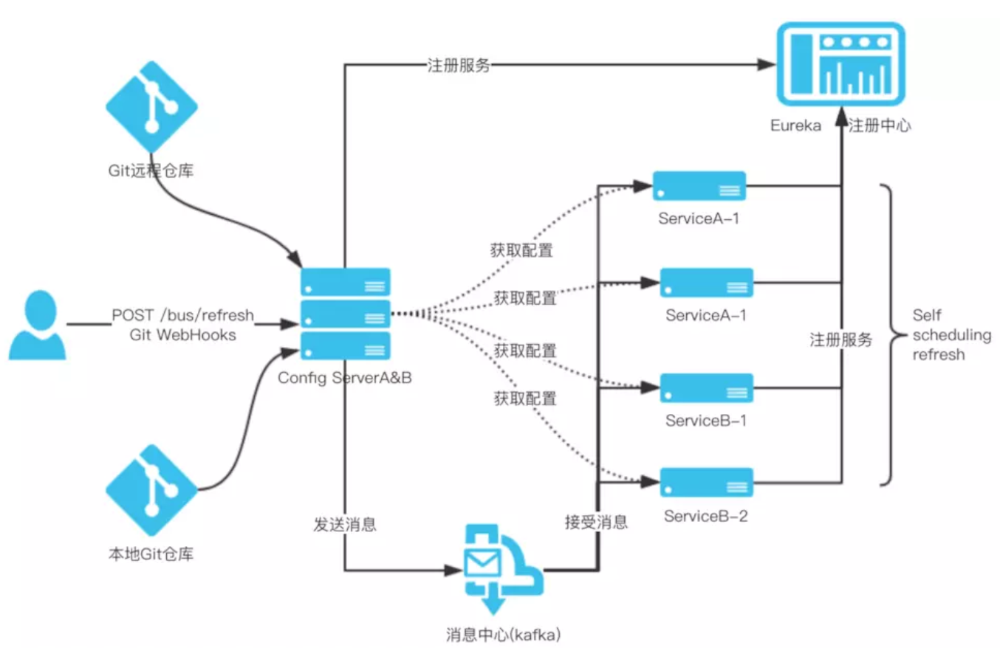
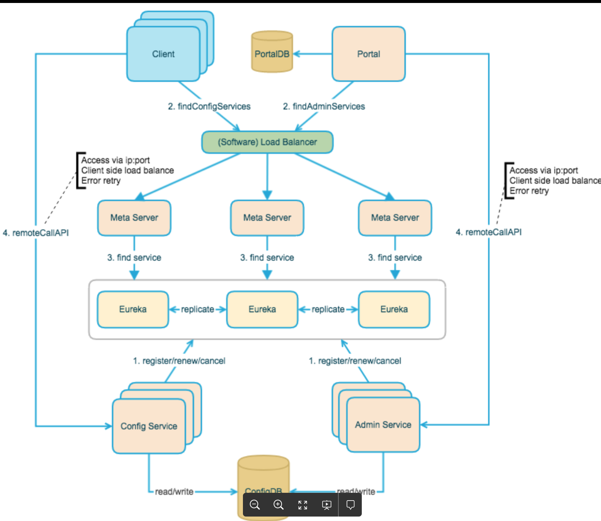
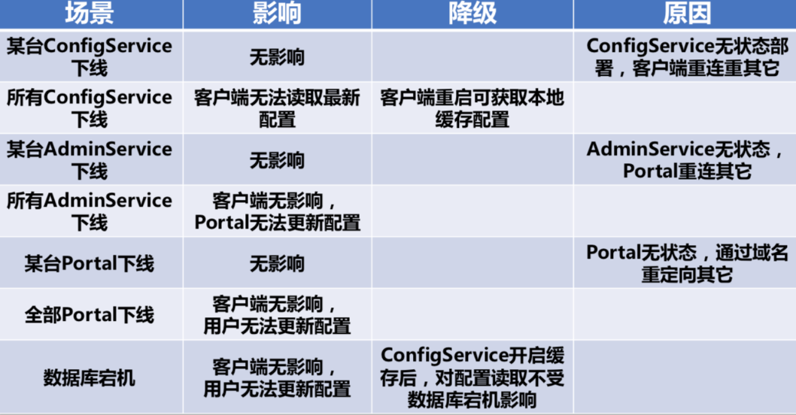
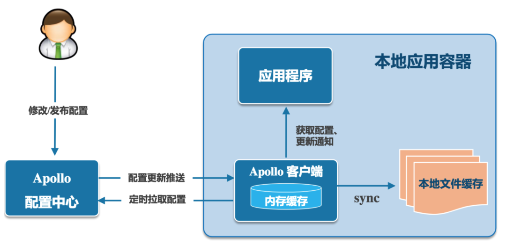

## 为什么需配置中心

### 配置实时生效

传统的静态配置方式要想修改某个配置只能修改之后重新发布应用。如要实现动态性，可以选择使用数据库，通过定时轮询访问数据库来感知配置的变化。但是轮询频率低，感知配置变化的延时就长，轮询频率高，感知配置变化的延时就短，但又比较损耗性能，所以需要在实时性和性能之间做折中。而配置中心专门针对这个业务场景，兼顾实时性和一致性来管理动态配置。

### 配置管理流程

配置的权限管控、灰度发布、版本管理、格式检验和安全配置等一系列的配置管理相关的特性也是配置中心不可获取的一部分。

### 运维需求

随着程序功能的日益复杂，程序的配置日益增多：各种功能的开关、参数的配置、服务器的地址等等。对程序配置的期望值也越来越高：配置修改后实时生效，分环境、分集群管理配置，代码安全、审核机制等等。在这样的大环境下，传统的通过配置文件、数据库等方式已经越来越无法满足开发人员对配置管理的需求。所以，配置中心应运而生。

## 开源配置中心比较

目前市面上用的比较多的配置中心有：（按开源时间排序）

### Disconf

2014年7月百度开源的配置管理中心，同样具备配置的管理能力，不过目前已经不维护了，最近的一次提交是两年前了。

### Spring Cloud Config

2014年9月开源，Spring Cloud 生态组件，可以和Spring Cloud体系无缝整合。

### Apollo

2016年5月，携程开源的配置管理中心，具备规范的权限、流程治理等特性。

### Nacos

2018年6月，阿里开源的配置中心，也可以做DNS和RPC的服务发现。

## 参考文档

[Spring Cloud Config](https://springcloud.cc/spring-cloud-config.html)

[Apollo](https://github.com/ctripcorp/apollo)

[Nacos](https://nacos.io/)

<!--more-->

## 产品概念特点比较

由于Disconf不再维护，下面对比一下Spring Cloud Config、Apollo和Nacos。

### 应用

应用是客户端系统的基本单位，Spring Cloud Config 将应用名称和对应Git中的文件名称关联起来了，这样可以起到多个应用配置相互隔离的作用。Apollo的配置都是在某个应用下面的（除了公共配置），也起到了多个应用配置相互隔离的作用。Nacos的应用概念比较弱，只有一个用于区分配置的额外属性，不过可以使用 Group 来做应用字段，可以起到隔离作用。

### 集群

不同的环境可以搭建不同的集群，这样可以起到物理隔离的作用，Spring Cloud Config、Apollo、Nacos都支持多个集群。

### Label Profile & 环境 & 命名空间

Spring Cloud Config可以使用Label和Profile来做逻辑隔离，Label指远程仓库的分支，Profile类似Maven Profile可以区分环境，比如{application}-{profile}.properties。

Nacos的命名空间和Apollo的环境一样，是一个逻辑概念，可以作为环境逻辑隔离。Apollo中的命名空间指配置的名称，具体的配置项指配置文件中的一个Property。

### 配置管理功能的对比

作为配置中心，配置的整个管理流程应该具备流程化能力。

### 灰度发布

配置的灰度发布是配置中心比较重要的功能，当配置的变更影响比较大的时候，需要先在部分应用实例中验证配置的变更是否符合预期，然后再推送到所有应用实例。

Spring Cloud Config支持通过/bus/refresh端点的destination参数来指定要更新配置的机器，不过整个流程不够自动化和体系化。

Apollo可以直接在控制台上点灰度发布指定发布机器的IP，接着再全量发布，做得比较体系化。
Nacos目前发布到0.9版本，还不支持灰度发布。

### 权限管理

配置的变更和代码变更都是对应用运行逻辑的改变，重要的配置变更常常会带来核弹的效果，对于配置变更的权限管控和审计能力同样是配置中心重要的功能。

Spring Cloud Config依赖Git的权限管理能力，开源的GitHub权限控制可以分为Admin、Write和Read权限，权限管理比较完善。

Apollo通过项目的维度来对配置进行权限管理，一个项目的owner可以授权给其他用户配置的修改发布权限。

Nacos目前看还不具备权限管理能力。

### 版本管理&回滚

当配置变更不符合预期的时候，需要根据配置的发布版本进行回滚。Spring Cloud Config、Apollo和Nacos都具备配置的版本管理和回滚能力，可以在控制台上查看配置的变更情况或进行回滚操作。Spring Cloud Config通过Git来做版本管理，更方便些。

### 配置格式校验

应用的配置数据存储在配置中心一般都会以一种配置格式存储，比如Properties、Json、Yaml等，如果配置格式错误，会导致客户端解析配置失败引起生产故障，配置中心对配置的格式校验能够有效防止人为错误操作的发生，是配置中心核心功能中的刚需。
Spring Cloud Config使用Git，目前还不支持格式检验，格式的正确性依赖研发人员自己。
Apollo和Nacos都会对配置格式的正确性进行检验，可以有效防止人为错误。

### 监听查询

当排查问题或者进行统计的时候，需要知道一个配置被哪些应用实例使用到，以及一个实例使用到了哪些配置。
Spring Cloud Config使用Spring Cloud Bus推送配置变更，Spring Cloud Bus兼容 RabbitMQ、Kafka等，支持查询订阅Topic和Consumer的订阅关系。
Apollo可以通过灰度实例列表查看监听配置的实例列表，但实例监听的配置(Apollo称为命名空间)目前还没有展示出来。

Nacos可以查看监听配置的实例，也可以查看实例监听的配置情况。

基本上，这三个产品都具备监听查询能力，在我们自己的使用过程中，Nacos使用起来相对简单，易用性相对更好些。

### 多环境

在实际生产中，配置中心常常需要涉及多环境或者多集群，业务在开发的时候可以将开发环境和生产环境分开，或者根据不同的业务线存在多个生产环境。如果各个环境之间的相互影响比较小（开发环境影响到生产环境稳定性），配置中心可以通过逻辑隔离的方式支持多环境。

Spring Cloud Config支持Profile的方式隔离多个环境，通过在Git上配置多个Profile的配置文件，客户端启动时指定Profile就可以访问对应的配置文件。

Apollo也支持多环境，在控制台创建配置的时候就要指定配置所在的环境，客户端在启动的时候指定JVM参数ENV来访问对应环境的配置文件。

Nacos通过命名空间来支持多环境，每个命名空间的配置相互隔离，客户端指定想要访问的命名空间就可以达到逻辑隔离的作用。

### 多集群

当对稳定性要求比较高，不允许各个环境相互影响的时候，需要将多个环境通过多集群的方式进行物理隔离。

Spring Cloud Config可以通过搭建多套Config Server，Git使用同一个Git的多个仓库，来实现物理隔离。

Apollo可以搭建多套集群，Apollo的控制台和数据更新推送服务分开部署，控制台部署一套就可以管控多个集群。

Nacos控制台和后端配置服务是部署在一起的，可以通过不同的域名切换来支持多集群。

### 配置实时推送的对比

当配置变更的时候，配置中心需要将配置实时推送到应用客户端。

Nacos和Apollo配置推送都是基于HTTP长轮询，客户端和配置中心建立HTTP长联接，当配置变更的的时候，配置中心把配置推送到客户端。

Spring Cloud Config原生不支持配置的实时推送，需要依赖Git的WebHook、Spring Cloud Bus和客户端/bus/refresh端点:

- 基于Git的WebHook，配置变更触发server端refresh
- Server端接收到请求并发送给Spring Cloud Bus
- Spring Cloud Bus接到消息并通知给客户端
- 客户端接收到通知，请求Server端获取最新配置

整体比较下来，Nacos和Apollo在配置实时推送链路上是比较简单高效的，Spring Cloud Config的配置推送引入Spring Cloud Bus，链路较长，比较复杂。

## 产品功能特点比较

根据下面的图，就可以直观了解各个产品功能

## 架构比较

目前很多公司内部微服务架构基础设施建设中，技术选型以Spring Cloud技术为主，也被大家俗称作“全家桶”。

因其具备微服务架构体系中所需的各个服务组件，比如服务注册发现(如Spring Cloud Eureka、Zookeeper、Consul)、API网关路由服务(Spring Cloud Zuul)，客户端负载均衡(Spring Cloud Ribbon，Zuul默认集成了Ribbon)、服务容错保护(Spring Cloud Hystrix)，消息总线 (Spring Cloud Bus)、分布式配置中心(Spring Cloud Config)、消息驱动的微服务(Spring Cloud Stream)、分布式链路跟踪服务(Spring Cloud Sleuth)。

### **Spring Cloud Config配置中心介绍&架构**

在微服务架构体系中配置中心是比较重要的组件之一，Spring Cloud官方自身提供了Spring Cloud Config分布式配置中心，由它来提供集中化的外部配置支持，它分为客户端和服务端两个部分。其中服务端称作配置中心，是一个独立的微服务应用，用来连接仓库(如Git、Svn)并未客户端提供获取配置的接口；而客户端是各微服务应用，通过指定配置中心地址从远端获取配置内容，启动时加载配置信息到应用上下文中。因Spring Cloud Config实现的配置中心默认采用了Git来存储配置信息，所以版本控制管理也是基于Git仓库本身的特性来支持的 。
对该组件调研后，主要采用基于消息总线的架构方式，架构图如下所示：

基于消息总线的配置中心架构中需要依赖外部的MQ组件，如Rabbit、Kafka 实现远程环境事件变更通知，客户端实时配置变更可以基于Git Hook功能实现。
**Self scheduleing refresher**

> **Self scheduleing refresher** 是一个定时任务，默认5分钟执行一次，执行时会判断本地的Git仓库版本与远程Git仓库版本如果不一致，则会从配置中心获取最新配置进行加载，保障了配置最终一致性。

经过实际使用你会发现Spring Cloud Config这个配置中心并不是非常好用，如果是小规模的项目可以使用问题不大，但它并不适用于中大型的企业级的配置管理。

### Apollo总体架构设计

**各组件作用说明**

**Apollo HA高可用设计**

### Apollo客户端架构

**客户端架构原理**

1. 推拉结合方式
   客户端与配置中心保持一个长连接，配置实时推送
   定时拉配置(默认5分钟)
2. 本地缓存
   配置缓存在内存
   本地缓存一份配置文件
3. 应用程序
   通过Apollo客户端获取最新配置
   订阅配置更新通知

### Apollo核心概念

application (应用)

> 每个应用都需要有唯一的身份标识 -- appId

environment (环境)

> Apollo客户端通过不同环境获取对应配置

cluster (集群)

> 一个应用下不同实例的分组，不同的cluster，可以有不同的配置。
>  比如北京机房和天津机房可以有不一样的kafka或zk地址配置。

namespace (命名空间)

> 一个应用下不同配置的分组，不同的namespace的类似于不同的文件。
>  如：数据库配置，RPC配置等。支持继承公共组件的配置。
>  **配置分类**
>  私有类型（private）：只能被所属应用获取
>  公共类型（public）：必须全局唯一。使用场景：部门/小组级别共享配置，中间件客户端配置。
>  关联类型（继承类型）：私有继承公有配置并覆盖；定制公共组件配置场景。
>  **配置项(Item)**
>  默认和公共配置使用properties格式；私有配置支持properties/json/xml/yaml/yml格式。
>  定位方式：app+cluster+namespace+item_key

权限管理

> 系统管理员拥有所有的权限
>  创建者可以代为创建项目，责任人默认是项目管理员，一般创建者=责任人
>  项目管理员可创建集群，Namespace，管理项目和Namespace权限
>  编辑权限只能编辑不能发布
>  发布权限只能发布不能编辑
>  普通用户可以搜索查看所有项目配置，但没有相关操作权限

### Nacos架构

## 部署结构 & 高可用的对比

### Spring Cloud Config

Spring Cloud Config包含config-server、Git和Spring Cloud Bus三大组件：

- config-server提供给客户端获取配置;
- Git用于存储和修改配置;
- Spring Cloud Bus通知客户端配置变更;

本地测试模式下，Spring Cloud Bus和config-server需要部署一个节点，Git使用GitHub就可以。

Git服务如果使用GitHub就不用考虑高可用问题，如果考虑到安全性要自建Git私有仓库，整体的成本比较高。Web服务可以部署多节点支持高可用，由于Git有数据的一致性问题，可以通过以下的方式来支持高可用：

- Git+Keepalived冷备模式，当主Git挂了可以马上切到备Git;
- Git多节点部署，存储使用网络文件系统或者通过DRBD实现多个Git节点的数据同步;

### Apollo

Apollo分为MySQL，Config Service，Admin Service，Portal四个模块：

- MySQL存储Apollo元数据和用户配置数据;
- Config Service提供配置的读取、推送等功能，客户端请求都是落到Config Service上;
- Admin Service提供配置的修改、发布等功能，Portal操作的服务就是Admin Service;
- Portal提供给用户配置管理界面;

本地测试Config Service，Admin Service，Portal三个模块可以合并一起部署，MySQL单独安装并创建需要的表结构。在生产环境使用Apollo，Portal可以两个节点单独部署，稳定性要求没那么高的话，Config Service和Admin Service可以部署在一起，数据库支持主备容灾。

### Nacos

Nacos部署需要Nacos Service和MySQL：

- Nacos对外提供服务，支持配置管理和服务发现;
- MySQL提供Nacos的数据持久化存储;

单机模式下，Nacos可以使用嵌入式数据库部署一个节点，就能启动。

### 整体来看

Nacos的部署结构比较简单，运维成本较低。Apollo部署组件较多，运维成本比Nacos高。Spring Cloud Config生产高可用的成本最高。

### 多语言支持的对比

一个公司的各个系统可能语言不尽相同，现在使用的比较多的比如C++，Java，PHP，Python，Nodejs，还有Go等。引入配置中心之后，配置中心要想让多语言的系统都能享受到动态配置的能力，需要支持多语言生态。

### 多语言支持

Spring Cloud服务于Java生态，一开始只是针对Java微服务应用，对于非Java应用的微服务调用，可以使用Sidecar提供了HTTP API，但动态配置方面还不能很好的支持。

Apollo已经支持了多种语言，并且提供了open API。其他不支持的语言，Apollo的接入成本相对较低。

[Nacos](http://mp.weixin.qq.com/s?__biz=MzI3ODcxMzQzMw==&mid=2247488083&idx=1&sn=75cbbb39c04510953e9d7b0eb8e43147&chksm=eb539765dc241e73849c188fd51761aeb09b2ea9b1f3919313659476bf5a92a764bd42828b73&scene=21#wechat_redirect)支持主流的语言，例如Java、Go、Python、Nodejs、PHP等，也提供了open API。

### 迁移支持

国内主流的互联网公司仍是以Java为主，除了原生Java SDK，在对整个Java生态，比如Spring Boot和Spring Cloud的支持上，三个产品都是支持的。

Spring Cloud Config原生就支持Spring Boot和Spring Cloud，Nacos通过Spring Cloud for Alibaba支持Spring Boot和Spring Cloud生态，符合Spring生态中的标准实现方式，可以无缝从Spring Cloud Conig迁移到Nacos。

Apollo支持Spring Boot和Spring Cloud项目，但是实现方式不同于标准，无法做无缝迁移，从Spring Cloud迁移到Apollo，存在代码改造和兼容性成本。

## 总结

总的来说，Apollo和Nacos相对于Spring Cloud Config的生态支持更广，在配置管理流程上做的更好。Apollo相对于Nacos在配置管理做的更加全面。Nacos使用起来相对比较简洁，在对性能要求比较高的大规模场景更适合。此外，Nacos除了提供配置中心的功能，还提供了动态服务发现、服务共享与管理的功能，降低了服务化改造过程中的难度。但Nacos开源不久，还有一定的局限性，如权限管理，灰度等等。所以下篇文章详细介绍apollo的搭建过程。