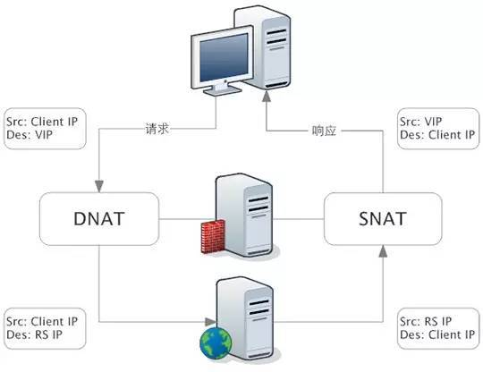

## 简介

    LVS（Linux Virtual Server）即Linux虚拟服务器，是由章文嵩博士主导的开源负载均衡项目，目前LVS已经被集成到Linux内核模块中。该项目在Linux内核中实现了基于IP的数据请求负载均衡调度方案，其体系结构如图1所示，终端互联网用户从外部访问公司的外部负载均衡服务器，终端用户的Web请求会发送给LVS调度器，调度器根据自己预设的算法决定将该请求发送给后端的某台Web服务器，比如，轮询算法可以将外部的请求平均分发给后端的所有服务器，终端用户访问LVS调度器虽然会被转发到后端真实的服务器，但如果真实服务器连接的是相同的存储，提供的服务也是相同的服务，最终用户不管是访问哪台真实服务器，得到的服务内容都是一样的，整个集群对用户而言都是透明的。最后根据LVS工作模式的不同，真实服务器会选择不同的方式将用户需要的数据发送到终端用户，LVS工作模式分为NAT模式、TUN模式、以及DR模式。


本文详细讲解了lvs的三种模式和十种算法。让你有个清晰的认识。


<!--more-->


## 三种模式

### 基于NAT

      NAT（Network Address Translation）即网络地址转换，其作用是通过数据报头的修改，使得位于企业内部的私有IP地址可以访问外网，以及外部用用户可以访问位于公司内部的私有IP主机。VS/NAT工作模式拓扑结构如图2所示，LVS负载调度器可以使用两块网卡配置不同的IP地址，eth0设置为私钥IP与内部网络通过交换设备相互连接，eth1设备为外网IP与外部网络联通。

 第一步，用户通过互联网DNS服务器解析到公司负载均衡设备上面的外网地址，相对于真实服务器而言，LVS外网IP又称VIP（Virtual IP Address），用户通过访问VIP，即可连接后端的真实服务器（Real Server），而这一切对用户而言都是透明的，用户以为自己访问的就是真实服务器，但他并不知道自己访问的VIP仅仅是一个调度器，也不清楚后端的真实服务器到底在哪里、有多少真实服务器。

第二步，用户将请求发送至124.126.147.168，此时LVS将根据预设的算法选择后端的一台真实服务器（192.168.0.1~192.168.0.3），将数据请求包转发给真实服务器，并且在转发之前LVS会修改数据包中的目标地址以及目标端口，目标地址与目标端口将被修改为选出的真实服务器IP地址以及相应的端口。

第三步，真实的服务器将响应数据包返回给LVS调度器，调度器在得到响应的数据包后会将源地址和源端口修改为VIP及调度器相应的端口，修改完成后，由调度器将响应数据包发送回终端用户，另外，由于LVS调度器有一个连接Hash表，该表中会记录连接请求及转发信息，当同一个连接的下一个数据包发送给调度器时，从该Hash表中可以直接找到之前的连接记录，并根据记录信息选出相同的真实服务器及端口信息。


NAT（Network Address Translation）是一种外网和内网地址映射的技术。

NAT 模式下，网络数据报的进出都要经过 LVS 的处理。LVS 需要作为 RS（真实服务器）的网关。

当包到达 LVS 时，LVS 做目标地址转换（DNAT），将目标 IP 改为 RS 的 IP。RS 接收到包以后，仿佛是客户端直接发给它的一样。RS 处理完，返回响应时，源 IP 是 RS IP，目标 IP 是客户端的 IP。这时 RS 的包通过网关（LVS）中转，LVS 会做源地址转换（SNAT），将包的源地址改为 VIP，这样，这个包对客户端看起来就仿佛是 LVS 直接返回给它的。




### 基于TUN

     在LVS（NAT）模式的集群环境中，由于所有的数据请求及响应的数据包都需要经过LVS调度器转发，如果后端服务器的数量大于10台，则调度器就会成为整个集群环境的瓶颈。我们知道，数据请求包往往远小于响应数据包的大小。因为响应数据包中包含有客户需要的具体数据，所以LVS（TUN）的思路就是将请求与响应数据分离，让调度器仅处理数据请求，而让真实服务器响应数据包直接返回给客户端。VS/TUN工作模式拓扑结构如图3所示。其中，IP隧道（IP tunning）是一种数据包封装技术，它可以将原始数据包封装并添加新的包头（内容包括新的源地址及端口、目标地址及端口），从而实现将一个目标为调度器的VIP地址的数据包封装，通过隧道转发给后端的真实服务器（Real Server），通过将客户端发往调度器的原始数据包封装，并在其基础上添加新的数据包头（修改目标地址为调度器选择出来的真实服务器的IP地址及对应端口），LVS（TUN）模式要求真实服务器可以直接与外部网络连接，真实服务器在收到请求数据包后直接给客户端主机响应数据。


**VS/TUN模式的工作原理**

```
(1)IP隧道技术又称为IP封装技术，它可以将带有源和目标IP地址的数据报文使用新的源和目标IP进行第二次封装，这样这个报文就可以发送到一个指定的目标主机上；
(2)VS/TUN模式下，调度器和后端服务器组之间使用IP隧道技术。当客户端发送的请求(CIP-->VIP)被director接收后，director修改该报文，加上IP隧道两端的IP地址作为新的源和目标地址，并将请求转发给后端被选中的一个目标；
(3)当后端服务器接收到报文后，首先解封报文得到原有的CIP-->VIP，该后端服务器发现自身的tun接口上配置了VIP，因此接受该数据包。
(4)当请求处理完成后，结果将不会重新交给director，而是直接返回给客户端；在后端服务器返回给客户端数据包时，由于使用的是普通网卡接口，根据一般的路由条目，源IP地址将是该网卡接口上的地址，例如是RIP。因此，要让响应数据包的源IP为VIP，必须添加一条特殊的路由条目，明确指定该路由的源地址是VIP。
```

**采用VS/TUN模式时的基本属性和要求**

```
(1)Real  Server的RIP和director的DIP不用处于同一物理网络中，且RIP必须可以和公网通信。也就是说集群节点可以跨互联网实现。
(2)real server的 tun接口上需要配置VIP地址，以便接收director转发过来的数据包，以及作为响应报文的源IP。
(3)director给realserver时需要借助隧道，隧道外层的IP头部的源IP是DIP，目标IP是RIP。而realsever响应给客户端的IP头部是根据隧道内层的IP头分析得到的，源IP是VIP，目标IP是CIP。这样客户端就无法区分这个VIP到底是director的还是服务器组中的。
(4)需要添加一条特殊的路由条目，使得后端服务器返回响应给客户端时的源IP为VIP。
(5)director只处理入站请求，响应请求由realserver完成。

一般来说，VS/TUN模式会用来负载调度缓存服务器组，这些缓存服务器一般放置在不同网络环境，可以就近返回数据给客户端。在请求对象不能在Cache服务器本地命中的情况下，Cache服务器要向源服务器发请求，将结果取回，最后将结果返回给客户。
```


### 基于DR

```
在LVS（TUN）模式下，由于需要在LVS调度器与真实服务器之间创建隧道连接，这同样会增加服务器的负担。与LVS（TUN）类似，DR模式也叫直接路由模式，其体系结构如图4所示，该模式中LVS依然仅承担数据的入站请求以及根据算法选出合理的真实服务器，最终由后端真实服务器负责将响应数据包发送返回给客户端。与隧道模式不同的是，直接路由模式（DR模式）要求调度器与后端服务器必须在同一个局域网内，VIP地址需要在调度器与后端所有的服务器间共享，因为最终的真实服务器给客户端回应数据包时需要设置源IP为VIP地址，目标IP为客户端IP，这样客户端访问的是调度器的VIP地址，回应的源地址也依然是该VIP地址（真实服务器上的VIP），客户端是感觉不到后端服务器存在的。由于多台计算机都设置了同样一个VIP地址，所以在直接路由模式中要求调度器的VIP地址是对外可见的，客户端需要将请求数据包发送到调度器主机，而所有的真实服务器的VIP地址必须配置在Non-ARP的网络设备上，也就是该网络设备并不会向外广播自己的MAC及对应的IP地址，真实服务器的VIP对外界是不可见的，但真实服务器却可以接受目标地址VIP的网络请求，并在回应数据包时将源地址设置为该VIP地址。调度器根据算法在选出真实服务器后，在不修改数据报文的情况下，将数据帧的MAC地址修改为选出的真实服务器的MAC地址，通过交换机将该数据帧发给真实服务器。整个过程中，真实服务器的VIP不需要对外界可见。
```


DR 模式下需要 LVS 和 RS 集群绑定同一个 VIP（RS 通过将 VIP 绑定在 loopback 实现），但与 NAT 的不同点在于：请求由 LVS 接受，由真实提供服务的服务器（RealServer，RS）直接返回给用户，返回的时候不经过 LVS。

详细来看，一个请求过来时，LVS 只需要将网络帧的 MAC 地址修改为某一台 RS 的 MAC，该包就会被转发到相应的 RS 处理，注意此时的源 IP 和目标 IP 都没变，LVS 只是做了一下移花接木。RS 收到 LVS 转发来的包时，链路层发现 MAC 是自己的，到上面的网络层，发现 IP 也是自己的，于是这个包被合法地接受，RS 感知不到前面有 LVS 的存在。而当 RS 返回响应时，只要直接向源 IP（即用户的 IP）返回即可，不再经过 LVS。


DR 负载均衡模式数据分发过程中不修改 IP 地址，只修改 mac 地址，由于实际处理请求的真实物理 IP 地址和数据请求目的 IP 地址一致，所以不需要通过负载均衡服务器进行地址转换，可将响应数据包直接返回给用户浏览器，避免负载均衡服务器网卡带宽成为瓶颈。因此，DR 模式具有较好的性能，也是目前大型网站使用最广泛的一种负载均衡手段。


## 十种调度算法

    根据前面的介绍，我们了解了LVS的三种工作模式，但不管实际环境中采用的是哪种模式，调度算法进行调度的策略与算法都是LVS的核心技术。
    LVS的调度方法分为两种，一种是静态方法，一种是动态方法：
    静态方法：仅根据算法本身实现调度；实现起点公平，不管服务器当前处理多少请求，分配的数量一致
    动态方法：根据算法及后端RS当前的负载状况实现调度；不管以前分了多少，只看分配的结果是不是公平

### 静态调度算法（4种）

*1)rr  ( round robin 轮叫,轮询)*  

说明：轮询调度算法的原理是每一次把来自用户的请求轮流分配给内部中的服务器，从1开始，直到N(内部服务器个数)，然后重新开始循环。算法的优点是其简洁性，它无需记录当前所有连接的状态，所以它是一种无状态调度。缺点：是不考虑每台服务器的处理能力。


*(2)wrr  (weight round robin  加权轮询:以权重之间的比例实现在各主机之间进行调度)*  

说明：由于每台服务器的配置、安装的业务应用等不同，其处理能力会不一样。所以，我们根据服务器的不同处理能力，给每个服务器分配不同的权值，使其能够接受相应权值数的服务请求。


*(3)sh  (source hashing  源地址hash实现会话绑定session affinity)*  

说明：简单的说就是有将同一客户端的请求发给同一个real server,源地址散列调度算法正好与目标地址散列调度算法相反，它根据请求的源IP地址，作为散列键（Hash Key）从静态分配的散列表找出对应的服务器，若该服务器是可用的并且没有超负荷，将请求发送到该服务器，否则返回空。它采用的散列函数与目标地址散列调 度算法的相同。它的算法流程与目标地址散列调度算法的基本相似，除了将请求的目标IP地址换成请求的源IP地址。


*(4)dh  (destination hashing  目标地址hash)*  

说明：将同样的请求发送给同一个server,一般用于缓存服务器，简单的说，LB集群后面又加了一层，在LB与realserver之间加了一层缓存服 务器，当一个客户端请求一个页面时,LB发给cache1,当第二个客户端请求同样的页面时，LB还是发给cache1,这就是我们所说的，将同样的请求 发给同一个server,来提高缓存的命中率。目标地址散列调度算法也是针对目标IP地址的负载均衡，它是一种静态映射算法，通过一个散列（Hash）函 数将一个目标IP地址映射到一台服务器。目标地址散列调度算法先根据请求的目标IP地址，作为散列键（Hash Key）从静态分配的散列表找出对应的服务器，若该服务器是可用的且未超载，将请求发送到该服务器，否则返回空。

### 动态调度算法（6种）

*(1)lc  (leash-connection 最少连接)* 

说明：最少连接调度算法是把新的连接请求分配到当前连接数最小的服务器，最小连接调度是一种动态调度短算法，它通过服务器当前所活跃的连接数来估计服务器 的负载均衡，调度器需要记录各个服务器已建立连接的数目，当一个请求被调度到某台服务器，其连接数加1，当连接中止或超时，其连接数减一，在系统实现时， 我们也引入当服务器的权值为0时，表示该服务器不可用而不被调度。此算法忽略了服务器的性能问题，有的服务器性能好，有的服务器性能差，通过加权重来区分 性能，所以有了下面算法wlc。

简单算法：active*256+inactive (谁的小，挑谁)


*(2)wlc  (加权最少连接 )* 

说明:加权最小连接调度算法是最小连接调度的超集，各个服务器用相应的权值表示其处理性能。服务器的缺省权值为1，系统管理员可以动态地设置服务器的权限，加权 最小连接调度在调度新连接时尽可能使服务器的已建立连接数和其权值成比例。由于服务器的性能不同，我们给性能相对好的服务器，加大权重，即会接收到更多的 请求。

简单算法：（active*256+inactive）/weight（谁的小，挑谁）


*(3)sed (最少期望延迟)* 

说明：不考虑非活动连接，谁的权重大，我们优先选择权重大的服务器来接收请求，但会出现问题，就是权重比较大的服务器会很忙，但权重相对较小的服务器很闲，甚至会接收不到请求，所以便有了下面的算法nq。

基于wlc算法，简单算法：（active+1)*256/weight （谁的小选谁）


*(4)nq (never queue 永不排队)*  

说明：在上面我们说明了，由于某台服务器的权重较小，比较空闲，甚至接收不到请求，而权重大的服务器会很忙，所此算法是sed改进，就是说不管你的权重多 大都会被分配到请求。简单说，无需队列，如果有台real server的连接数为0就直接分配过去，不需要在进行sed运算。


*(5)LBLC  (基于局部性的最少连接)*  

说明：基于局部性的最少连接算法是针对请求报文的目标IP地址的负载均衡调度，主要用于Cache集群系统，因为Cache集群中客户请求报文的目标IP 地址是变化的，这里假设任何后端服务器都可以处理任何请求，算法的设计目标在服务器的负载基本平衡的情况下，将相同的目标IP地址的请求调度到同一个台服 务器，来提高服务器的访问局部性和主存Cache命中率，从而调整整个集群系统的处理能力。


*(6)LBLCR  (基于局部性的带复制功能的最少连接)*   

说明：基于局部性的带复制功能的最少连接调度算法也是针对目标IP地址的负载均衡，该算法根据请求的目标IP地址找出该目标IP地 址对应的服务器组，按“最小连接”原则从服务器组中选出一台服务器，若服务器没有超载，将请求发送到该服务器；若服务器超载，则按“最小连接”原则从这个 集群中选出一台服务器，将该服务器加入到服务器组中，将请求发送到该服务器。同时，当该服务器组有一段时间没有被修改，将最忙的服务器从服务器组中删除， 以降低复制的程度。


总结: 在实际lvs环境中，比较常用的算法有:wlc，rr，wrr这三种，一般性能相近的server常用rr，而根据应用比如连接情况，一般用wlc

