## 安装node.js

在 Windows 环境下安装 Node.js 非常简单，仅须到[官网下载](https://nodejs.org/en/download/)安装文件并执行即可完成安装，其中LTS是长期支持版，Current为最新版，但最新版一般都在开发阶段，还不稳定。建议选择LTS版本


像我的是Windows 64位LTS，直接下载后执行，无脑下一步就行了，不需要配置环境变量。

<!--more-->

## 安装git

访问Git[官网](https://git-scm.com/download/)，下载对应系统的版本。


这里选择windows, 下载完成后执行，一直下一步安装完毕。验证：通过在命令行输入 git version 查看是否安装成功，有输出版本号说明安装成功。

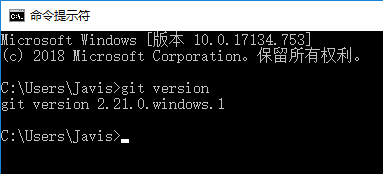

因是windows图形界面，鼠标右键桌面菜单中就多了Git GUI Here和Git Bash Here两个按钮，一个是图形界面的Git操作，一个是命令行，我们选择Git Bash Here。

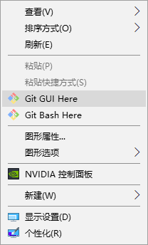

## Hexo介绍

Hexo 是一个快速、简洁且高效的博客框架。Hexo 使用 Markdown（或其他渲染引擎）解析文章，在几秒内，即可利用靓丽的主题生成静态网页。

## 安装Hexo

桌面右键鼠标，点击Git Bash Here，输入npm命令即可安装

```
npm install hexo-cli -g
npm install hexo-deployer-git --save
```

第一句是安装hexo，第二句是安装hexo部署到gitpage的deployer依赖包，两个都需要安装。


创建Hexo文件夹
安装完成后，根据自己喜好建立目录（如F:\Blog\Hexo），直接进入F:\Blog\Hexo文件夹下右键鼠标，点击Git Bash Here，进入Git命令框，执行以下操作。

```
$ hexo init
```


安装 Hexo 完成后，Hexo 将会在指定文件夹中新建所需要的文件。Hexo文件夹下的目录如下： 

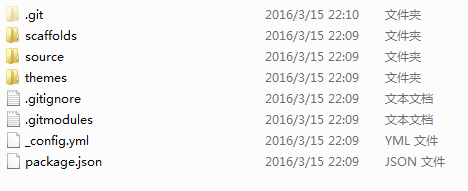

本地查看效果
执行下面语句，执行完即可登录localhost:4000查看效果

```
hexo generate
hexo server
```

登录localhost:4000，即可看到本地的效果如下： 

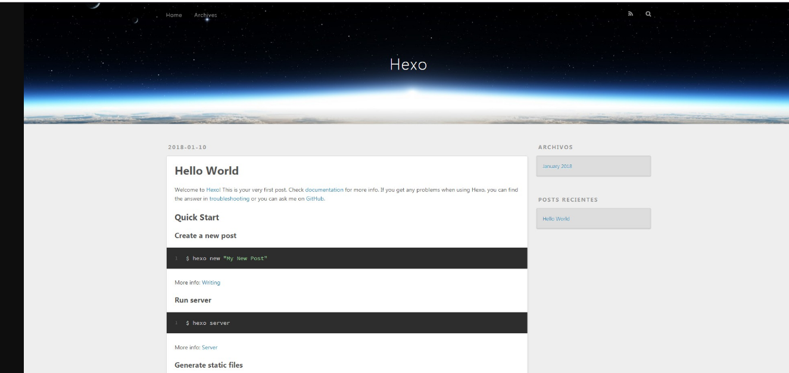

## 部署到GitHub Page上

那么现在本地的博客已经搭建起来了，但是我们只可以通过本地连接查看我们的博客。那么我们现在需要做的就是把本地的博客发布到服务器上，让别人也可以连接我们的博客，而Github Pages就帮我完成了这件事情。但是Github Pages的代码就是寄存在Github上面的。那么接下来我们需要在Github上面创建一个新的项目。

### 一、注册github账户

访问[Github首页](https://github.com)
点击右上角的 Sign Up，注册自己的账户

### 二、创建代码库

注册完登陆后，我们就创建一个我们自己的Github Pages项目。点击New repository，按图中所示填写。


### 三、配置SSH密钥

配置Github的SSH密钥可以让本地git项目与远程的github建立联系，让我们在本地写了代码之后直接通过git操作就可以实现本地代码库与Github代码库同步。操作如下：

### 第一步、看看是否存在SSH密钥(keys)

首先，我们需要看看是否看看本机是否存在SSH keys,打开Git Bash,并运行:

`$ cd ~/. ssh `
检查你本机用户home目录下是否存在.ssh目录


如果，不存在此目录，则进行第二步操作，否则，你本机已经存在ssh公钥和私钥，可以略过第二步，直接进入第三步操作。

### 第二步、创建一对新的SSH密钥(keys)

```
$ssh-keygen -t rsa -C "your_email@example.com"
#这将按照你提供的邮箱地址，创建一对密钥
Generating public/private rsa key pair.
Enter file in which to save the key (/c/Users/you/.ssh/id_rsa): [Press enter]
```


直接回车，则将密钥按默认文件进行存储。此时也可以输入特定的文件名，比如/c/Users/you/.ssh/github_rsa

接着，根据提示，你需要输入密码和确认密码（说到这里，如果你很放心，其实可以不用密码，就是到输密码的地方，都直接回车，所以每次push就只管回车就行了。所谓的最安全的密码，就是没有密码 哈哈）。相关提示如下：

```
Enter passphrase (empty for no passphrase): [Type a passphrase]
Enter same passphrase again: [Type passphrase again]
```

输入完成之后，屏幕会显示如下信息：

```
Your identification has been saved in /c/Users/you/.ssh/id_rsa.
Your public key has been saved in /c/Users/you/.ssh/id_rsa.pub.
The key fingerprint is:
01:0f:f4:3b:ca:85:d6:17:a1:7d:f0:68:9d:f0:a2:db your_email@example.com
```

### 第三步、在GitHub账户中添加你的公钥

运行如下命令，将公钥的内容复制到系统粘贴板(clipboard)中，或者打开~/.ssh/id_rsa.pub后复制。

```
clip < ~/.ssh/id_rsa.pub
```


接着：

登陆GitHub,进入你的Account Settings.

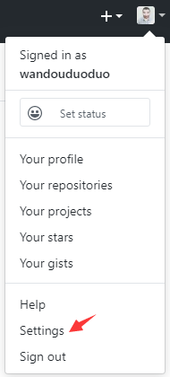

2.选择SSH Keys


3.粘贴密钥，添加即可

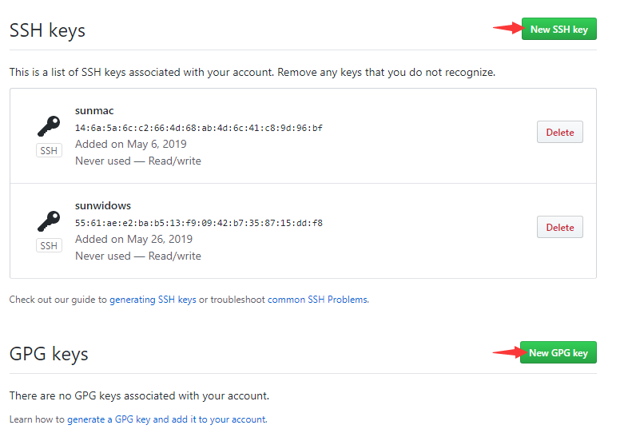

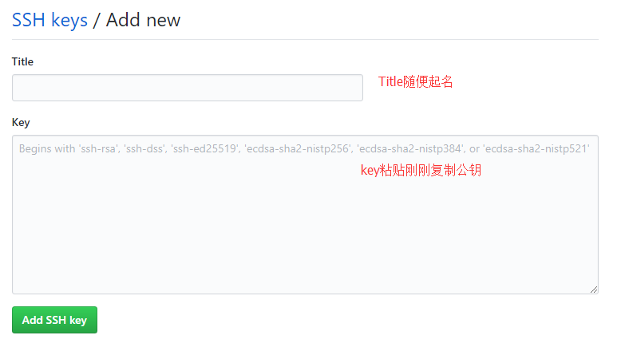

### 第四步、测试

可以输入下面的命令，看看设置是否成功，git@github.com的部分不要修改：

```
$ ssh -T git@github.com
```

如果是下面的反馈：

```
The authenticity of host 'github.com (207.97.227.239)' can't be established.
RSA key fingerprint is 16:27:ac:a5:76:28:2d:36:63:1b:56:4d:eb:df:a6:48.
Are you sure you want to continue connecting (yes/no)?
```

不要紧张，输入yes就好。

### 第五步、设置用户信息

现在你已经可以通过SSH链接到GitHub了，还有一些个人信息需要完善的。 Git会根据用户的名字和邮箱来记录提交。GitHub也是用这些信息来做权限的处理，输入下面的代码进行个人信息的设置，把名称和邮箱替换成你自己的，名字根据自己的喜好自己取，而不是GitHub的昵称。

```
$ git config --global user.name "wandouduoduo"//用户名
$ git config --global user.email  "wandouduoduo@163.com"//填写自己的邮箱
```


### 第六步、SSH Key配置成功

本机已成功连接到github。

### 四、将本地的Hexo文件更新到Github的库中

第一步、登录Github打开自己的项目 username.github.io

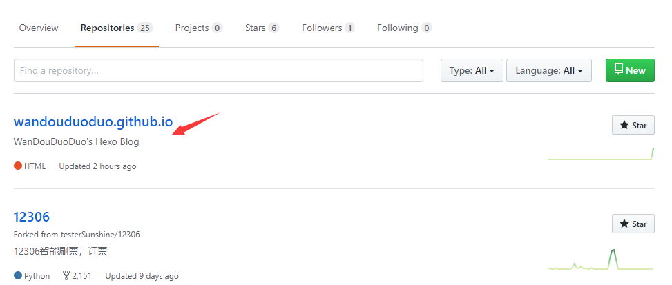

第二步、打开之后，点击SSH，选择SSH类型地址


第三步、复制地址

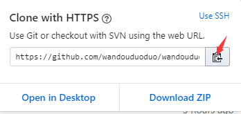

第四步、打开你一开始创建的Hexo文件夹（如E:\Blog\Hexo），用记事本打开刚文件夹下的_config.yml文件


第五步、在配置文件里作如下修改，保存


第六步、在Hexo文件夹下执行：

```
hexo g
hexo d
```

或者直接执行

```
hexo g -d
```

执行完之后会让你输入github的账号和密码，输入完后就可以登录我们自己的部署在Github Pages服务器上的博客了。对应的地址是 username.github.io(我的是：wandouduoduo.github.io)。

假如这时候，报错 ERROR Deployer not found: git，那么就是你的deployer没有安装成功，你需要执行如下命令再安装一次：

```
npm install hexo-deployer-git --save
```

这样，你再执行hexo g -d，你的博客就部署到Github上了。

第七步、在浏览器上输入自己的主页地址
在浏览器上输入Github Pager为我们生成的外链（例如我的是：https://wandouduoduo.github.io，而你的只需要把你的github用户名替换掉这个链接中的wandouduoduo，因为我的用户名是这个）即可看到自己的博客了。

当然，每一个人都可以通过这个地址访问到你的博客了。

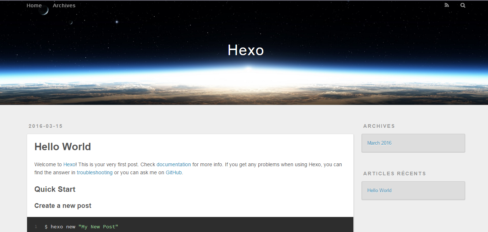

## 美化自己博客

那么现在我们的博客已经挂在了Github服务器上面，别人已经可以通过地址来登陆我们的博客了，但是我们这时就有了新的需求，就是自己的博客并不好看，那怎么办的？这很简单，要知道很多前端开发者在Hexo框架下开发了很多的主题给我们使用，我们只需要把他们的主题克隆过来，然后通过修改配置文件即可达到我们所需要的效果。

那么我们应该怎么修改呢？

一、进入[Hexo的官网主题专栏](https://hexo.io/themes/)

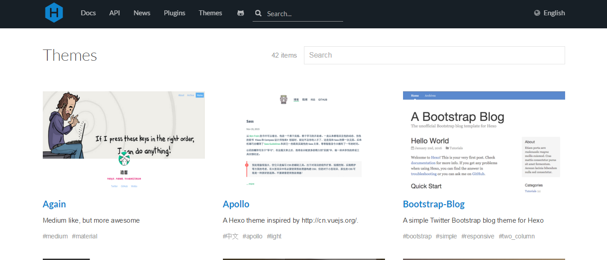

二、挑选我们喜欢的主题
可以看到有很多主题给我们选，我们只要选择喜欢的主题点击进去，然后进入到它的github地址，我们只要把这个地址复制下来(例如我是选择：hexo-theme-next这个主题)

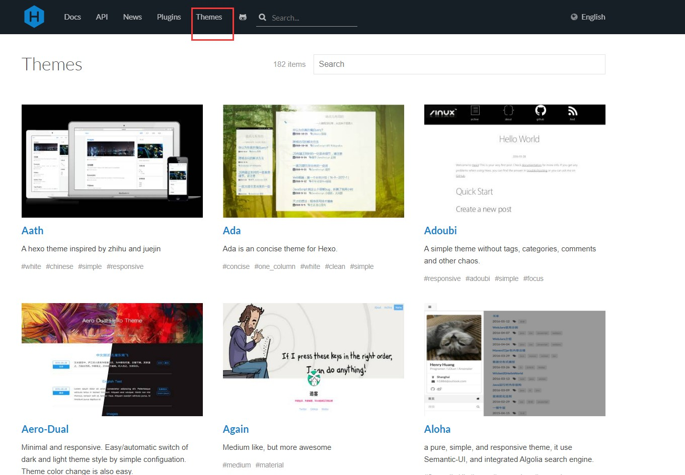

三、克隆主题
再打开Hexo文件夹下的themes目录（E:\Blog\hexo\themes），右键Git Bash，在命令行输入命令下载:

```
git clone https://github.com/iissnan/hexo-theme-next(此处地址替换成你需要使用的主题的地址)
```

四、修改Hexo配置文件
下载完成后，打开Hexo文件夹下的配置文件_config.yml

修改参数为：

```
theme: hexo-theme-next
```

五、部署主题，本地查看效果
返回Hexo目录，右键Git Bash，输入

```
hexo g
hexo s
```


打开浏览器，输入 http://localhost:4000/ 即可看见我们的主题已经更换了。

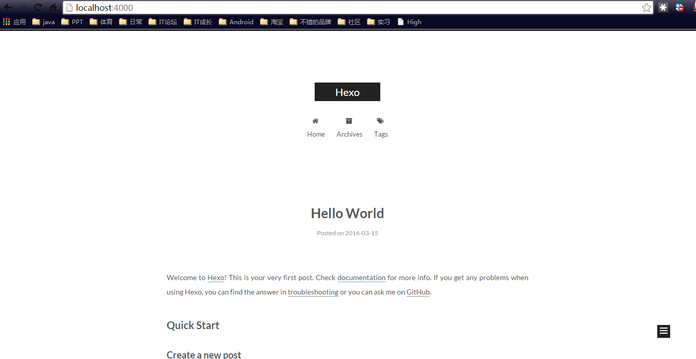

六、如果效果满意，将它部署到Github上
打开Hexo文件夹，右键Git Bash，输入

hexo clean   (必须要，不然有时因为缓存问题，服务器更新不了主题)
hexo g -d


七、打开自己的主页，即可看到修改后的效果
更多修改效果请查看对应主题的说明文档，点击此查看本主题(Next)对应的说明文档。

## 在博客写文章

### 一、用hexo发表新文章

`

```
$ hexo n "文章标题"
```

其中 我的家 为文章标题，执行命令 hexo n "我的家" 后，会在项目 \Hexo\source_posts 中生成 我的家.md文件，用编辑器打开编写即可。

当然，也可以直接在\Hexo\source_posts中新建一个md文件，我就是这么做的。 写完后，推送到服务器上，执行以下命令即可在我们的站点看到新的文章。

```
$ hexo g #生成
$ hexo d #部署 # 可与hexo g合并为 hexo d -g
```


### 二、用Markdown写文章

我们注意到在 \Hexo\source_posts 文件夹下存放着我们的文章，它们的格式都是以.md格式结尾的，没错，Hexo也是支持Markdown语法的，所以当我们需要写具有格式化的文章时，我们可以使用支持Markdown语法的编辑器进行文章编译，然后保存文件到 \Hexo\source_posts 文件夹下即可。


复制进去之后，只要执行

```
$ hexo d -g 
```

推送到我们的Github仓库即可。

那么什么是Markdown？
Markdown 是一种轻量级的「标记语言」，它的优点很多，目前也被越来越多的写作爱好者，撰稿者广泛使用。看到这里请不要被「标记」、「语言」所迷惑，Markdown 的语法十分简单。常用的标记符号也不超过十个，这种相对于更为复杂的HTML 标记语言来说，Markdown 可谓是十分轻量的，学习成本也不需要太多，且一旦熟悉这种语法规则，会有一劳永逸的效果。

Markdown有什么优点？
专注你的文字内容而不是排版样式。
轻松的导出 HTML、PDF 和本身的 .md 文件。
纯文本内容，兼容所有的文本编辑器与字处理软件。
可读，直观。适合所有人的写作语言。
我该用什么工具？
Windows下可以使用 MarkdownPad2。
在 Mac OS X 上，我建议你用 Mou 这款免费且十分好用的 Markdown 编辑器。
Web 端上，我强烈推荐 简书 这款产品。
关于Markdown的更多资料可以查看如下：

[认识与入门 Markdown](https://sspai.com/post/25137)
[Markdown入门指南](https://www.douban.com/note/350126154/?type=like)

## 将自己的域名关联到Github Pages上

很多朋友创建了自己的博客之后会选择买一个属于自己的域名，然后将自己域名绑定到自己的Github Pages博客上，其实这也并不难，只要你有个域名。

### 一、购买域名

如果你不是很有钱，在[阿里云](https://wanwang.aliyun.com/domain/?spm=5176.383338.1907008.1.LWIFhw)上，你只要几块钱就可以买到一个域名。

选择你喜欢的域名，然后购买即可。


### 二、配置CNAME文件

在 \hexo\source 文件夹下创建文件 CNAME （新建记事本文件命名CNAME，然后打开）

内容为你的域名


在Hexo文件夹提交

```
hexo g -d
```


### 三、修改DNS的DNS

1.如果你是在阿里云购买域名的话，请登录阿里云网站。打开个人中心，点击域名


2.选择管理


3.修改DNS为

```
f1g1ns2.dnspod.net 
f1g1ns1.dnspod.net
```

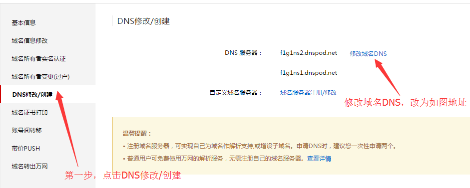

### 四、域名解析

打开[DNSPOD](https://www.dnspod.cn/)，注册一个账户

点击添加域名，把你的域名添加进去，如无意外，添加完之后就是以下这个状态 


此时点击添加记录，添加两个记录，一个主机记录为@， 一个为www，而记录值都是填同一个，填你的博客主页对应的ip，添加完后如下。 


但是如何获取ip值呢？打开运行，输入cmd，打开命令窗口输入 ping 域名 ， 查看解析ip地址

将IP输入过去，然后会提示你到域名注册的地方修改DNS。等待生效，最迟72小时生效。即可通过你的域名浏览你的博客主页。


## 结语

按照上述操作，开始建立你自己的博客吧，还在等什么呢？用博客展现自己的能力和分享自己心得，你会交到很多志同道合的朋友和成就。


