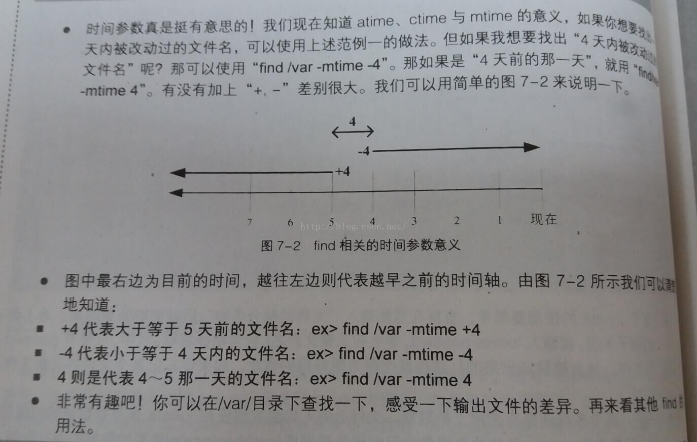

Linux在日常用find mtime命令来查找近几天的文件，或者日志文件只需要保留7天，7天前的需要查找处理删掉。那么mtime参数有带符号(+号，-号)和不带符号之分。你真的能够清楚辨别区分吗？不见得吆，本文详解这个时间点，让你轻松辨别。

<!--more-->

## 区别

`-mtime n`

### 带+符号

这里的n，如果n为带有+号的值，意思为查找n天前所有的文件。比如n=+1且当前是24号9点，那么查找22号9点以前的数据，不包括22号9点到23号9点这段时间。

### 带-符号

如果是负号（n=-1）则为查找一天内的文件，比如当前时间24号9点，那么查找23点9点到24点9点时间段的数据，如果是（n=-2）则代表查找两天内的所有数据，比如当前时间24号9点，那么查找22点9点到24点9点时间段的数据。

### 不带符号

如果不带有符号，那么则查找指定前n天中这一天的数据。比如（n=1）且当前时间24号9点，那么查找22点9点到23点9点这个时间段的数据。

## 实例

find . -mtime +0 -type f -name "log*" | xargs rm -f  #删除24小时以前log格式的文件     

#按文件更改时间来查找文件，-n指n天以内，+n指n天以前。