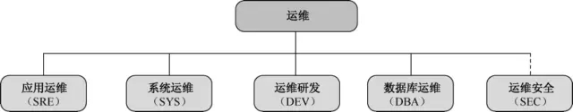

## 指南概要

随着业务规模的不断发展，越成熟的互联网公司，运维岗位会划分得越细。当前很多大型的互联网公司，在初创时期只有系统运维，随着规模、服务质量的 要求，也逐渐进行了工作细分。但是现在很多从业人员对自己的定位没有一个清晰的认识，本指南旨在理清工作职责和发展方向。一般情况下运维团队的工作分类和职责如下：

## **应用运维**

应用运维负责线上服务的变更、服务状态监控、服务容灾和数据备份等工作，对服务进行例行排查、故障应急处理等工作。详细的工作职责如下所述。

### **设计评审**

在产品研发阶段，参与产品设计评审，从运维的角度提出评审意见，使服务满足运维准入的高可用要求。

### **服务管理**

负责制定线上业务升级变更及回滚方案，并进行变更实施。掌握所负责的服务及服务间关联关系、服务依赖的各种资源。

能够发现服务上的缺陷，及时通报并推进解决。

制定服务稳定性指标及准入标准，同时不断完善和优化程序和系统的功能、效率，提高运行质量，完善监控内容，提高报警准确度。

在线上服务出现故障时，第一时间响应，对已知线上故障能按流程进行通报并按预案执行，未知故障组织相关人员联合排障。

### **资源管理**

对各服务的服务器资产进行管理，梳理服务器资源状况、数据中心分布情况、网络专线及带宽情况，能够合理使用服务器资源，根据不同服务的需求，分配不同配置的服务器，确保服务器资源的充分利用。

### **例行检查**

第一，制定服务例行排查点，并不断完善。

第二，根据制定的服务排查点，对服务进行定期检查。

第三，对排查过程中发现的问题，及时进行追查，排除可能存在的隐患。

### **预案管理**

第一，确定服务所需的各项监控、系统指标的阈值或临界点，以及出现该情况后的处理预案。

第二，建立和更新服务预案文档，并根据日常故障情况不断补充完善，提高预案完备性。

第三，能够制定和评审各类预案，周期性进行预案演练，确保预案的可执行性。

### **数据备份**

制定数据备份策略，按规范进行数据备份工作。

保证数据备份的可用性和完整性，定期开展数据恢复性测试。

## **系统运维**

系统运维负责IDC、网络、CDN和基础服务的建设（LVS、NTP、DNS）；负责资产管理，服务器选型、交付和维修。详细的工作职责如下：

### **IDC数据中心建设**

收集业务需求，预估未来数据中心的发展规模，从骨干网的分布，数据中心建筑，以及Internet接入、网络攻击防御能力、扩容能力、空间预留、外接专线能力、现场服务支撑能力等方面评估选型数据中心，负责数据中心的建设、现场维护工作。

### **网络建设**

设计及规划生产网络架构，这里面包括：数据中心网络架构、传输网架构、CDN网络架构等，以及网络调优等日常运维工作。

### **LVS负载均衡和SNAT建设**

LVS是整个站点架构中的流量入口，根据网络规模和业务需求，构建负载均衡集群；

完成网络与业务服务器的衔接，提供高性能、高可用的负载调度能力，以及统一的网络层防攻击能力；

SNAT集中提供数据中心的公网访问服务，通过集群化部署，保证出网服务的高性能与高可用。

### **CDN规划和建设**

CDN工作划分为第三方和自建两部分。

第一，建立第三方CDN的选型和调度控制；

第二，根据业务发展趋势，规划CDN新节点建设布局；

第三，完善CDN业务及监控，保障CDN系统稳定、高效运行；

第四，分析业务加速频道的文件特性和数量，制定最优的加速策略和资源匹配；

第五，负责用户劫持等CDN日常故障排查工作。

### **服务器选型、交付和维护**

负责服务器的测试选型，包含服务器整机、部件的基础性测试和业务测试，降低整机功率，提升机架部署密度等；

结合对公司业务的了解，推广新硬件、新方案减少业务的服务器投入规模；

负责服务器硬件故障的诊断定位，服务器硬件监控、健康检查工具的开发和维护；

### **OS、内核选型和OS相关维护系统**

负责整体平台的OS选型、定制和内核优化，以及Patch的更新和内部版本发布；

建立基础的YUM包管理和分发中心，提供常用包版本库；

跟进日常各类OS相关故障；

针对不同的业务类型，提供定向的优化支持。

### **资产管理**

记录和管理运维相关的基础物理信息，包括数据中心、网络、机柜、服务器、ACL、IP等各种资源信息，制定有效的流程，确保信息的准确性；

开放API接口，为自动化运维提供数据支持。

### **基础服务建设**

业务对DNS、NTP、SYSLOG等基础服务的依赖非常高，需要设计高可用架构避免单点，提供稳定的基础服务。

## **运维研发**

运维研发负责通用的运维平台设计和研发工作，如：资产管理、监控系统、运维平台、数据权限管理系统等。提供各种API供运维或研发人员使用，封装更高层的自动化运维系统。详细的工作职责如下所述。

### **运维平台**

记录和管理服务及其关联关系，协助运维人员自动化、流程化地完成日常运维操作，包括机器管理、重启、改名、初始化、域名管理、流量切换和故障预案实施等。

### **监控系统**

负责监控系统的设计、开发工作，完成公司服务器和各种网络设备的资源指标、线上业务运行指标的收集、告警、存储、分析、展示和数据挖掘等工作，持续提高告警的及时性、准确性和智能性，促进公司服务器资源的合理化调配。

### **自动化部署系统**

参与部署自动化系统的开发，负责自动化部署系统所需要的基础数据和信息，负责权限管理、API开发、Web端开发。结合云计算，研发和提供PaaS相关高可用平台，进一步提高服务的部署速度和用户体验，提升资源利用率。

## **数据库运维**

数据库运维负责数据存储方案设计、数据库表设计、索引设计和SQL优化，对数据库进行变更、监控、备份、高可用设计等工作。详细的工作职责如下所述。

### **设计评审**

在产品研发初始阶段，参与设计方案评审，从DBA的角度提出数据存储方案、库表设计方案、SQL开发标准、索引设计方案等，使服务满足数据库使用的高可用、高性能要求。

### **容量规划**

掌握所负责服务的数据库的容量上限，清楚地了解当前瓶颈点，当服务还未到达容量上限时，及时进行优化、分拆或者扩容。

### **数据备份与灾备**

制定数据备份与灾备策略，定期完成数据恢复性测试，保证数据备份的可用性和完整性。

### **数据库监控**

完善数据库存活和性能监控，及时了解数据库运行状态及故障。

### **数据库安全**

建设数据库账号体系，严格控制账号权限与开放范围，降低误操作和数据泄露的风险；加强离线备份数据的管理，降低数据泄露的风险。

### **数据库高可用和性能优化**

对数据库单点风险和故障设计相应的切换方案，降低故障对数据库服务的影响；

不断对数据库整体性能进行优化，包括新存储方案引进、硬件优化、文件系统优化、数据库优化、SQL优化等，在保障成本不增加或者少量增加的情况下，数据库可以支撑更多的业务请求。

### **自动化系统建设**

设计开发数据库自动化运维系统，包括数据库部署、自动扩容、分库分表、权限管理、备份恢复、SQL审核和上线、故障切换等功能。

## **运维安全**

运维安全负责网络、系统和业务等方面的安全加固工作，进行常规的安全扫描、渗透测试，进行安全工具和系统研发以及安全事件应急处理。详细的工作职责如下所述。

### **安全制度建立**

根据公司内部的具体流程，制定切实可行，且行之有效的安全制度。

### **安全培训**

定期向员工提供具有针对性的安全培训和考核，在全公司内建立安全负责人制度。

### **风险评估**

通过黑白盒测试和检查机制，定期产生对物理网络、服务器、业务应用、用户数据等方面的总体风险评估结果。

### **安全建设**

根据风险评估结果，加固最薄弱的环节，包括设计安全防线、部署安全设备、及时更新补丁、防御病毒、源代码自动扫描和业务产品安全咨询等。

为了降低可能泄露数据的价值，通过加密、匿名化、混淆数据，乃至定期删除等技术手段和流程来达到目的。

### **安全合规**

为了满足例如支付牌照等合规性要求，安全团队承担着安全合规的对外接口人工作。

### **应急响应**

建立安全报警系统，通过安全中心收集第三方发现的安全问题，组织各部门对已经发现的安全问题进行修复、影响面评估、事后安全原因追查。

在整个运维的发展过程中，希望所有的工作都自动化起来，减少人的重复工作，降低知识传递的成本，使我们的运维交付更高效、更安全，使产品运行更稳定。对于故障的处理，也希望由事后处理变成提前发现，由人工处理变成系统自动容灾。