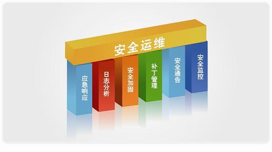

## 目的

有同学看到标题就会说5年以上的技术大咖都傻傻分不清楚，那能成的上大咖？这还真是的，有朋友在BAT等互联网大厂里工作多年，是做技术开发的，在业务上技术很牛的，但是有次聊天时问到这个问题，傻傻分不清楚运维具体是干什么的？有哪些分类？这很正常，孔子曰：术业有专攻，如是而已。还有一些新人小白想要进入这个行业，但是很懵懂，在刚刚接触，心里就打退堂鼓了，害怕自己学不会搞不定弄不懂。那这里就为大家揭开这一职业的朦胧面纱。

<!--more-->

## 前言

何为运维？运维，从字面意思很好理解，运行维护。有可能你认为的运维是高大上，坐在高档写字楼里，敲敲电脑动动手指的，可能是风吹日晒走街串巷等等。

是的，这些都是运维，但是行业，分工以及内容都不同。总体来说大致可以分为两类：线上运维和线下运维。而互联网运维就属于线上运维，共享单车运维就是线下运维。这里我们聊得就是互联网运维。

## 运维前景

要说运维的前景还是很广阔的。可以这么说只要有互联网就会需要运维，试问下，现在的生活还能没有互联网吗？所以，就业前景还是可以的。就企业而言，运维属于技术职务，所以走的是P路线。什么是P路线呢？是互联网就个人职业规划的上升和晋级通道，P路线就是技术路线，M路线就是管理路线。分不同等级，逐级或跨级晋升，当然不能等级体现了你的能力高低。我们常常自嘲为“打杂的”，因为运维是技术支持部门，是为开发出产品后上线提供支持的，所以很多东西都需要懂。所以如果想要从事这个行业先有个心理准备。技术方面有两个维度：深度和广度。就运维而言，广度是第一要求，你不需要精，但是一定要知道。深度在根据自己的规划方向再深入研究。就广度来说，从网络，服务器，系统，环境，应用，监控，虚拟化，容器化，自动化，智能化等等，需要学的太多了。还有，有人说：“运维是吃青春饭的”，对也不对，对的是做技术的，年龄大了操作和思维等肯定不如年轻人，不对的是：看能力，能力比较牛，不可替代，无论年龄多大都有市场。就单纯的说运维晋升：初级，中级，高级，资深，架构师，CTO。少年，你做好准备了吗？

## 运维分类

有很多程序员都是宅男，单身，过年过节回家，亲戚朋友问到从事的职业被戏称为修电脑的。但是只要是从事技术的，哪怕是刚入行的小白，也能够了解清楚分类，工具等。一般程序员根据开发语言划分的，像：php，java, C++，Go等等，根据业务划分可分为：前端和后端。这些基本就可以涵盖所有了。而运维的分类是怎样的呢？问什么会让很多人傻傻分不清和懵懂呢？各自有哪些职责呢？按职责划分运维的分类大致可以分为应用运维，系统运维，运维研发，数据库运维和运维安全。如下图所示：

那下面我们就逐个介绍下。

## **应用运维**

应用运维也是大部分人所认知的运维，应用运维根据字面意思就可以知道是和应用维护的。主要负责线上服务的发布变更、服务健康状况监控、服务的容灾高可用和数据安全备份等工作。针对这些工作需要对服务进行巡检了解服务状况，服务出故障的应急处理和排查优化。下面详细的职责如下所述。

**评审**

在产品研发阶段，参与产品设计评审，从运维的角度提出评审意见，使服务满足准入要求，尽快上线并预备高可用等方案。

**服务**

服务管理主要就是发布系统，制定线上业务的升级变更及回滚方案，并根据申请进行变更的实施。掌握所负责的服务及服务间的依赖关联关系中的各种资源。能够发现服务上的缺陷，及时通报并推进解决。制定服务的稳定性指标及准入标准方案，同时不断完善和优化程序和系统的功能、效率，提高运行质量，完善监控内容，提高报警准确度。在线上服务出现故障时，第一时间响应，对已知的故障能按流程进行通报并按预案执行，未知故障组织相关人员进行联合排障。

**资源**

对各个服务使用的服务器资产进行管理，梳理服务器资源实时状况、IDC数据中心分布情况、网络专线及带宽情况，能够合理使用服务器资源，根据不同服务的需求，分配不同配置的服务器，确保服务器资源的充分利用。

**巡检**

实时了解服务的运行状况，制定服务的例行排查点，并不断完善。并根据制定的服务排查点，对服务进行定期检查。对排查过程中发现的问题，及时进行追查处理，排除可能存在的隐患和痛点

**监控**

确定服务存活状态正常，对服务的各项性能、系统的指标阈值或临界点安排合理，以及对出现该异常后的处理制定预案。建立和更新和维护服务预案文档，并根据日常故障情况不断补充完善，提高预案完备性。周期性进行预案演练，确保预案的可行性。

**备份**

制定业务数据的备份方案，按策略对数据进行备份和冗余工作。保证数据备份的可用性，完整性和安全性，定期开展数据恢复性测试。

## **系统运维**

系统运维主要和系统及底层网络等打交道，如：IDC机房、网络拓扑、CDN加速和基础服务的建设等；对所有服务器的资产进行管理，服务器的调研选型、交付上架和后期维护等。详细的工作职责如下：

**IDC机房**

根据业务申请需求，预估未来数据中心的发展规模，从骨干网络的分布，数据中心建筑可靠性，以及Internet的接入、网络中的攻击防御、扩容、空间预留、外接专线、现场支撑等方面。

**网络**

设计及规划生产网络架构，这里面包括：数据中心网络架构、传输网架构、CDN网络架构等，以及网络调优等日常运维工作。

**基础服务**

根据网络规模和业务需求，构建负载均衡集群，完成网络与业务服务器的衔接，提供高性能、高可用的负载调度能力，以及统一的网络层防御能力；通过集群化部署，保证公网访问服务的高性能与高可用。有些服务需要借助于第三方的，对第三方进行测试选型和调度控制，监控等等，保障系统稳定、高效运行。

**服务器**

服务器的测试和选型，包含服务器整机、部件的基础性测试和业务压力测试，降低整机功率，规划服务器上架位置，在保证温湿度的情况下，提升部署密度，降低成本；服务器硬件故障的诊断排查和定位，服务器温湿度转速等硬件监控等；

**操作系统**

所有平台的操作系统选型、定制和内核优化，以及漏洞补丁的更新和内部版本升级；建立统一的软件包管理和分发中心库，以及现在用的很多的maven依赖包仓库和Docker容器仓库；

**资产管理**

记录和管理所有基础物理信息，包括IDC数据中心、网络信息、机架机柜位置、服务器型号信息，售后信息等等各种资源信息，制定有效合理的流程，确保信息的准确性；

## **运维开发**

运维平台设计,开发和实施部署，如：用户管理，资产管理、监控系统、发布平台、权限管理系统等等。提供各种接口，封装更高层的自动化运维系统。详细的工作职责如下所述。

**发布平台**

记录关联关系，协助运维人员对日常运维标准化，流程化进而自动化，包括服务器的管理如：重启、改名、初始化、域名管理、流量切换和故障预案实施等。

**监控系统**

监控系统的调研选型，对服务器和各种网络设备的资源性能指标、业务性能指标的收集、告警、存储、分析、展示和数据分析等工作，保证公司服务器资源的合理化调配，持续提高告警的及时性、准确性和有效性，对监控进行聚合，进而实现智能化报警监控。

**自动化平台**

自动化系统的开发，自动化部署系统所需要的各种数据和信息。结合云计算，区块链等技术，研发和提供PaaS相关高可用平台，提高服务的部署有效性和稳定性，提高资源利用率。

## **数据库运维**

数据库运维需要对库、表、索引和SQL等制定规范，对数据库进行变更、监控、备份、高可用设计等工作。详细的工作职责如下所述。

**评审**

在产品研发阶段，参与设计方案评审，从DBA的角度提出数据存储、库表设计，索引设计等方案、SQL开发标准，使服务满足数据库的高可用、高性能要求。

**容量**

掌握所负责服务数据库的容量上限，清楚地了解瓶颈点，当服务将触及容量阈值时，及时优化、分拆或者扩容等

**备份与灾备**

制定数据备份与灾备策略方案，定期对数据进行恢复性测试，保证数据备份的有效性，可用性和完整性。

**监控**

对数据库存活和各项性能指标监控，及时了解数据库的运行状态。

**安全**

建立数据库账号和权限控制体系，有效降低误操作和数据泄露的风险；加强离线备份数据的管理，降低数据泄露的风险。

**性能优化**

对数据库风险点有备用或切换方案，降低故障对数据库的影响；对数据库性能进行优化，包括存储方案改进、硬件资源优化、文件系统优化、库表优化、SQL优化等。

**自动化**

开发数据库自动化平台，包括数据库部署、自动扩容、分库分表、权限管理、备份恢复、SQL审核和上线、故障处理等。

## **运维安全**

运维安全负责各方面的安全加固工作，进行安全扫描、渗透测试，进行安全工具和系统研发以及安全事件应急处理。详细的工作职责如下所述。

**安全文档**

根据公司内部的具体流程，制定切实可行且行之有效的安全方案和制度。

**安全培训**

定期向员工提供具有安全培训和考核，在公司内建立安全负责人制度。

**风险评估**

通过黑白盒测试和检查机制，对网络、服务器、业务、用户数据等方面的风险评估。

**安全**

根据风险评估报告，加固薄弱环节，包括设计安全防线、部署安全设备、更新补丁、防御病毒、源代码自动扫描和业务产品安全咨询等等。通过加密、匿名化、混淆数据，乃至定期删除等技术手段和流程来降低可能泄露数据的风险。

**安全合规**

为了满足合规性要求例如金融牌照，支付牌照等，安全团队承担着对外安全合规的接口人角色。

**应急响应**

建立安全报警系统，通过安全中心收集第三方发现的安全问题，评估影响面，组织各部门对已经发现的安全问题进行修复和事后造成安全的追查。

运维工作的目标和期望是：希望所有的工作都自动化起来，减少人的重复工作，降低知识传递的成本，使我们的业务能够更高效、更安全运行，使产品运行的更加稳定。Good  Luck!!!