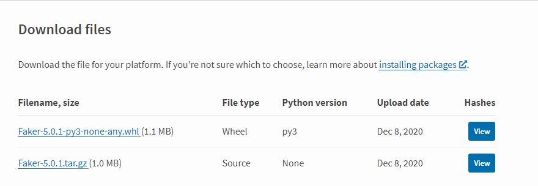

互联网中软件开发和测试过程中，有时候需要一些测试数据。针对这种需求，我们通常的做法是使用现有的系统数据或者手动随意制造一些数据。但是由于现在的互联网飞速发展，业务系统越来越复杂，数据也越来越多样。如再手动去制造数据，不仅需要花费大量精力，还容易出错，而且制造的数据很假。本文推荐造数据神器python开源库Faker，此Faker不是lol天才选手大魔王Faker，但是也是一样给力。


<!--more-->

## 场景

假如需要一批用户的三要素(例如：姓名、手机号和身份证)、或需要一批银行卡数据、一批地址通讯录等等。一般情况下，为了偷懒快捷也好，我们制造的测试数据可能是类似此类:

```
测试, 1300000 000123456
张三, 1310000 000123456
李四, 1320000 000234567
王五, 1330000 000345678
```

在测试过程中数据包括了大量的“测试xx”等等字眼，通常都是随手在键盘上一顿乱敲制造的毫无意义的假数据。
但是你看这些数据。不仅需要自己手动敲哪怕是胡乱随机敲的，而且数据还假的不能再假。既浪费时间和人力，数据的价值也不高。手工制造的数据还无法保障真的能够和业务场景中的数据一致，例如uuid、MD5、SHA等加密类数据等。为了帮助解决这个普遍场景的问题，提供一种解决方案或思路，Python的造数据利器：Faker库可以帮到你。

## 介绍 

Faker是一个Python的一个开源库。主要用途：制造伪数据。使用Faker库，无需再手写随机来生成数据，只需调用Faker库的方法即可完成数据的生成。


## 安装

使用 pip 方式安装

```bash
pip install Faker
```

或者去Faker的[PyPI页面](https://link.zhihu.com/?target=https%3A//pypi.org/project/Faker/)下载Wheel或者Source文件进行安装：



## 基本用法

```python
from faker import Faker

fake = Faker()
name = fake.name()
address = fake.address()
print(name)
print(address)

# 输出信息
Ashley Love
074 Lee Village Suite 464
Dawnborough, RI 44234
```

**1.** 导入Faker这个类。

**2.** 实例化，保存到变量fake中。

**3.** 调用name()方法随机生成一个名字。

**4.** 调用address()方法随机生成地址信息。

默认是英文数据，如果需要造其他语言的数据，可以使用 locale参数，例如：

```python
from faker import Faker

fake = Faker(locale='zh_CN')
name = fake.name()
address = fake.address()
print(name)
print(address)

# 输出信息
张艳
海南省上海市朝阳邱路y座 175208
```

其他语种或地区的数据，我们可以传入相应的地区值：

```bash
ar_EG - Arabic (Egypt)
ar_PS - Arabic (Palestine)
ar_SA - Arabic (Saudi Arabia)
bg_BG - Bulgarian
bs_BA - Bosnian
cs_CZ - Czech
de_DE - German
dk_DK - Danish
el_GR - Greek
en_AU - English (Australia)
en_CA - English (Canada)
en_GB - English (Great Britain)
en_NZ - English (New Zealand)
en_US - English (United States)
es_ES - Spanish (Spain)
es_MX - Spanish (Mexico)
et_EE - Estonian
fa_IR - Persian (Iran)
fi_FI - Finnish
fr_FR - French
hi_IN - Hindi
hr_HR - Croatian
hu_HU - Hungarian
hy_AM - Armenian
it_IT - Italian
ja_JP - Japanese
ka_GE - Georgian (Georgia)
ko_KR - Korean
lt_LT - Lithuanian
lv_LV - Latvian
ne_NP - Nepali
nl_NL - Dutch (Netherlands)
no_NO - Norwegian
pl_PL - Polish
pt_BR - Portuguese (Brazil)
pt_PT - Portuguese (Portugal)
ro_RO - Romanian
ru_RU - Russian
sl_SI - Slovene
sv_SE - Swedish
tr_TR - Turkish
uk_UA - Ukrainian
zh_CN - Chinese (China Mainland)
zh_TW - Chinese (China Taiwan)
```

## 常用方法

```bash
#地理信息类
fake.city_suffix()：市，县
fake.country()：国家
fake.country_code()：国家编码
fake.district()：区
fake.geo_coordinate()：地理坐标
fake.latitude()：地理坐标(纬度)
fake.longitude()：地理坐标(经度)
fake.postcode()：邮编
fake.province()：省份
fake.address()：详细地址
fake.street_address()：街道地址
fake.street_name()：街道名
fake.street_suffix()：街、路

#基础信息类
ssn()：生成身份证号
bs()：随机公司服务名
company()：随机公司名（长）
company_prefix()：随机公司名（短）
company_suffix()：公司性质
credit_card_expire()：随机信用卡到期日
credit_card_full()：生成完整信用卡信息
credit_card_number()：信用卡号
credit_card_provider()：信用卡类型
credit_card_security_code()：信用卡安全码
job()：随机职位
first_name_female()：女性名
first_name_male()：男性名
last_name_female()：女姓
last_name_male()：男姓
name()：随机生成全名
name_female()：男性全名
name_male()：女性全名
phone_number()：随机生成手机号
phonenumber_prefix()：随机生成手机号段

#计算机基础、Internet信息类
ascii_company_email()：随机ASCII公司邮箱名
ascii_email()：随机ASCII邮箱：
company_email()：
email()：
safe_email()：安全邮箱

#网络基础信息类
domain_name()：生成域名
domain_word()：域词(即，不包含后缀)
ipv4()：随机IP4地址
ipv6()：随机IP6地址
mac_address()：随机MAC地址
tld()：网址域名后缀(.com,.net.cn,等等，不包括.)
uri()：随机URI地址
uri_extension()：网址文件后缀
uri_page()：网址文件（不包含后缀）
uri_path()：网址文件路径（不包含文件名）
url()：随机URL地址
user_name()：随机用户名
image_url()：随机URL地址

#浏览器信息类
chrome()：随机生成Chrome的浏览器user_agent信息
firefox()：随机生成FireFox的浏览器user_agent信息
internet_explorer()：随机生成IE的浏览器user_agent信息
opera()：随机生成Opera的浏览器user_agent信息
safari()：随机生成Safari的浏览器user_agent信息
linux_platform_token()：随机Linux信息
user_agent()：随机user_agent信息

#数字类
numerify()：三位随机数字
random_digit()：0~9随机数
random_digit_not_null()：1~9的随机数
random_int()：随机数字，默认0~9999，可以通过设置min,max来设置
random_number()：随机数字，参数digits设置生成的数字位数
pyfloat()：
left_digits=5 #生成的整数位数, right_digits=2 #生成的小数位数, positive=True #是否只有正数
pyint()：随机Int数字（参考random_int()参数）
pydecimal()：随机Decimal数字（参考pyfloat参数）

#文本、加密类
pystr()：随机字符串
random_element()：随机字母
random_letter()：随机字母
paragraph()：随机生成一个段落
paragraphs()：随机生成多个段落
sentence()：随机生成一句话
sentences()：随机生成多句话，与段落类似
text()：随机生成一篇文章
word()：随机生成词语
words()：随机生成多个词语，用法与段落，句子，类似
binary()：随机生成二进制编码
boolean()：True/False
language_code()：随机生成两位语言编码
locale()：随机生成语言/国际 信息
md5()：随机生成MD5
null_boolean()：NULL/True/False
password()：随机生成密码,可选参数：length：密码长度；special_chars：是否能使用特殊字符；digits：是否包含数字；upper_case：是否包含大写字母；lower_case：是否包含小写字母
sha1()：随机SHA1
sha256()：随机SHA256
uuid4()：随机UUID

#时间信息类
date()：随机日期
date_between()：随机生成指定范围内日期，参数：start_date，end_date
date_between_dates()：随机生成指定范围内日期，用法同上
date_object()：随机生产从1970-1-1到指定日期的随机日期。
date_time()：随机生成指定时间（1970年1月1日至今）
date_time_ad()：生成公元1年到现在的随机时间
date_time_between()：用法同dates
future_date()：未来日期
future_datetime()：未来时间
month()：随机月份
month_name()：随机月份（英文）
past_date()：随机生成已经过去的日期
past_datetime()：随机生成已经过去的时间
time()：随机24小时时间
timedelta()：随机获取时间差
time_object()：随机24小时时间，time对象
time_series()：随机TimeSeries对象
timezone()：随机时区
unix_time()：随机Unix时间
year()：随机年份

#python 相关方法
profile()：随机生成档案信息
simple_profile()：随机生成简单档案信息
pyiterable()
pylist()
pyset()
pystruct()
pytuple()
pydict()
```

可以用dir(fake)方法，来查看Faker库可以制造哪些数据。目前Faker支持近300种数据，还支持自行扩展。而我们只需要创造fake对象后调用不同的方法即可。


## 总结

通过上面的了解，Faker真的是造数据的神器，值得你去好好学习下，让它真正成为你手动的利器。