我们在做网站的搜索功能时需要用到检索数据，而从数据库中来查找效率是很低，而且不现实的。通常对检索支持比较好的就是`Elasticsearch`或`HBase`等存储，但是前期的数据都存在mysql数据库中，那么怎么一直实时数据同步到es中，而又不影响现有业务。阿里开源神器`canal`可以解决这个问题，它可以把MySQL中的数据实时同步到`Elasticsearch`、`HBase`等数据存储中。

<!--more-->

## 简介

canal简单说就是对MySQL的增量数据进行实时同步到MySQL、Elasticsearch、HBase等数据存储中，它还提供增量数据的订阅和消费等用途。


## 参考

[官方文档](https://github.com/alibaba/canal/wiki)


## 工作原理

canal会模拟mysql主库和从库的交互协议，伪装成从库，然后向主库发送dump协议请求，主库收到dump请求会向canal推送binlog，canal通过解析binlog将数据同步到其他存储中去。


## 环境规划

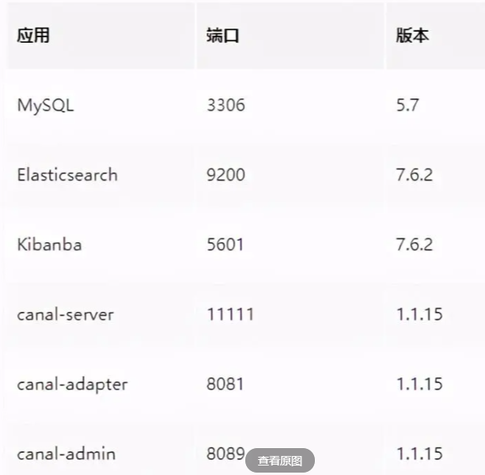

## 教程

本文以mysql实时同步数据到es为例来操作。

### 下载

从[官方下载地址](https://github.com/alibaba/canal/releases)下载所有组件：canal-server、canal-adapter、canal-admin。

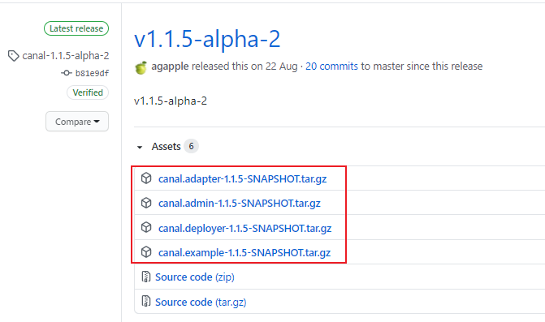

```
canal-server（canal-deploy）：直接监听MySQL的binlog，把自己伪装成MySQL的从库，只负责接收数据，并不做处理。

canal-adapter：相当于canal的客户端，会从canal-server中获取数据，然后对数据进行同步，可以同步到MySQL、Elasticsearch和HBase等存储中去。

canal-admin：为canal提供整体配置管理、节点运维等面向运维的功能，提供相对友好的WebUI操作界面，方便更多用户快速和安全的操作。
```

### **数据库配置**

由于canal是通过订阅MySQL的binlog来实现数据同步的，所以我们需要开启MySQL的binlog写入功能，并设置binlog-format为ROW模式，配置文件为/etc/mysql/conf/my.cnf，改为如下内容即可；

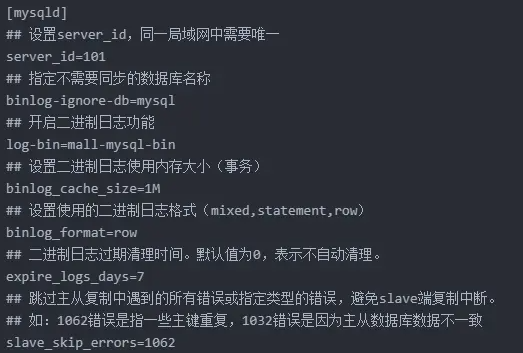

配置完成后需要重新启动MySQL，重启

查看binlog是否启用；

> show  variables  like  '%log_bin%'

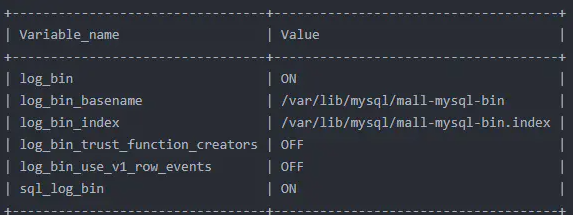

查看下MySQL的binlog模式；

> show  variables  like  'binlog_format%';

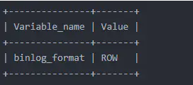

创建一个从库账号，用于订阅binlog，这里创建的账号为canal:canal；


测试用的数据库为canal-test，之后创建一张商品表product，建表语句如下。


### **canal-server**

将下载好的压缩包canal.deployer-1.1.5-SNAPSHOT.tar.gz上传到Linux服务器，解压到指定目录/mydata/canal-server。

```shell
tar  -zxvf  canal.deployer-1.1.5-SNAPSHOT.tar.gz -C /mydata/canal-server/
```

目录结构如下:

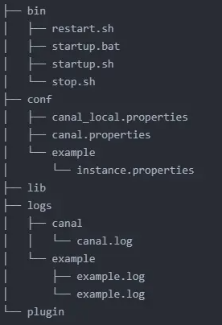

修改配置文件conf/example/instance.properties，修改数据库相关配置；

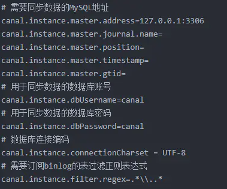

```bash
#启动服务
sh  bin/startup.sh
#查看日志
tail -f logs/canal/canal.log
#查看instance日志信息
tail -f logs/example/example.log
```


### **canal-adapter**

将下载好的压缩包canal.adapter-1.1.5-SNAPSHOT.tar.gz上传到Linux服务器，然后解压到指定目录/mydata/canal-adpter，解压完成后目录结构如下；

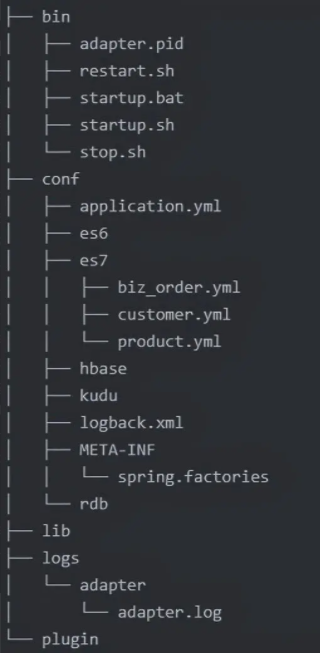

修改配置文件conf/application.yml，修改canal-server配置、数据源配置和客户端适配器配置；

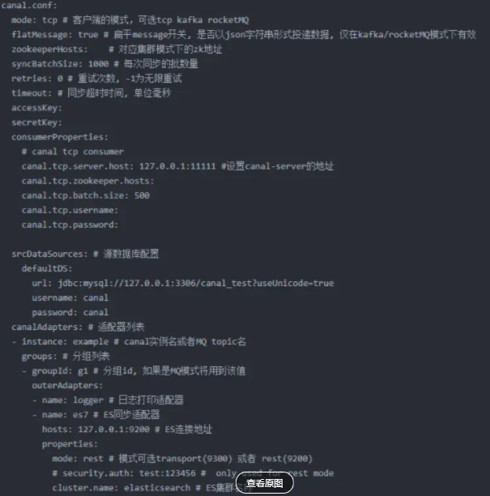

添加配置文件canal-adapter/conf/es7/product.yml，用于配置MySQL中的表与Elasticsearch中索引的映射关系；

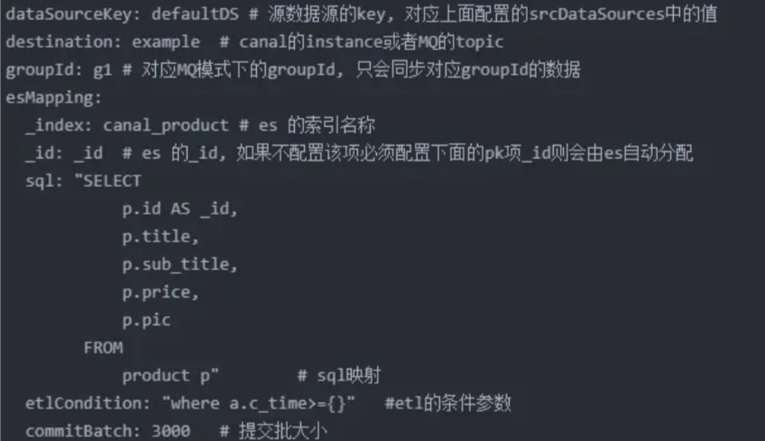

```bash
#启动canal-adapter服务
sh bin/startup.sh

#查看服务日志信息
tail -f logs/adapter/adapter.log
```


### **数据同步演示**

首先需要在Elasticsearch中创建索引，与MySQL中的product表相对应，直接在Kibana的Dev Tools中使用如下命令创建即可；


查看下索引的结构

```bash
GET  canal_product/_mapping
```

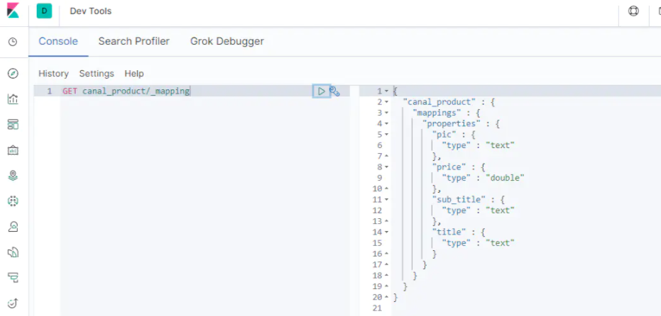

在数据库中创建一条记录；


在Elasticsearch中搜索下，发现数据已经同步

```bash
GET canal_product/_search
```

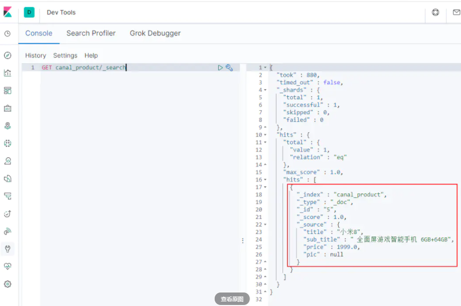

再对数据进行修改

```bash
UPDATE product SET title='小米10' WHEREid=5
```

修改成功后，再在Elasticsearch中搜索下查看

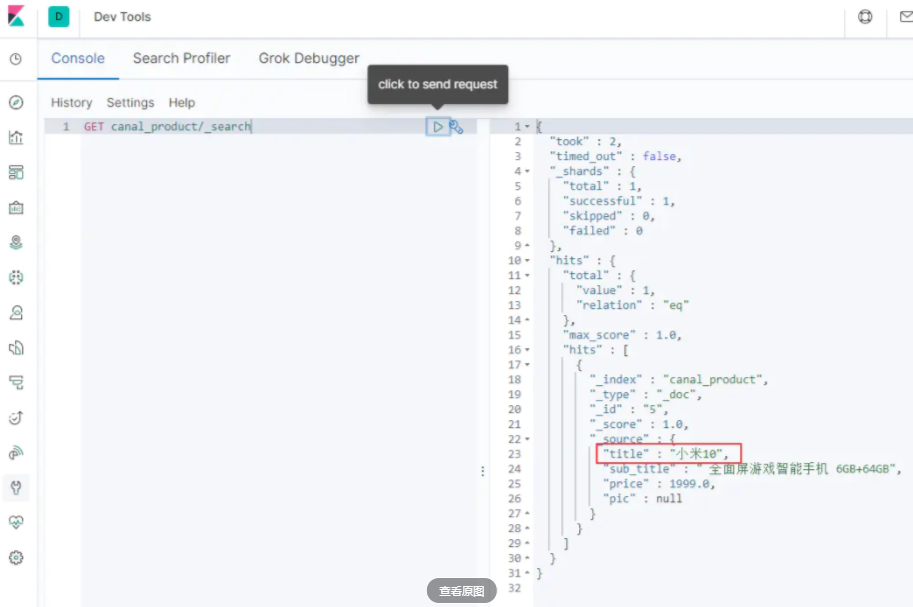

再对数据进行删除

```bash
DELETE FROM product WHEREid=5
```

删除成功后，在Elasticsearch中搜索下查看。至此MySQL同步到Elasticsearch的功能完成了！

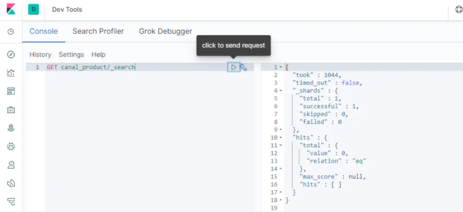

### canal-admin使用

将下载好的压缩包canal.admin-1.1.5-SNAPSHOT.tar.gz上传到Linux服务器，然后解压到指定目录/mydata/canal-admin，解压完成后目录结构如下:


创建canal-admin数据库canal_manager，创建SQL脚本为/mydata/canal-admin/conf/canal_manager.sql，会创建如下表:


修改配置文件conf/application.yml，修改数据源配置和canal-admin的管理账号配置。注意需要用一个有读写权限的数据库账号，比如管理账号root:root；


canal-server的conf/canal_local.properties文件进行配置，修改canal-admin的配置，修改后重启canal-server

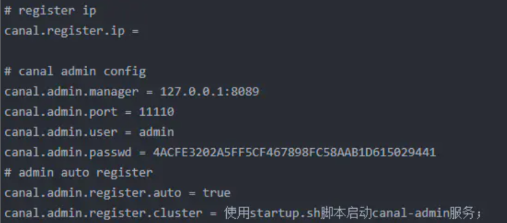

```bash
#启动canal-admin服务
sh bin/startup.sh

```

查看服务日志信息


访问canal-admin的Web界面，输入账号密码admin:123456即可登录，访问地址：http://192.168.3.101:8089

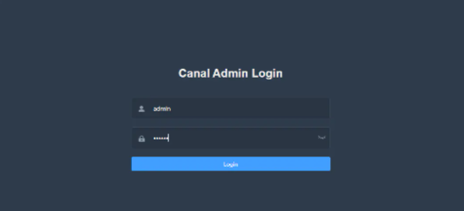

登录成功后即可使用Web界面操作canal-server。

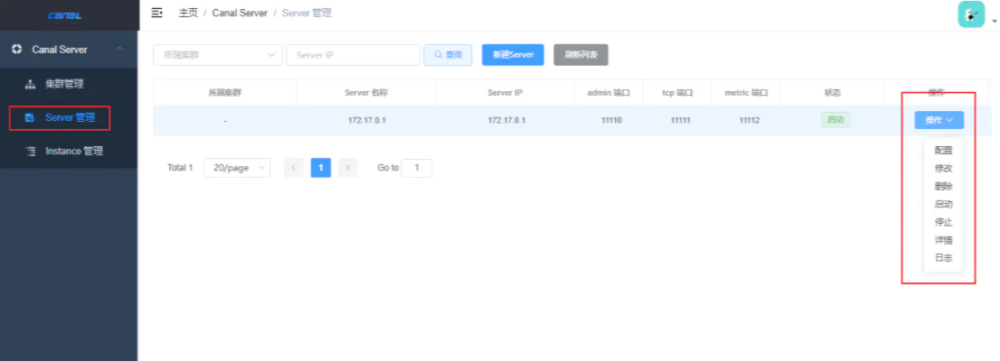

