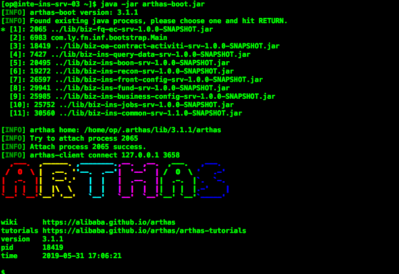

## 介绍

在阿里巴巴内部，有很多自研工具供开发者使用，其中有一款工具，是几乎每个Java开发都使用过的工具，那就是**Arthas**，这是一款**Java诊断工具**，是一款牛逼**带闪电的工具**。该工具已于2018年9月份开源。

[GitHub 地址](https://github.com/alibaba/arthas)

[用户文档](https://alibaba.github.io/arthas/)


在日常开发中，你是否遇到过以下问题：

> 1. 这个类从哪个 jar 包加载的？为什么会报各种类相关的 Exception？
> 2. 我改的代码为什么没有执行到？难道是我没 commit？分支搞错了？
> 3. 遇到问题无法在线上 debug，难道只能通过加日志再重新发布吗？
> 4. 线上遇到某个用户的数据处理有问题，但线上同样无法 debug，线下无法重现！
> 5. 是否有一个全局视角来查看系统的运行状况？
> 6. 有什么办法可以监控到JVM的实时运行状态？

以上问题，通通可以通过Arthas来进行问题诊断！！！是不是很好很强大。

<!--more-->

## Arthas 安装

### 使用脚本一键安装

Arthas 支持在 Linux/Unix/Mac 等平台上一键安装，请复制以下内容，并粘贴到命令行中，敲 回车 执行即可：

```bash
curl -L https://alibaba.github.io/arthas/install.sh | sh
```

上述命令会下载启动脚本文件 as.sh 到当前目录，你可以放在任何地方或将其加入到 $PATH 中。

直接在shell下面执行./as.sh，就会进入交互界面。

也可以执行./as.sh -h来获取更多参数信息。

如果从github下载有问题，可以使用gitee镜像

```
curl -L https://arthas.gitee.io/install.sh | sh
```

### 使用arthas-boot 安装(推荐)

下载arthas-boot.jar，然后用java -jar的方式启动：

1. ```bash
   wget https://alibaba.github.io/arthas/arthas-boot.jar
   java -jar arthas-boot.jar
   ```

   打印帮助信息：

   ```
   java -jar arthas-boot.jar -h
   ```

   如果下载速度比较慢，可以使用aliyun的镜像：

   ```bash
   java -jar arthas-boot.jar --repo-mirror aliyun --use-http
   ```

​       如果从github下载有问题，可以使用gitee镜像

```shell
wget https://arthas.gitee.io/arthas-boot.jar
```

## 启动Arthas

在命令行下面执行（使用和目标进程一致的用户启动，否则可能attach失败）：

```shell
java -jar arthas-boot.jar
```

- 执行该程序的用户需要和目标进程具有相同的权限。比如以`admin`用户来执行：`sudo su admin && java -jar arthas-boot.jar` 或 `sudo -u admin -EH java -jar arthas-boot.jar`。

- 如果attach不上目标进程，可以查看`~/logs/arthas/` 目录下的日志。

- 如果下载速度比较慢，可以使用aliyun的镜像：`java -jar arthas-boot.jar --repo-mirror aliyun --use-http`

- `java -jar arthas-boot.jar -h` 打印更多参数信息。

  ```
  java -jar arthas-boot.jar
  ```

  

启动成功会列出java进程，随便选择一个后回车或直接回车。

## 操作命令

### 基础命令

- help——查看命令帮助信息
- [cat](https://alibaba.github.io/arthas/cat.html)——打印文件内容，和linux里的cat命令类似
- [pwd](https://alibaba.github.io/arthas/pwd.html)——返回当前的工作目录，和linux命令类似
- cls——清空当前屏幕区域
- session——查看当前会话的信息
- [reset](https://alibaba.github.io/arthas/reset.html)——重置增强类，将被 Arthas 增强过的类全部还原，Arthas 服务端关闭时会重置所有增强过的类
- version——输出当前目标 Java 进程所加载的 Arthas 版本号
- history——打印命令历史
- quit——退出当前 Arthas 客户端，其他 Arthas 客户端不受影响
- shutdown——关闭 Arthas 服务端，所有 Arthas 客户端全部退出
- [keymap](https://alibaba.github.io/arthas/keymap.html)——Arthas快捷键列表及自定义快捷键

### jvm相关

- [dashboard](https://alibaba.github.io/arthas/dashboard.html)——当前系统的实时数据面板
- [thread](https://alibaba.github.io/arthas/thread.html)——查看当前 JVM 的线程堆栈信息
- [jvm](https://alibaba.github.io/arthas/jvm.html)——查看当前 JVM 的信息
- [sysprop](https://alibaba.github.io/arthas/sysprop.html)——查看和修改JVM的系统属性
- [sysenv](https://alibaba.github.io/arthas/sysenv.html)——查看JVM的环境变量
- [getstatic](https://alibaba.github.io/arthas/getstatic.html)——查看类的静态属性
- **New!** [ognl](https://alibaba.github.io/arthas/ognl.html)——执行ognl表达式
- **New!** [mbean](https://alibaba.github.io/arthas/mbean.html)——查看 Mbean 的信息

### class/classloader相关

- [sc](https://alibaba.github.io/arthas/sc.html)——查看JVM已加载的类信息
- [sm](https://alibaba.github.io/arthas/sm.html)——查看已加载类的方法信息
- [jad](https://alibaba.github.io/arthas/jad.html)——反编译指定已加载类的源码
- [mc](https://alibaba.github.io/arthas/mc.html)——内存编绎器，内存编绎`.java`文件为`.class`文件
- [redefine](https://alibaba.github.io/arthas/redefine.html)——加载外部的`.class`文件，redefine到JVM里
- [dump](https://alibaba.github.io/arthas/dump.html)——dump 已加载类的 byte code 到特定目录
- [classloader](https://alibaba.github.io/arthas/classloader.html)——查看classloader的继承树，urls，类加载信息，使用classloader去getResource

### monitor/watch/trace相关

> 请注意，这些命令，都通过字节码增强技术来实现的，会在指定类的方法中插入一些切面来实现数据统计和观测，因此在线上、预发使用时，请尽量明确需要观测的类、方法以及条件，诊断结束要执行 `shutdown` 或将增强过的类执行 `reset` 命令。

- [monitor](https://alibaba.github.io/arthas/monitor.html)——方法执行监控
- [watch](https://alibaba.github.io/arthas/watch.html)——方法执行数据观测
- [trace](https://alibaba.github.io/arthas/trace.html)——方法内部调用路径，并输出方法路径上的每个节点上耗时
- [stack](https://alibaba.github.io/arthas/stack.html)——输出当前方法被调用的调用路径
- [tt](https://alibaba.github.io/arthas/tt.html)——方法执行数据的时空隧道，记录下指定方法每次调用的入参和返回信息，并能对这些不同的时间下调用进行观测

### options

- [options](https://alibaba.github.io/arthas/options.html)——查看或设置Arthas全局开关

### 管道

Arthas支持使用管道对上述命令的结果进行进一步的处理，如`sm java.lang.String * | grep 'index'`


### 后台异步任务

当线上出现偶发的问题，比如需要watch某个条件，而这个条件一天可能才会出现一次时，异步后台任务就派上用场了，详情请参考[这里](https://alibaba.github.io/arthas/async.html)

- 使用 > 将结果重写向到日志文件，使用 & 指定命令是后台运行，session断开不影响任务执行（生命周期默认为1天）
- jobs——列出所有job
- kill——强制终止任务
- fg——将暂停的任务拉到前台执行
- bg——将暂停的任务放到后台执行

### Web Console

通过websocket连接Arthas。

- [Web Console](https://alibaba.github.io/arthas/web-console.html)

## 主要命令详解

### Dashboard

当前系统的实时数据面板，按 ctrl+c 退出。

当运行在Ali-tomcat时，会显示当前tomcat的实时信息，如HTTP请求的qps, rt, 错误数, 线程池信息等等

```
dashboard
```


数据说明

- ID: Java级别的线程ID，注意这个ID不能跟jstack中的nativeID一一对应
- NAME: 线程名
- GROUP: 线程组名
- PRIORITY: 线程优先级, 1~10之间的数字，越大表示优先级越高
- STATE: 线程的状态
- CPU%: 线程消耗的cpu占比，采样100ms，将所有线程在这100ms内的cpu使用量求和，再算出每个线程的cpu使用占比。
- TIME: 线程运行总时间，数据格式为`分：秒`
- INTERRUPTED: 线程当前的中断位状态
- DAEMON: 是否是daemon线程

### thread

查看当前线程信息，查看线程的堆栈

参数说明

| 参数名称      | 参数说明                              |
| ------------- | ------------------------------------- |
| *id*          | 线程id                                |
| [n:]          | 指定最忙的前N个线程并打印堆栈         |
| [b]           | 找出当前阻塞其他线程的线程            |
| [i `<value>`] | 指定cpu占比统计的采样间隔，单位为毫秒 |

> cpu占比是如何统计出来的？

> 这里的cpu统计的是，一段采样间隔内，当前JVM里各个线程所占用的cpu时间占总cpu时间的百分比。其计算方法为： 首先进行一次采样，获得所有线程的cpu的使用时间(调用的是`java.lang.management.ThreadMXBean#getThreadCpuTime`这个接口)，然后睡眠一段时间，默认100ms，可以通过`-i`参数指定，然后再采样一次，最后得出这段时间内各个线程消耗的cpu时间情况，最后算出百分比。

> 注意： 这个统计也会产生一定的开销（JDK这个接口本身开销比较大），因此会看到as的线程占用一定的百分比，为了降低统计自身的开销带来的影响，可以把采样间隔拉长一些，比如5000毫秒。

> 如果想看从Java进程启动开始到现在的cpu占比情况：可以使用[show-busy-java-threads](https://github.com/oldratlee/useful-scripts/blob/master/docs/java.md#-show-busy-java-threads)这个脚本

### jvm

查看当前JVM信息

这里列举三个命令不再赘述，如你需要深入了解和使用，请详读介绍中的[用户文档](https://alibaba.github.io/arthas/)。

